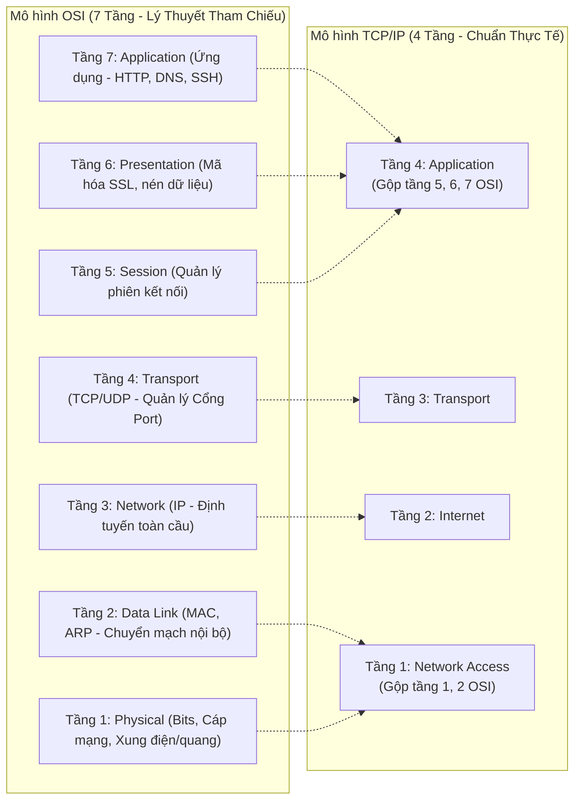
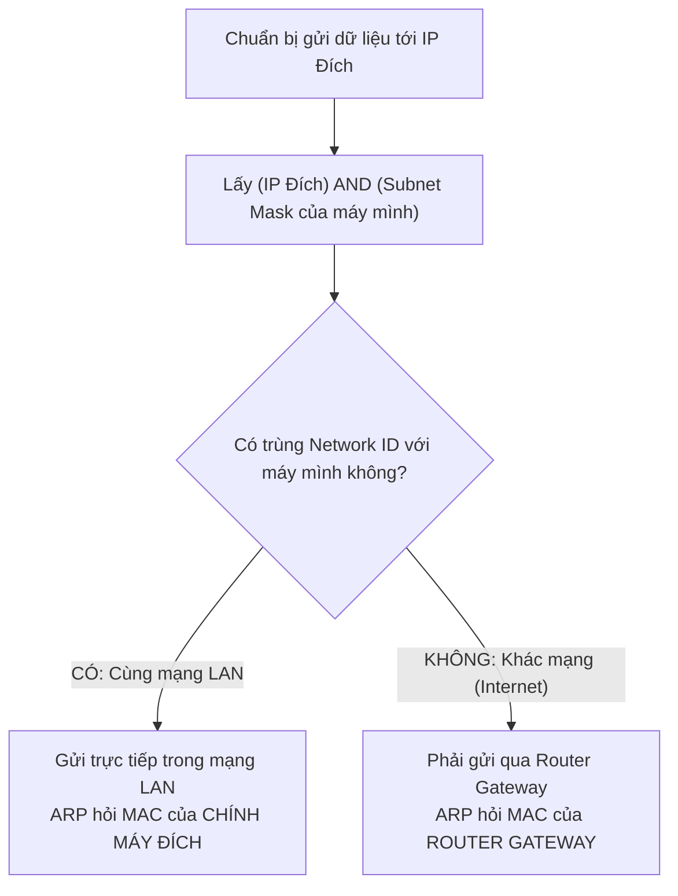
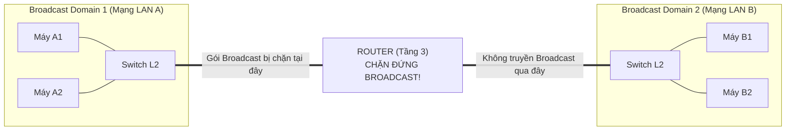
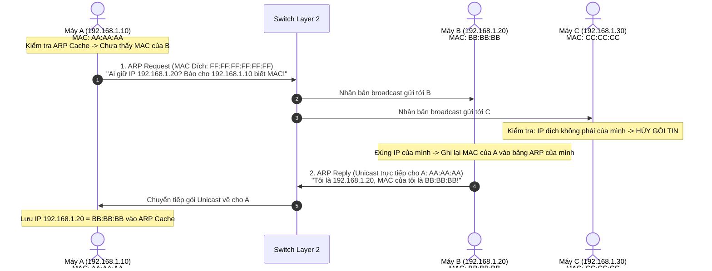
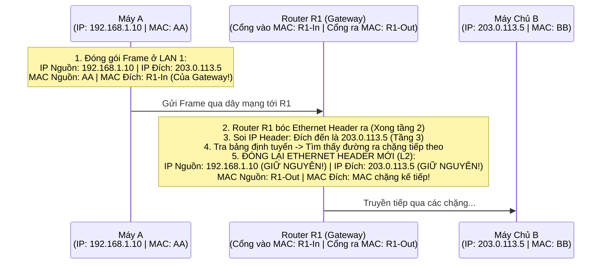

# 🌐 NGÀY 01: MÔ HÌNH OSI, TCP/IP, MAC & GIAO THỨC ARP
*Từ bản chất phần cứng đến tư duy giải quyết sự cố trong Data Center & Viettel Cloud*

> [!abstract] Mục Tiêu Bài Học
> - **Hiểu bản chất phân tầng:** Tại sao mạng không gửi thẳng dữ liệu mà phải chia tầng và đóng gói nhiều lớp (*Headers*).
> - **Nắm vững cơ chế "Cùng mạng vs Khác mạng":** Máy tính dùng phép toán logic nào để quyết định gửi tin trực tiếp hay nhờ đến Router.
> - **Làm chủ giao thức ARP & Broadcast Domain:** Hiểu tường tận nguyên lý tìm MAC từ IP, tại sao Switch chuyển tiếp Broadcast còn Router dứt khoát chặn lại.
> - **Hiểu sâu cơ chế Hop-by-Hop:** Tận mắt nhìn thấy Router bóc tách và thay thế địa chỉ MAC ở mỗi chặng đường như thế nào.
> - **Tự tin trả lời phỏng vấn Viettel Cloud:** Nắm trọn logic gốc rễ để tự giải thích mọi câu hỏi hóc búa về Layer 2 / Layer 3 mà không cần học vẹt.

---

## 1. Bản Chất Mô Hình Phân Tầng: OSI vs TCP/IP

### 1.1. Tư duy "Chia để trị" (Tại sao phải phân tầng?)
Hãy tưởng tượng bạn mua một món hàng trên Shopee:
- Bạn (Tầng ứng dụng) chỉ quan tâm đến món hàng.
- Người bán đóng thùng carton dán mã vận đơn (Tầng đóng gói).
- Shipper nhận hàng, nhìn mã bưu điện để biết chuyển đến kho tổng nào (Tầng định tuyến).
- Xe tải chở hàng qua đường cao tốc (Tầng vật lý).

Trong mạng máy tính cũng vậy. Nếu card mạng (NIC) phải tự xử lý cả mã hóa SSL/TLS, giao diện Web HTTP và tín hiệu điện, hệ thống sẽ cực kỳ cồng kềnh. Phân tầng giúp:
- **Độc lập:** Thay đổi cáp mạng Cat5e sang Cáp quang không bắt buộc trình duyệt Chrome phải sửa code.
- **Tiêu chuẩn hóa:** Máy chủ Dell, switch Cisco, máy ảo KVM của Viettel Cloud đều nói chung một "ngôn ngữ".



---

## 2. Quá Trình Đóng Gói (Encapsulation) & Các Đơn Vị PDU

Khi dữ liệu đi từ phần mềm xuống phần cứng, mỗi tầng sẽ dán thêm thông tin điều khiển (**Header**) của riêng mình:

```
[Dữ liệu ứng dụng]
      ↓ (Thêm TCP Header gồm Source Port, Destination Port)
[TCP Header | Dữ liệu]                                  ==> Gọi là SEGMENT (Tầng 4)
      ↓ (Thêm IP Header gồm Source IP, Destination IP)
[IP Header | TCP Header | Dữ liệu]                      ==> Gọi là PACKET (Tầng 3)
      ↓ (Thêm Ethernet Header gồm Source MAC, Dest MAC và FCS Trailer)
[Ethernet Header | IP Header | TCP Header | Dữ liệu | FCS] ==> Gọi là FRAME (Tầng 2)
      ↓ (Chuyển thành tín hiệu vật lý)
01010110010100101001010101...                           ==> Gọi là BITS (Tầng 1)
```

> [!TIP] Mẹo nhớ đơn vị dữ liệu (PDU) cực nhanh
> - Tầng 4 (Transport): **S**egment (chữ **S** giống chữ **T**ransport)
> - Tầng 3 (Network): **P**acket (gắn liền với **IP**)
> - Tầng 2 (Data Link): **F**rame (đóng **khung** card mạng)
> - Tầng 1 (Physical): **B**it

---

## 3. Bản Chất Cốt Lõi: MAC Address vs IP Address

Nhiều bạn thắc mắc: *"Đã có IP rồi, tại sao lại phải đẻ thêm địa chỉ MAC làm gì cho phức tạp?"*

### 3.1. Ẩn dụ kinh điển: Địa chỉ nhà vs Số Căn cước công dân
- **Địa chỉ IP (Layer 3 - Logic):** Giống như **Địa chỉ nhà bưu điện** (Số 10, Ngõ 5, Đường Duy Tân, Cầu Giấy, Hà Nội). Địa chỉ này có tính phân cấp theo khu vực. Khi bạn xách laptop từ nhà đến công ty Viettel, địa chỉ IP của bạn **bắt buộc phải thay đổi** theo mạng ở đó.
- **Địa chỉ MAC (Layer 2 - Vật lý):** Giống như **Số Căn Cước Công Dân (CCCD)** của bạn. Nó được hãng sản xuất in chết vào card mạng. Dù bạn ở nhà hay lên công ty, số CCCD của bạn **không bao giờ thay đổi**.

### 3.2. Quy luật vận hành phần cứng
- Các con chip trên card mạng (NIC) và Switch Layer 2 thuần túy **không hiểu địa chỉ IP là gì**. Chúng chỉ là các cổng mạch điện tử đọc tín hiệu quang/điện và nhận diện khung Frame dựa trên **48-bit địa chỉ MAC**.
- Ngược lại, mạng Internet toàn cầu với hàng triệu thiết bị không thể ghi nhớ từng địa chỉ MAC phẳng (*flat address*). Nó cần tính phân cấp của IP để gom nhóm thành các dải mạng (*Subnet*) và thực hiện **định tuyến (Routing)**.

---

## 4. Làm Sao Máy Tính Biết Máy Đích Cùng Mạng Hay Khác Mạng?

Đây là mắt xích quan trọng nhất mà sách vở thường bỏ qua! 
Trước khi gửi bất kỳ gói tin nào, Máy tính A **phải tự xác định xem máy đích đang nằm cùng phòng (LAN) với mình hay đang ở tít ngoài Internet**.

### 4.1. Phép toán Logic `AND` thần thánh
Mỗi máy tính đều được cấp 1 địa chỉ IP và 1 **Subnet Mask**.
*Ví dụ:* Máy A có IP `192.168.1.10`, Subnet Mask `255.255.255.0` (`/24`).

Khi A muốn gửi dữ liệu cho IP B (`192.168.1.25`):
1. Máy A lấy: `IP của A` **AND** `Subnet Mask của A` $\rightarrow$ Ra **Network ID của A**: `192.168.1.0`.
2. Máy A lấy: `IP của B` **AND** `Subnet Mask của A` $\rightarrow$ Ra **Network ID của B**: `192.168.1.0`.
3. **So sánh:** Hai Network ID **TRÙNG NHAU** $\Rightarrow$ **CÙNG MẠNG NỘI BỘ (Local LAN)**!
   - **Hành động:** Máy A sẽ gửi thẳng gói tin cho B trong mạng nội bộ bằng cách dùng **ARP hỏi địa chỉ MAC của chính B**.

Khi A muốn gửi dữ liệu cho IP Google C (`8.8.8.8`):
1. Máy A lấy: `8.8.8.8` **AND** `255.255.255.0` $\rightarrow$ Ra: `8.8.8.0`.
2. **So sánh:** `8.8.8.0` **KHÁC** `192.168.1.0` $\Rightarrow$ **KHÁC MẠNG (Remote Network / Internet)**!
   - **Hành động:** Máy A tự hiểu: *"Tôi không thể với tới Google được. Tôi phải nhờ anh bảo vệ cổng (Default Gateway / Router) chuyển hộ!"*
   - **Hành động tiếp theo:** Máy A sẽ dùng **ARP để hỏi địa chỉ MAC của Router Gateway**, chứ tuyệt đối **KHÔNG** hỏi MAC của Google!



---

## 5. Bản Chất Giao Thức ARP (Address Resolution Protocol)

### 5.1. Khái niệm Broadcast Domain (Miền quảng bá) là gì?
- Hãy tưởng tượng một phòng học đóng kín cửa. Khi thầy giáo đứng giữa phòng hét to: *"Em Tuấn có ở đây không?"* $\rightarrow$ **Tất cả mọi người trong phòng đều phải nghe thấy**. Phòng học này chính là một **Broadcast Domain**.
- **Switch Layer 2:** Giống như không gian mở trong phòng. Khi nhận được một gói tin gửi cho địa chỉ phát thanh chung (`FF:FF:FF:FF:FF:FF`), Switch sẽ **nhân bản và bắn gói tin ra tất cả các cổng** để đảm bảo ai cũng nghe thấy.
- **Router Layer 3:** Giống như bức tường và cánh cửa đóng kín của phòng học. Router đứng ở ranh giới giữa các phòng. Khi tiếng hét broadcast va vào Router, **Router sẽ dập tắt ngay lập tức**, không cho lọt sang phòng khác hay ra hành lang.



---

### 5.2. Luồng hoạt động 2 bước của ARP
Khi Máy A cần gửi tin cho Máy B trong cùng mạng LAN nhưng chưa biết MAC của B:



> [!NOTE] Tại sao ARP Reply lại là Unicast mà không phải Broadcast?
> Vì trong gói tin **ARP Request** ban đầu, Máy A đã đính kèm sẵn: *"Tôi là Máy A, IP của tôi là 192.168.1.10 và MAC của tôi là `AA:AA:AA`"*.  
> Máy B khi nhận được đã biết chính xác danh tính của A rồi, nên B chỉ cần gửi **Unicast** (gửi đích danh) trả lời riêng cho A, không cần làm phiền các máy khác trong mạng.

---

### 5.3. Bảng ARP Cache (Bộ nhớ đệm ARP)
Nếu mỗi gói tin gửi đi đều phải hét broadcast ARP thì mạng sẽ nghẽn liên tục. Vì vậy, hệ điều hành lưu tạm cặp `(IP, MAC)` vào bộ nhớ RAM gọi là **ARP Cache**.
- Thời gian lưu (*TTL / Aging time*): Thường từ 60 giây đến 5 phút trên Linux.
- Nếu không có lưu lượng mới, bản ghi chuyển sang trạng thái `STALE` rồi bị xóa để nếu máy kia có đổi card mạng, hệ thống vẫn cập nhật được MAC mới.

---

## 6. Cơ Chế Hop-By-Hop: Gói Tin Đi Xuyên Qua Router Như Thế Nào?

Đây là kiến thức quyết định giúp bạn trả lời xuất sắc câu hỏi phỏng vấn số 2! Hãy theo dõi hành trình của gói tin khi Máy A gửi tin cho Web Server B ở xa:

```
Máy A (192.168.1.10) ──[LAN 1]──> Router R1 ──[Internet]──> Router R2 ──[LAN 2]──> Máy Chủ B (203.0.113.5)
```



> [!IMPORTANT] Quy tắc bất biến trong mạng máy tính
> 1. **IP Nguồn và IP Đích là END-TO-END:** Đi từ đầu đến cuối không bao giờ thay đổi (trừ khi có thiết bị NAT/Firewall can thiệp).
> 2. **MAC Nguồn và MAC Đích là HOP-BY-HOP:** Bị **Router bóc ra và vứt bỏ**, sau đó thay thế bằng cặp MAC mới sau mỗi chặng di chuyển!
> 
> $\Rightarrow$ **Kết luận:** Máy A ở Việt Nam **không thể và không bao giờ cần biết địa chỉ MAC của máy chủ Google ở Mỹ**. Máy A chỉ cần biết duy nhất địa chỉ MAC của **Default Gateway** ngay cạnh nó!

---

## 7. Hiểm Họa "Broadcast Storm" Trong Data Center & Cloud

Tại sao các kỹ sư Cloud của Viettel luôn bị ám ảnh bởi broadcast ARP?

### 7.1. Hiện tượng bão mạng Broadcast (Broadcast Storm)
Hãy hình dung trong một Data Center có **10.000 máy chủ ảo (VM)** kết nối chung vào một mạng Layer 2 phẳng (*Flat Network*):
1. Mỗi giây, hàng trăm máy gửi gói ARP broadcast (`FF:FF:FF:FF:FF:FF`).
2. Switch ToR (Top of Rack) khi thấy frame broadcast sẽ **nhân bản ra tất cả các cổng**.
3. Cứ 1 gói gửi đi $\rightarrow$ Switch phải nhân bản thành 9.999 bản copy gửi tới 9.999 máy chủ khác!
4. Kết quả: Băng thông mạng bị chiếm trọn bởi gói rác broadcast, card mạng của máy chủ liên tục gửi ngắt (*interrupt*) ép CPU phải xử lý, dẫn đến **CPU 100%, Switch bị tràn bộ nhớ đệm (buffer overflow) và toàn bộ hạ tầng sập hoàn toàn**.

### 7.2. Giải pháp của các kỹ sư Cloud
- **VLAN (Virtual LAN - 802.1Q):** Băm nhỏ một switch vật lý thành nhiều mạng ảo độc lập. Broadcast của phòng kế toán không bao giờ bay sang phòng kỹ thuật.
- **VXLAN & Overlay Network (Chuẩn Cloud hiện đại):**
  - Đóng gói toàn bộ Frame Layer 2 vào bên trong gói tin UDP Layer 3.
  - Sử dụng cơ chế **ARP Suppression (Dập tắt ARP)**: Hệ thống SDN / Controller thông minh đã lưu sẵn bảng IP-MAC của toàn bộ VM. Khi VM gửi ARP Request, Switch ảo (OVS) sẽ chặn lại và tự trả lời ngay tại chỗ, không cho gói broadcast bay tung tóe khắp Data Center.

---

## 8. Thực Hành Lab Linux CLI (Có Giải Thích Từng Chữ)

Hãy mở terminal Linux (Ubuntu / CentOS / WSL) và chạy lần lượt các lệnh:

### Bước 1: Xem thông tin card mạng và địa chỉ MAC
```bash
ip link show
```
*Mẫu kết quả:*
```text
2: eth0: <BROADCAST,MULTICAST,UP,LOWER_UP> mtu 1500 ...
    link/ether 00:15:5d:62:3a:18 brd ff:ff:ff:ff:ff:ff
```
*Giải thích:*
- `link/ether 00:15:5d:62:3a:18`: Đây là **Địa chỉ MAC** của máy bạn.
- `brd ff:ff:ff:ff:ff:ff`: Địa chỉ Broadcast ở tầng 2.
- `mtu 1500`: Kích thước Frame tối đa (1500 bytes).

### Bước 2: Tìm địa chỉ IP Default Gateway của bạn
Trước khi ping thử, bạn phải biết Router nhà bạn hoặc cạc mạng ảo có IP là gì:
```bash
ip route show | grep default
```
*Mẫu kết quả:*
```text
default via 192.168.1.1 dev eth0
```
$\rightarrow$ Địa chỉ Default Gateway của bạn chính là `192.168.1.1`!

### Bước 3: Xem bảng ARP Cache hiện tại
```bash
ip neigh show
```
*Mẫu kết quả:*
```text
192.168.1.1 dev eth0 lladdr 70:f1:a1:22:33:44 REACHABLE
```
- `lladdr` (Link-layer address): Địa chỉ MAC của Router Gateway.
- `REACHABLE`: Kết nối đang sống, thông tin MAC này rất mới và tin cậy.

### Bước 4: Xóa sạch bảng ARP Cache (Ép máy học lại)
```bash
sudo ip neigh flush all
ip neigh show
```
*Kết quả:* Bảng trống trơn! Máy bạn tạm thời "quên" mất MAC của Router.

### Bước 5: Kích hoạt gói ARP và kiểm tra lại
```bash
ping -c 2 192.168.1.1
ip neigh show
```
*Điều gì vừa diễn ra dưới ngầm?*
Khi bạn gõ lệnh ping, nhân Linux kiểm tra thấy chưa có MAC của `192.168.1.1`, nó lập tức dừng gói ping ICMP lại, bắn 1 gói **ARP Request Broadcast** lên mạng. Nhận được reply từ Router xong, nó lưu MAC vào bảng rồi mới phát gói Ping đi!

---

## 9. Giải Mã Bộ Câu Hỏi Phỏng Vấn Viettel Cloud (Từ Bản Chất)

Bây giờ bạn đã có đầy đủ kiến thức gốc rễ. Hãy xem cách một ứng viên xuất sắc trả lời phỏng vấn:

> [!QUESTION] **Câu hỏi 1**
> *Gói tin ARP chạy ở tầng nào trong mô hình OSI? Tại sao Router không cho gói tin ARP đi qua ra ngoài Internet?*

**Trả lời mạch lạc:**
1. **Tầng hoạt động:** ARP hoạt động ở **Tầng 2 (Data Link)**. Gói tin ARP được đóng trực tiếp vào Ethernet Frame (với mã EtherType `0x0806`), nó không hề có IP Header của Tầng 3.
2. **Tại sao Router dứt khoát chặn lại:**
   - Gói ARP Request sử dụng địa chỉ MAC đích là địa chỉ phát thanh quảng bá **`FF:FF:FF:FF:FF:FF` (Broadcast)**.
   - Theo định nghĩa kiến trúc mạng, Router là thiết bị Layer 3 có nhiệm vụ **phân tách các Broadcast Domain** (miền quảng bá).
   - Nếu Router cho phép các bản tin broadcast như ARP tràn ra ngoài Internet, hàng tỷ máy tính trên toàn cầu sẽ liên tục nhân bản gói tin của nhau, gây ra hiện tượng **Bão mạng Broadcast (Broadcast Storm)** làm sập toàn bộ đường truyền viễn thông và thiết bị mạng toàn cầu.
   - Ngoài ra, địa chỉ IP trong mạng nội bộ thường là **IP Private** (ví dụ `192.168.1.x`), địa chỉ này hoàn toàn vô nghĩa và không thể định tuyến trên Internet.

---

> [!QUESTION] **Câu hỏi 2**
> *Khi Máy A (192.168.1.10) muốn gửi gói tin cho Máy chủ Web B (203.0.113.5 - ngoài Internet), Máy A sẽ gửi ARP Request để hỏi địa chỉ MAC của ai? Tại sao?*

**Trả lời mạch lạc:**
- Máy A sẽ gửi ARP Request để hỏi **địa chỉ MAC của Default Gateway (Router)**, chứ **không bao giờ** hỏi MAC của Máy B.
- **Giải thích bản chất:**
  1. Máy A dùng phép toán logic: Lấy IP đích `203.0.113.5` nhân logic (`AND`) với Subnet Mask của mình. Kết quả cho thấy Máy B nằm ở **khác mạng (khác Subnet)**.
  2. Theo nguyên tắc định tuyến, khi gửi tin ra ngoài dải mạng cục bộ, host bắt buộc phải chuyển dữ liệu cho **Default Gateway** làm trung gian xử lý.
  3. Bản tin ARP Broadcast chỉ có phạm vi trong mạng LAN nội bộ, không thể bay qua Router để tới máy B.
  4. Do đó, Máy A đóng gói Frame Layer 2 với **MAC đích là MAC của Gateway**, còn ở Layer 3 gói tin vẫn giữ nguyên **IP đích là IP của máy B (`203.0.113.5`)**.

---

> [!QUESTION] **Câu hỏi 3**
> *Trong hạ tầng Viettel Cloud với hàng chục ngàn máy ảo (VM), kỹ sư giải quyết bài toán nghẽn mạng do ARP Broadcast như thế nào?*

**Trả lời mạch lạc:**
- **Không dùng mạng phẳng Layer 2:** Chia nhỏ hạ tầng thành các cụm mạng riêng biệt thông qua **VLAN** hoặc kiến trúc **Spine-Leaf Layer 3**.
- **Ứng dụng Overlay Network (VXLAN / EVPN):** 
  - Đóng gói Frame Layer 2 vào gói UDP Layer 3 (gọi là đóng gói MAC-in-UDP).
  - Tích hợp tính năng **ARP Suppression (Triệt tiêu ARP)**: Các bộ điều khiển mạng ảo (SDN Controller) hoặc Switch ảo (Open vSwitch) đã nắm sẵn bảng phân giải IP-MAC của tất cả các VM. Khi có 1 VM gửi ARP Request, switch ảo trên máy chủ vật lý sẽ **tự động đứng ra trả lời ngay lập tức (Local Proxy ARP)**, ngăn không cho gói broadcast bị bắn ra mạng vật lý của Data Center.

---

## 10. Checklist Tự Đánh Giá Tiến Độ

- [ ] Tôi hiểu tại sao đơn vị dữ liệu ở Tầng 4 là Segment, Tầng 3 là Packet, Tầng 2 là Frame.
- [ ] Tôi biết tự làm phép toán `AND` giữa IP và Subnet Mask để phân biệt Cùng mạng vs Khác mạng.
- [ ] Tôi giải thích được tại sao khi đi qua Router thì MAC thay đổi nhưng IP vẫn giữ nguyên.
- [ ] Tôi hiểu cơ chế Switch nhân bản Broadcast và Router chặn đứng Broadcast.
- [ ] Tôi tự thực hành thành công lệnh `ip route`, `ip neigh` và `sudo ip neigh flush all` trên Linux.

---

**Bài tiếp theo trong lộ trình:**  
👉 [[02 - IPv4, Public vs Private IP & Bastion Host]]
