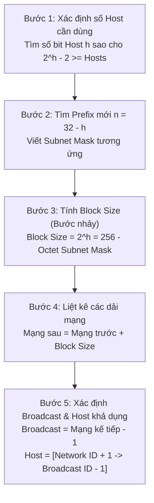
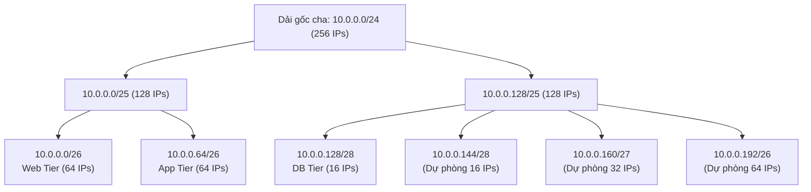
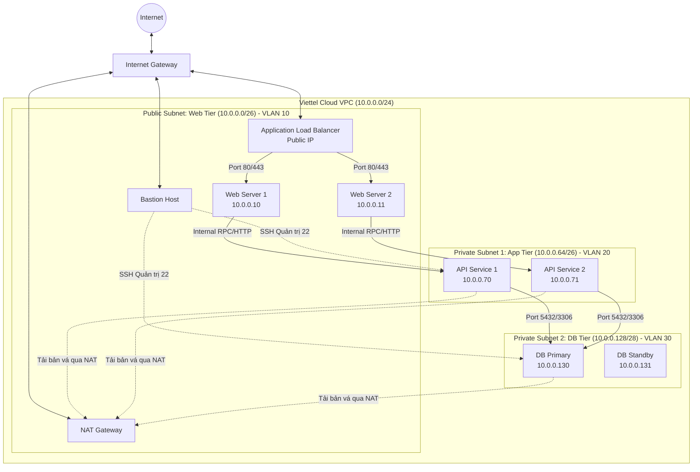
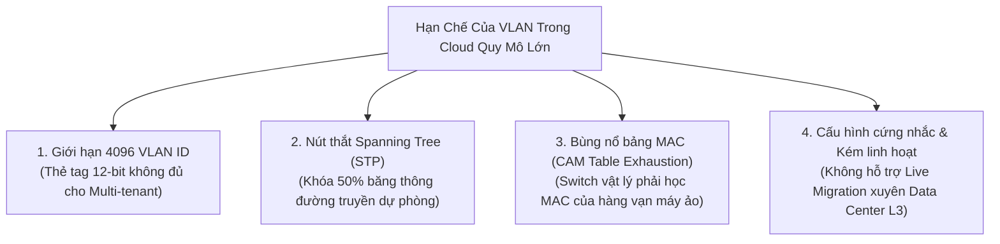

---
course: Lộ Trình Mạng Thực Chiến Cho Cloud & DevOps
module: "Ngày 04: Kỹ thuật chia Subnet từng bước (VLSM, VPC 3-Tier) & Phân đoạn mạng VLAN (802.1Q)"
tags:
  - networking
  - subnetting
  - vlsm
  - cidr
  - vlan
  - 802-1q
  - vpc-3-tier
  - viettel-cloud
  - devops
  - linux-networking
date: 2026-09-10
status: done
---

# 🌐 NGÀY 04: KỸ THUẬT CHIA SUBNET TỪNG BƯỚC (VLSM, VPC 3-TIER) & PHÂN ĐOẠN MẠNG VLAN (802.1Q)
*Phương pháp tính nhẩm bước nhảy (Block Size), tối ưu không gian địa chỉ với VLSM và phân đoạn mạng ảo L2 trong hạ tầng Enterprise & Cloud*

> [!abstract] Mục Tiêu Bài Học
> - **Làm chủ quy trình 5 bước chia Subnetting bất kỳ:** Nắm vững công thức tính số bit Host $h$, xác định tiền tố mới $n = 32 - h$, tính Block Size (Bước nhảy), xác định Network ID, Broadcast ID và dải Host khả dụng trong 30 giây.
> - **Hiểu sâu kỹ thuật VLSM (Variable Length Subnet Masking):** Hiểu rõ sự khác biệt giữa FLSM và VLSM, khắc cốt ghi tâm *Nguyên tắc vàng của VLSM* (sắp xếp từ lớn đến nhỏ) để không bao giờ bị chồng lấn (overlap) dải mạng.
> - **Thiết kế kiến trúc VPC 3-Tier chuẩn Enterprise & Viettel Cloud:** Thực hành quy hoạch dải `10.0.0.0/24` thành 3 vùng mạng: Web Tier (`/26`), App Tier (`/26`), Database Tier (`/28`) kèm dải IP dự phòng.
> - **Bản chất công nghệ VLAN (IEEE 802.1Q):** Phân tích chi tiết thẻ VLAN Tag 12-bit (tại sao chỉ có 4096 IDs), phân biệt rạch ròi **Access Port (Untagged)** vs **Trunk Port (Tagged)**, luồng đi của Frame qua switch.
> - **Thực hành cấu hình VLAN trên Linux:** Tạo sub-interface 802.1Q (`eth0.10`), gán địa chỉ IP và kiểm tra lưu lượng bằng lệnh `ip link`, `ip addr` và `tcpdump`.
> - **Tự tin trả lời phỏng vấn Viettel Cloud (Câu 36 - Phần 2):** Giải thích nguồn gốc giới hạn của VLAN trong môi trường Cloud quy mô lớn và lý do công nghệ hiện đại chuyển dịch sang **Overlay Network (VXLAN / Geneve)**.

---

## 1. Nền Tảng Tư Duy: Tại Sao Phải Chia Mạng (Subnetting & VLAN)?

Hãy tưởng tượng bạn xây dựng một tòa nhà văn phòng 10 tầng cho 500 nhân viên:
- Nếu bạn để tòa nhà thành **một không gian mở duy nhất không có vách ngăn**: Khi một người nói to qua loa phóng thanh, toàn bộ 500 người đều bị điếc tai (*Broadcast Storm*). Đồng thời, nhân viên bảo vệ có thể tự do đi vào phòng kế toán xem bảng lương và hồ sơ mật (*Lỗ hổng an ninh*).
- Để giải quyết, bạn xây các bức tường ngăn thành từng phòng ban (Phòng Kế toán, Phòng Kỹ thuật, Phòng Giám đốc) và lắp cửa khóa thẻ từ.

Trong hạ tầng mạng Data Center và Viettel Cloud cũng hoàn toàn tương tự:
1. **Mạng phẳng Layer 2 (Flat Network) là thảm họa:** Nếu hàng ngàn máy chủ cắm chung một mạng, các gói tin broadcast (ARP, DHCP) sẽ làm tê liệt toàn bộ băng thông và vắt kiệt CPU của card mạng máy chủ.
2. **Nguyên tắc cô lập đặc quyền tối thiểu (Least Privilege):** Một máy chủ Web Frontend hứng chịu trực tiếp traffic từ Internet tuyệt đối không được phép nằm chung một dải mạng Layer 2 với cụm Database lưu thông tin tài khoản ngân hàng. Nếu Web bị hacker chiếm quyền (RCE), hacker có thể nghe lén gói tin hoặc tấn công thẳng vào Database.
3. **Subnetting (Layer 3) kết hợp VLAN (Layer 2):**
   - **Subnetting:** Chia nhỏ không gian địa chỉ IP logic, tạo ranh giới định tuyến để kiểm soát luồng dữ liệu bằng Firewall / Security Group.
   - **VLAN:** Chia nhỏ Switch vật lý thành các Switch ảo biệt lập ở Tầng 2, ngăn chặn triệt để gói broadcast lan truyền chéo giữa các phân vùng.

---

## 2. Quy Trình 5 Bước Chia Subnetting Bất Kỳ (Phương Pháp "Bước Nhảy" - Block Size)

Trong các bài thi tuyển dụng hoặc phỏng vấn trực tiếp, bạn không có công cụ tính toán tự động (`ipcalc`) và cũng không có thời gian chuyển đổi từng bit `0` và `1` sang hệ nhị phân. **Phương pháp Bước nhảy (Block Size)** là phương pháp chuẩn mực của các kỹ sư mạng quốc tế giúp tính nhẩm dải mạng chỉ trong 30 giây.

### 2.1. Công thức toán học gốc
- Địa chỉ IPv4 gồm $32 \text{ bits}$.
- $\text{Network Bits } (n) + \text{Host Bits } (h) = 32$.
- Tổng số IP trong một subnet:
  $$\text{Total IPs} = 2^h$$
- Số lượng địa chỉ IP khả dụng gán được cho máy chủ:
  $$\text{Usable Hosts} = 2^h - 2$$
  *(Lý do trừ 2: Địa chỉ đầu tiên là **Network ID** đại diện cho toàn mạng; Địa chỉ cuối cùng là **Broadcast ID** dùng để phát thanh chung).*

---

### 2.2. Chi tiết 5 bước thực hiện



#### Bước 1: Xác định số Host cần dùng $\rightarrow$ Tìm số bit Host $h$
- Bạn cần kết nối bao nhiêu máy chủ trong subnet này?
- Tìm số nguyên dương $h$ nhỏ nhất thỏa mãn:
  $$2^h - 2 \ge \text{Số máy chủ thực tế}$$
- *Bảng lũy thừa cơ số 2 cần thuộc lòng:*
  - $2^1 = 2$ | $2^2 = 4$ | $2^3 = 8$ | $2^4 = 16$ | $2^5 = 32$ | $2^6 = 64$ | $2^7 = 128$ | $2^8 = 256$

#### Bước 2: Xác định tiền tố Prefix mới ($n$) và Subnet Mask
- Số bit dành cho Network:
  $$n = 32 - h$$
- Ký hiệu CIDR mới sẽ là: `/n`.
- Dựa vào $n$, xác định Octet nào bị mượn bit (Octet 1, 2, 3 hay 4) để viết Subnet Mask dạng thập phân chấm.

#### Bước 3: Tính Block Size (Bước nhảy thần tốc)
- Bước nhảy (Block Size) chính là khoảng cách giữa 2 địa chỉ Network ID liên tiếp.
- Công thức tính cực nhanh:
  $$\text{Block Size} = 2^h$$
  *hoặc:*
  $$\text{Block Size} = 256 - \text{Giá trị của Octet Subnet Mask tại vị trí thay đổi}$$

#### Bước 4: Tìm dải mạng (Network IDs)
- Subnet đầu tiên luôn bắt đầu từ **Network ID gốc** được cấp (ví dụ: `x.x.x.0`).
- Mạng tiếp theo = **Network ID cũ + Block Size** (cộng trực tiếp vào Octet tương ứng).
- Lặp lại cho đến khi hết dải địa chỉ.

#### Bước 5: Xác định Broadcast ID và Dải Host khả dụng
- **Broadcast ID của một Subnet** = `Network ID của Subnet kế tiếp - 1`.
- **Dải Host khả dụng** = `[Network ID + 1  ──>  Broadcast ID - 1]`.

---

### 2.3. Bảng tra cứu thần tốc Octet thứ 4 (/24 đến /30)

Trong thực tế thiết kế Cloud (VPC, Subnet, Point-to-Point), hầu hết các bài toán đều diễn ra ở Octet thứ 4 (từ `/24` đến `/30`). Hãy ghi nhớ bảng này:

| CIDR Prefix | Số bit Host ($h$) | Subnet Mask (Octet 4) | Block Size ($2^h = 256 - \text{Mask}$) | Tổng IP ($2^h$) | Host khả dụng ($2^h - 2$) | Ứng dụng thực tế trong Cloud |
| :---: | :---: | :---: | :---: | :---: | :---: | :--- |
| **`/24`** | 8 | `255.255.255.0` | **256** | 256 | 254 | Mạng VPC mặc định, Subnet lớn |
| **`/25`** | 7 | `255.255.255.128`| **128** | 128 | 126 | Phân nửa dải C, Vùng mạng hỗn hợp |
| **`/26`** | 6 | `255.255.255.192`| **64** | 64 | 62 | Web Tier, App Tier (Quy mô 50 máy) |
| **`/27`** | 5 | `255.255.255.224`| **32** | 32 | 30 | Cụm dịch vụ phụ trợ, Redis Cluster |
| **`/28`** | 4 | `255.255.255.240`| **16** | 16 | 14 | Database Tier, Management Nodes |
| **`/29`** | 3 | `255.255.255.248`| **8** | 8 | 6 | Cụm Firewall HA, Load Balancer VIP |
| **`/30`** | 2 | `255.255.255.252`| **4** | 4 | 2 | Đường kết nối Router-to-Router (P2P) |
| **`/32`** | 0 | `255.255.255.255`| **1** | 1 | 1 (Host) | Loopback IP, Floating IP, Host Route |

---

## 3. Bản Chất Kỹ Thuật VLSM (Variable Length Subnet Masking)

### 3.1. So sánh FLSM vs VLSM
- **FLSM (Fixed-Length Subnet Masking - Phân hoạch subnet cố định):**
  - Mọi subnet con đều có cùng một Subnet Mask (ví dụ: chia dải `/24` thành 4 subnet đều là `/26`, mỗi mạng 62 host).
  - *Nhược điểm chí mạng:* Nếu bạn có một cụm Database chỉ có 6 máy và một đường truyền Router-to-Router chỉ cần 2 IP, bạn vẫn phải cấp cho chúng dải `/26` (62 IP). Bạn lãng phí hơn 90% địa chỉ IP!
- **VLSM (Variable-Length Subnet Masking - Subnet mặt nạ độ dài biến thiên):**
  - Cho phép các subnet trong cùng một mạng cha sử dụng **các Subnet Mask khác nhau** tùy theo nhu cầu thực tế của từng bộ phận.
  - Web cần nhiều IP $\rightarrow$ Cấp `/26` (62 host).
  - Database cần ít IP $\rightarrow$ Cấp `/28` (14 host).
  - Đường nối Router $\rightarrow$ Cấp `/30` (2 host).

---

### 3.2. NGUYÊN TẮC VÀNG CỦA VLSM (Bắt buộc phải nhớ)

> [!IMPORTANT] NGUYÊN TẮC BẤT DI BẤT DỊCH
> Khi chia mạng theo phương pháp VLSM, **LUÔN LUÔN SẮP XẾP NHU CẦU HOST TỪ LỚN NHẤT ĐẾN NHỎ NHẤT TRƯỚC KHI THỰC HIỆN CHIA!**
> 
> $$\text{Nhu cầu Host: } \text{LỚN NHẤT} \longrightarrow \text{VỪA} \longrightarrow \text{NHỎ NHẤT}$$

**Tại sao lại như vậy?**
- Mạng có nhu cầu host lớn sẽ có **Block Size lớn** (ví dụ `/26` có bước nhảy 64). Các Network ID của dải `/26` bắt buộc phải rơi vào các mốc là bội số của 64: `.0`, `.64`, `.128`, `.192`.
- Nếu bạn chia mạng nhỏ trước (ví dụ `/28` có bước nhảy 16, chiếm từ `.0` đến `.15`), thì dải tiếp theo sẽ bắt đầu từ `.16`. Số `.16` **không thể** làm điểm bắt đầu cho dải `/26` (bước nhảy 64) được! Nếu cố ép vào, bạn sẽ gây ra hiện tượng **chồng lấn dải mạng (Subnet Overlap)** hoặc làm xé nát, lãng phí toàn bộ không gian địa chỉ.



---

## 4. Bài Lab Thiết Kế Kiến Trúc VPC 3 Lớp (3-Tier VPC Architecture)

### 4.1. Đề bài thực tế từ Viettel Cloud
Doanh nghiệp được Viettel Cloud cấp dải mạng Private: **`10.0.0.0/24`**. Hãy thiết kế quy hoạch mạng VPC 3 lớp (3-Tier) chuẩn doanh nghiệp:
1. **Web Tier (Frontend):** Cần phục vụ **50 máy chủ**.
2. **App Tier (Backend Business Logic):** Cần phục vụ **50 máy chủ**.
3. **Database Tier (Storage & Cache):** Cần phục vụ **10 máy chủ**.

---

### 4.2. Quá trình giải toán chi tiết theo 5 bước

#### Bước 0: Sắp xếp theo thứ tự giảm dần
$$\text{Web (50 máy)} = \text{App (50 máy)} > \text{Database (10 máy)}$$

---

#### 🌐 PHÂN HOẠCH SUBNET 1: WEB TIER (50 máy)
1. **Tìm $h$:** Ta có $2^h - 2 \ge 50$. Với $h=5 \Rightarrow 2^5 - 2 = 30$ (không đủ). Chọn $h=6 \Rightarrow 2^6 - 2 = 62 \ge 50$ (thỏa mãn).
2. **Prefix & Subnet Mask:**
   - $n = 32 - 6 = 26 \rightarrow \mathbf{/26}$.
   - Mượn 2 bit ở Octet thứ 4 (`11000000` nhị phân $= 128 + 64 = 192$).
   - Subnet Mask: **`255.255.255.192`**.
3. **Tính Block Size:** $\text{Block Size} = 2^6 = 64$ *(hoặc $256 - 192 = 64$)*.
4. **Xác định Network ID:** Bắt đầu từ mốc đầu tiên của dải cha: **`10.0.0.0/26`**.
5. **Dải IP & Broadcast:**
   - Mạng kế tiếp sẽ là: $0 + 64 = \mathbf{10.0.0.64}$.
   - Broadcast ID = $64 - 1 = \mathbf{10.0.0.63}$.
   - Dải Host khả dụng: **`10.0.0.1` đến `10.0.0.62`** (Tổng cộng 62 IP).
   - Default Gateway (thường chọn IP đầu): `10.0.0.1`.

---

#### ⚙️ PHÂN HOẠCH SUBNET 2: APP TIER (50 máy)
1. **Tìm $h$:** Tương tự Web Tier, cần $h = 6$.
2. **Prefix & Subnet Mask:** Prefix **`/26`**, Subnet Mask: **`255.255.255.192`**.
3. **Tính Block Size:** $2^6 = 64$.
4. **Xác định Network ID:** Bắt đầu ngay tại mốc kết thúc của Subnet 1: **`10.0.0.64/26`**.
5. **Dải IP & Broadcast:**
   - Mạng kế tiếp sẽ là: $64 + 64 = \mathbf{10.0.0.128}$.
   - Broadcast ID = $128 - 1 = \mathbf{10.0.0.127}$.
   - Dải Host khả dụng: **`10.0.0.65` đến `10.0.0.126`** (Tổng cộng 62 IP).
   - Default Gateway: `10.0.0.65`.

---

#### 🗄️ PHÂN HOẠCH SUBNET 3: DATABASE TIER (10 máy)
1. **Tìm $h$:** Ta có $2^h - 2 \ge 10$. Với $h=3 \Rightarrow 2^3 - 2 = 6$ (thiếu). Chọn $h=4 \Rightarrow 2^4 - 2 = 14 \ge 10$ (thỏa mãn).
2. **Prefix & Subnet Mask:**
   - $n = 32 - 4 = 28 \rightarrow \mathbf{/28}$.
   - Mượn 4 bit ở Octet thứ 4 (`11110000` nhị phân $= 128 + 64 + 32 + 16 = 240$).
   - Subnet Mask: **`255.255.255.240`**.
3. **Tính Block Size:** $\text{Block Size} = 2^4 = 16$ *(hoặc $256 - 240 = 16$)*.
4. **Xác định Network ID:** Bắt đầu tại mốc kế tiếp: **`10.0.0.128/28`**.
5. **Dải IP & Broadcast:**
   - Mạng kế tiếp sẽ là: $128 + 16 = \mathbf{10.0.0.144}$.
   - Broadcast ID = $144 - 1 = \mathbf{10.0.0.143}$.
   - Dải Host khả dụng: **`10.0.0.129` đến `10.0.0.142`** (Tổng cộng 14 IP).
   - Default Gateway: `10.0.0.129`.

---

### 4.3. Bảng tổng hợp quy hoạch VPC 3-Tier

| Phân tầng (Tier) | Subnet Name | Network ID / CIDR | Subnet Mask | Block Size | Dải Host khả dụng | Broadcast IP | Số Host khả dụng |
| :--- | :--- | :--- | :--- | :---: | :--- | :--- | :---: |
| **Tầng 1 (Public)** | Web Subnet | `10.0.0.0/26` | `255.255.255.192` | 64 | `10.0.0.1` – `10.0.0.62` | `10.0.0.63` | 62 |
| **Tầng 2 (Private)** | App Subnet | `10.0.0.64/26` | `255.255.255.192` | 64 | `10.0.0.65` – `10.0.0.126` | `10.0.0.127` | 62 |
| **Tầng 3 (Private)** | DB Subnet | `10.0.0.128/28` | `255.255.255.240` | 16 | `10.0.0.129` – `10.0.0.142` | `10.0.0.143` | 14 |
| *Dự phòng 1* | Spare /28 | `10.0.0.144/28` | `255.255.255.240` | 16 | `10.0.0.145` – `10.0.0.158` | `10.0.0.159` | 14 |
| *Dự phòng 2* | Spare /27 | `10.0.0.160/27` | `255.255.255.224` | 32 | `10.0.0.161` – `10.0.0.190` | `10.0.0.191` | 30 |
| *Dự phòng 3* | Spare /26 | `10.0.0.192/26` | `255.255.255.192` | 64 | `10.0.0.193` – `10.0.0.254` | `10.0.0.255` | 62 |

> [!TIP] Tầm nhìn quy hoạch dải dự phòng
> Nhờ áp dụng chuẩn mực VLSM sắp xếp từ lớn đến nhỏ, bạn còn dư nguyên vẹn dải từ `10.0.0.144` đến `10.0.0.255` (112 IP). Khi doanh nghiệp mở rộng cụm Kubernetes Worker Nodes hoặc thêm dịch vụ lưu trữ Ceph, bạn có thể cấp phát ngay các dải `/28`, `/27`, `/26` mà không hề bị phân mảnh địa chỉ!

---

### 4.4. Sơ đồ kiến trúc luồng dữ liệu VPC 3-Tier trong Viettel Cloud



---

## 5. Phân Đoạn Mạng VLAN (IEEE 802.1Q) - Bản Chất Lớp 2

### 5.1. VLAN là gì và tại sao cần thiết?
- **VLAN (Virtual Local Area Network - Mạng LAN ảo):** Là công nghệ cho phép chia tách một Switch vật lý thành nhiều miền quảng bá (**Broadcast Domain**) logic hoàn toàn độc lập ở **Tầng 2 (Data Link)**.
- **Mối quan hệ giữa Subnet (Layer 3) và VLAN (Layer 2):**
  - Trong thực tế, chuẩn thiết kế mạng tốt nhất là: **1 Subnet = 1 VLAN**.
  - *Nếu chỉ chia Subnet ở Layer 3 mà không chia VLAN ở Layer 2:* Các máy thuộc Subnet Web (`10.0.0.0/26`) và Subnet DB (`10.0.0.128/28`) vẫn cắm chung một Switch vật lý phẳng. Gói ARP broadcast của Web vẫn bay sang máy DB. Kẻ xấu chỉ cần bật chế độ *Promiscuous Mode* trên card mạng là có thể bắt lén toàn bộ Ethernet frame của các máy khác!
  - *Khi kích hoạt VLAN:* Switch vật lý sẽ kiểm tra nhãn VLAN. Cổng thuộc VLAN 10 (Web) sẽ bị cách ly tuyệt đối khỏi cổng thuộc VLAN 30 (DB) ngay từ tầng phần cứng của Switch.

---

### 5.2. Cấu trúc Ethernet Frame gắn thẻ IEEE 802.1Q

Khi một frame di chuyển qua đường truyền trung kế (**Trunk Link**), chuẩn **IEEE 802.1Q** sẽ chèn thêm một thẻ tag gồm **4 bytes (32 bits)** vào giữa trường *Source MAC* và *EtherType* của Ethernet Frame:

```text
+---------------+---------------+--------------------+---------------+---------------+-----+
| Dest MAC (6B) | Src MAC (6B)  | 802.1Q Tag (4B)    | EtherType (2B)| Payload Data  | FCS |
+---------------+---------------+--------------------+---------------+---------------+-----+
                                          |
        +---------------------------------+---------------------------------+
        |                                                                   |
        |  TPID (16 bits) = 0x8100        |  TCI: Tag Control Info (16 bits)|
        +---------------------------------+---------------------------------+
                                          |-- PCP (3 bits)  : Priority QoS
                                          |-- DEI (1 bit)   : Drop Eligible
                                          |-- VLAN ID (12 bits): 0 -> 4095
```

#### Giải mã trường 12-bit VLAN ID (VID):
- Thẻ nhận diện VLAN có độ dài đúng **12 bits**.
- Số lượng VLAN ID tối đa theo lý thuyết toán học:
  $$2^{12} = 4096 \text{ giá trị (từ } 0 \text{ đến } 4095)$$
- **Quy định sử dụng các ID:**
  - `VLAN 0`: Dành riêng (Reserved) cho việc truyền frame có gắn độ ưu tiên (Priority Tagged Frame) mà không thuộc VLAN nào.
  - `VLAN 1`: VLAN mặc định của nhà sản xuất (Default VLAN). Tất cả các cổng của Switch khi xuất xưởng đều mặc định thuộc VLAN 1.
  - `VLAN 2 – 4094`: Các VLAN ID thông thường mà kỹ sư mạng có thể tự do tạo và gán cho các dự án, khách hàng.
  - `VLAN 4095`: Dành riêng cho hệ thống (Reserved for system use).

---

### 5.3. Phân biệt Access Port vs Trunk Port

Để các thiết bị kết nối với nhau qua Switch phân tầng VLAN, các cổng trên Switch được chia làm 2 chế độ cơ bản:

```mermaid
flowchart LR
    subgraph Hosts["Máy Chủ End-Host (Không hiểu VLAN Tag)"]
        H1["Web Server 1<br>(IP: 10.0.0.10)"]
        H2["DB Server 1<br>(IP: 10.0.0.130)"]
    end

    subgraph SW1["Switch Vật Lý 1"]
        P1["Port 1 (Access VLAN 10)"]
        P2["Port 2 (Access VLAN 30)"]
        Trunk1["Port 24 (Trunk Port)"]
    end

    subgraph SW2["Switch Vật Lý 2"]
        Trunk2["Port 24 (Trunk Port)"]
        P3["Port 1 (Access VLAN 10)"]
        P4["Port 2 (Access VLAN 30)"]
    end

    H1 <== Untagged Frame ==> P1
    H2 <== Untagged Frame ==> P2
    
    Trunk1 <=== 802.1Q TAGGED FRAME (Gắn Tag 10 & 30) ===> Trunk2
```

| Tiêu chí | Access Port (Cổng truy cập) | Trunk Port (Cổng trung kế) |
| :--- | :--- | :--- |
| **Định nghĩa** | Cổng chỉ thuộc về **duy nhất 1 VLAN**. | Cổng cho phép **nhiều VLAN** cùng truyền tải qua một kết nối vật lý. |
| **Xử lý VLAN Tag** | **Untagged (Không gắn tag):** Switch sẽ tháo thẻ tag trước khi đẩy frame ra cho máy chủ. Máy chủ nhận frame chuẩn Ethernet bình thường. | **Tagged (Có gắn tag 802.1Q):** Switch giữ nguyên hoặc chèn thêm thẻ 4-byte 802.1Q để Switch/Router ở đầu bên kia biết frame này của VLAN nào. |
| **Thiết bị kết nối** | Nối tới **thiết bị đầu cuối (End Devices)**: Server vật lý, PC, máy in, camera (những thiết bị không hiểu VLAN tag). | Nối giữa **Switch với Switch**, hoặc **Switch với Router**, hoặc Switch nối tới **Máy chủ ảo hóa Hypervisor (KVM/ESXi)**. |
| **Khái niệm Native VLAN** | Không áp dụng. | Là VLAN ngoại lệ duy nhất đi qua đường Trunk mà **không bị gắn tag** (mặc định là VLAN 1, khuyến cáo bảo mật nên đổi sang VLAN khác). |

---

### 5.4. Định Tuyến Liên VLAN (Inter-VLAN Routing)

Vì VLAN cô lập triệt để ở Layer 2, nên máy chủ ở VLAN 10 (Web) **không thể tự ý gửi tin** sang máy chủ ở VLAN 20 (App). Muốn truyền tin giữa 2 VLAN, gói tin bắt buộc phải đi lên **Layer 3 (Router hoặc Layer 3 Switch)**.

Hai phương pháp định tuyến liên VLAN kinh điển:
1. **Router-on-a-Stick:** Dùng một sợi dây mạng Trunk nối từ Switch lên 1 cổng vật lý duy nhất của Router. Trên Router, cổng này được chia nhỏ thành các cổng con logic (**Sub-interfaces**, ví dụ: `eth0.10`, `eth0.20`), mỗi cổng con đóng vai trò là Default Gateway cho từng VLAN.
2. **Switch Layer 3 (SVI - Switch Virtual Interface):** Cấu hình trực tiếp IP gateway trên chính switch core nội bộ (ví dụ `interface vlan 10`, `ip address 10.0.0.1 255.255.255.192`), giúp định tuyến gói tin với tốc độ phần cứng ASIC cực nhanh mà không cần router rời.

---

## 6. Thực Hành Lab Linux CLI (Cấu Hình VLAN 802.1Q Từng Bước)

Trong môi trường Linux Server hoặc Hypervisor (KVM/OpenStack), kỹ sư thường xuyên phải cấu hình card mạng nhận diện thẻ tag VLAN để đưa máy ảo vào đúng phân vùng mạng.

### Kịch bản Lab:
Cấu hình card mạng vật lý `eth0` của máy chủ Linux tiếp nhận lưu lượng **VLAN 10** (Web Subnet), đặt IP cho interface VLAN là `10.0.0.1/26` và kích hoạt dịch vụ.

```text
Card mạng vật lý (eth0) ──[Trunk Link từ Switch]──> Linux Kernel (Module 8021q)
                                                            │
                                                            └──> Sub-interface: eth0.10 (IP: 10.0.0.1/26)
```

---

### Các bước thực hiện chi tiết:

#### Bước 1: Kích hoạt module hạt nhân 8021q trên Linux
Nhân Linux hỗ trợ sẵn chuẩn 802.1Q thông qua module `8021q`. Kiểm tra và nạp module:
```bash
# Nạp module vào nhân Linux
sudo modprobe 8021q

# Kiểm tra xem module đã được nạp thành công chưa
lsmod | grep 8021q
```

#### Bước 2: Tạo card mạng con ảo (VLAN Sub-interface)
Sử dụng bộ công cụ hiện đại `iproute2` (lệnh `ip link`):
```bash
# Cú pháp: ip link add link <tên_cạc_gốc> name <tên_vlan_interface> type vlan id <VLAN_ID>
sudo ip link add link eth0 name eth0.10 type vlan id 10
```
*Giải thích:*
- `link eth0`: Chỉ định card mạng vật lý nền tảng tiếp nhận frame.
- `name eth0.10`: Đặt tên cho giao diện ảo (chuẩn đặt tên phổ biến: `<interface>.<vlan_id>`).
- `type vlan id 10`: Báo cho nhân Linux biết đây là interface tách luồng cho VLAN Tag 10.

#### Bước 3: Gán địa chỉ IP cho Sub-interface VLAN
Gán địa chỉ IP Default Gateway của Web Tier (`10.0.0.1/26`):
```bash
sudo ip addr add 10.0.0.1/26 dev eth0.10
```

#### Bước 4: Kích hoạt (Bật UP) giao diện VLAN
```bash
sudo ip link set dev eth0.10 up
```

#### Bước 5: Xác minh cấu hình chi tiết
Kiểm tra thông số VLAN vừa tạo:
```bash
# Xem thông tin chi tiết bao gồm VLAN protocol và ID
ip -d link show eth0.10
```
*Mẫu kết quả mong đợi:*
```text
3: eth0.10@eth0: <BROADCAST,MULTICAST,UP,LOWER_UP> mtu 1500 ...
    link/ether 52:54:00:12:34:56 brd ff:ff:ff:ff:ff:ff
    vlan protocol 802.1Q id 10 <REORDER_HDR>
```

Kiểm tra địa chỉ IP đã gán:
```bash
ip -4 addr show eth0.10
```
*Mẫu kết quả mong đợi:*
```text
3: eth0.10@eth0: <BROADCAST,MULTICAST,UP,LOWER_UP> ...
    inet 10.0.0.1/26 scope global eth0.10
```

#### Bước 6: Bắt gói tin quan sát thẻ VLAN Tag bằng tcpdump
Để chứng minh gói tin thực sự có gắn thẻ 802.1Q khi truyền trên dây mạng:
```bash
# Tham số -e giúp hiển thị thông tin Ethernet Header (chứa VLAN tag)
sudo tcpdump -i eth0 -e -nn vlan 10
```

#### Bước 7: Dọn dẹp Lab (Xóa Sub-interface khi hoàn thành)
```bash
sudo ip link delete eth0.10
```

> [!NOTE] Cấu hình vĩnh viễn trên Ubuntu Server (Netplan)
> Trên môi trường Production Ubuntu, cấu hình bằng lệnh `ip link` sẽ mất khi khởi động lại máy. Để lưu vĩnh viễn, bạn khai báo vào file `/etc/netplan/01-netcfg.yaml`:
> ```yaml
> network:
>   version: 2
>   renderer: networkd
>   ethernets:
>     eth0:
>       dhcp4: no
>   vlans:
>     eth0.10:
>       id: 10
>       link: eth0
>       addresses: [10.0.0.1/26]
> ```
> Sau đó áp dụng bằng lệnh: `sudo netplan apply`.

---

## 7. Giải Mã Bộ Câu Hỏi Phỏng Vấn Viettel Cloud (Câu 36 - Phần 2)

> [!QUESTION] **Câu hỏi phỏng vấn Viettel Cloud**
> *VLAN là gì? Vì sao trong hạ tầng Cloud quy mô lớn (như Viettel Cloud / OpenStack), VLAN lại bộc lộ những hạn chế nghiêm trọng?*

### 🎙️ Cấu trúc câu trả lời xuất sắc (Chuẩn Senior Cloud Architect)

#### Ý 1: Định nghĩa bản chất cốt lõi
- **VLAN (Virtual Local Area Network - IEEE 802.1Q)** là kỹ thuật chia tách miền quảng bá (**Broadcast Domain**) ở **Tầng 2 (Data Link)** trên cùng một hạ tầng chuyển mạch (Switch) vật lý.
- VLAN giúp cô lập lưu lượng giữa các nhóm máy chủ, tăng cường bảo mật, giảm nghẽn mạng do gói tin broadcast (ARP, DHCP) và tạo tiền đề để định tuyến có kiểm soát thông qua Firewall ở Layer 3.

---

#### Ý 2: 4 Hạn chế chí mạng của VLAN trong môi trường Cloud lớn

Khi quy mô trung tâm dữ liệu phát triển lên hàng ngàn máy chủ vật lý và hàng chục vạn máy ảo (Multi-tenancy), kiến trúc VLAN truyền thống gặp phải 4 "nút thắt cổ chai" không thể vượt qua:



##### 1. Giới hạn không gian địa chỉ ở 4096 VLAN ID (VLAN ID Exhaustion)
- Thẻ 802.1Q chỉ dành ra đúng **12 bits** cho trường VLAN ID, tương ứng tối đa $2^{12} = 4096$ VLAN (thực tế khả dụng chỉ có 4094 IDs).
- Trong các nền tảng Cloud lớn như Viettel Cloud phục vụ hàng chục ngàn khách hàng doanh nghiệp (Tenants): Mỗi khách hàng cần tạo nhiều VPC, mỗi VPC lại chia thành nhiều Subnet (Web, App, DB). Con số 4094 nhanh chóng bị cạn kiệt ngay trong giai đoạn đầu vận hành.

##### 2. Lãng phí băng thông do giao thức chống lặp Spanning Tree (STP)
- Mạng VLAN Layer 2 truyền thống bắt buộc phải bật giao thức **Spanning Tree Protocol (STP)** để ngăn chặn hiện tượng lặp vòng lặp mạng (Loop / Broadcast Storm).
- STP giải quyết lặp bằng cách **chủ động khóa (Block) tới 50% số lượng đường cáp dự phòng**. Trong Data Center hiện đại, việc một nửa hạ tầng mạng quang tốc độ cao 40Gbps/100Gbps bị đặt ở trạng thái chờ không sử dụng là một sự lãng phí chi phí phần cứng khủng khiếp.

##### 3. Quá tải bảng địa chỉ MAC của Switch vật lý (MAC Table Exhaustion)
- Trong mô hình VLAN, Switch vật lý (Top of Rack - ToR) nhìn thấy trực tiếp địa chỉ MAC của từng máy ảo (VM) và container chạy bên trong các máy chủ.
- Khi một máy chủ vật lý chạy 50 máy ảo, 100 máy chủ sẽ có 5.000 địa chỉ MAC. Bảng nhớ CAM (*Content Addressable Memory*) của switch vật lý sẽ bị tràn bộ nhớ đệm, khiến switch bị suy thoái hiệu năng và rớt về chế độ Flooding làm nghẽn toàn mạng.

##### 4. Cấu hình tĩnh cứng nhắc và cản trở di trú máy ảo (Live Migration)
- Mỗi khi một khách hàng tạo một mạng mới trên cổng giao diện Cloud Portal, hệ thống mạng VLAN đòi hỏi phải cấu hình (provision) dải VLAN đó trên toàn bộ các Switch vật lý nằm trên đường đi.
- Máy ảo khi cần di trú sống (**Live Migration**) từ Server ở Rack này sang Server ở Rack khác bắt buộc hai Server đó phải nằm chung một miền Layer 2. Điều này ngăn cản việc mở rộng Data Center theo cấu trúc định tuyến Layer 3.

---

#### Ý 3: Giải pháp công nghệ thay thế hiện đại trong Viettel Cloud: VXLAN (RFC 7348)
- Để xóa bỏ hoàn toàn các hạn chế trên, Viettel Cloud và các nền tảng Cloud hiện đại (OpenStack Neutron, VMware NSX, Kubernetes Calico) đã chuyển sang sử dụng công nghệ **Mạng ảo hóa xếp chồng (Overlay Network)**, tiêu biểu là **VXLAN (Virtual Extensible LAN)**:
  1. **Mở rộng không gian lên 24-bit VNI (VXLAN Network Identifier):** Hỗ trợ tới $2^{24} = \mathbf{16.777.216}$ mạng ảo độc lập (thay vì chỉ 4096 của VLAN), giải quyết triệt để bài toán Multi-tenancy.
  2. **Đóng gói MAC-in-UDP qua Layer 3:** Đóng gói toàn bộ Ethernet frame Layer 2 của máy ảo vào bên trong gói tin UDP Layer 3. Toàn bộ mạng vật lý bên dưới (Underlay Network) chỉ chạy định tuyến IP thuần túy theo kiến trúc **Spine-Leaf ECMP**, loại bỏ hoàn toàn giao thức STP và tận dụng được 100% băng thông của mọi đường cáp.
  3. **Cô lập địa chỉ MAC:** Switch vật lý bên ngoài chỉ nhìn thấy IP và MAC của các máy chủ Host (VTEP), không còn bị quá tải bởi địa chỉ MAC của các máy ảo bên trong.

---

## 8. Bảng So Sánh Kỹ Thuật Tổng Hợp

### Bảng 1: So sánh VLAN (802.1Q) vs VXLAN (RFC 7348)

| Đặc tính kỹ thuật | VLAN (IEEE 802.1Q) | VXLAN (RFC 7348 - Cloud Overlay) |
| :--- | :--- | :--- |
| **Độ dài định danh mạng**| **12 bits** (VLAN ID) | **24 bits** (VNI - VXLAN Network Identifier) |
| **Số lượng mạng tối đa** | $2^{12} = \mathbf{4.096}$ mạng | $2^{24} = \mathbf{16.777.216}$ (16 triệu mạng ảo) |
| **Tầng hoạt động** | Tầng 2 thuần túy (Data Link) | Tầng 2 đóng gói bên trong Tầng 4 (MAC-in-UDP) |
| **Giao thức chống loop** | Spanning Tree Protocol (STP - khóa đường link) | Định tuyến IP L3 (OSPF/BGP + ECMP cân bằng tải) |
| **Tải trên Switch vật lý**| Phải học toàn bộ MAC của tất cả máy ảo | Chỉ học MAC/IP của máy chủ vật lý Hypervisor |
| **Phạm vi triển khai** | Bị giới hạn trong một miền Layer 2 nội bộ | Kéo dài mạng Layer 2 xuyên qua toàn bộ Data Center L3 |
| **Môi trường phù hợp** | Mạng doanh nghiệp vừa và nhỏ, Campus LAN | Hạ tầng Public Cloud, Viettel Cloud, OpenStack, K8s |

---

## 9. Checklist Tự Đánh Giá Kiến Thức

Hãy tự kiểm tra mức độ thấu hiểu của bạn bằng cách tích vào các mục dưới đây:

- [ ] Tôi nắm vững **công thức 5 bước**: Tính số bit host $h$, prefix $n=32-h$, tính Block Size và suy ra dải IP trong vòng 30 giây.
- [ ] Tôi giải thích được **Nguyên tắc vàng của VLSM**: Tại sao bắt buộc phải chia nhu cầu mạng từ lớn nhất đến nhỏ nhất.
- [ ] Tôi tự tính nhẩm thành thạo được bài toán chia dải `10.0.0.0/24` cho Web (/26), App (/26) và DB (/28).
- [ ] Tôi phân biệt được sự khác nhau giữa **Access Port (Untagged)** và **Trunk Port (Tagged)**.
- [ ] Tôi giải thích được tại sao thẻ VLAN Tag có độ dài 12-bit và chỉ hỗ trợ tối đa 4096 IDs.
- [ ] Tôi tự tay gõ lệnh tạo thành công sub-interface VLAN `eth0.10` bằng công cụ `ip link` trên Linux.
- [ ] Tôi tự tin trả lời phỏng vấn Viettel Cloud về 4 lý do tại sao VLAN bộc lộ hạn chế trong Cloud quy mô lớn và vai trò của VXLAN.

---

## 📚 Tài Nguyên Học Tập & Video Bài Giảng Đã Xác Minh

1. 🎥 **Chuỗi video chia Subnetting số 1 thế giới:**  
   [What is Subnetting? - Subnetting Mastery - Part 1 of 7 - Practical Networking](https://www.youtube.com/watch?v=BWZ-MHIhqjM)  
   *(Giải thích trực quan từ tư duy gốc rễ, chia nhẩm không cần đổi nhị phân).*
2. 🎥 **Hướng dẫn tính VLSM siêu tốc:**  
   [Subnetting VLSM: i bet you can't do this - NetworkChuck](https://www.youtube.com/watch?v=2-i5x8KCfII)  
   *(Phương pháp phân bổ subnet độ dài biến thiên sống động, dễ hiểu).*
3. 🎥 **Hoạt họa chi tiết về VLAN & Trunking:**  
   [VLAN Explained - PowerCert Animated](https://www.youtube.com/watch?v=jC6MJTh9fRE)  
   *(Hình ảnh trực quan về cách Switch đóng gói và bóc tách thẻ tag 802.1Q qua cổng Access và Trunk).*
4. 📄 **Tài liệu đặc tả kỹ thuật Internet (RFC):**  
   - [RFC 4632 - Classless Inter-domain Routing (CIDR)](https://datatracker.ietf.org/doc/html/rfc4632)  
   - [RFC 7348 - Virtual eXtensible Local Area Network (VXLAN)](https://datatracker.ietf.org/doc/html/rfc7348)

---

**Bài tiếp theo trong lộ trình:**  
👉 [[05 - Tang Giao Van, TCP vs UDP va Quan Ly Socket Tren Linux Server]]
