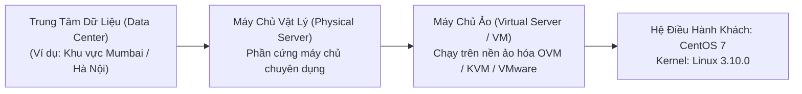
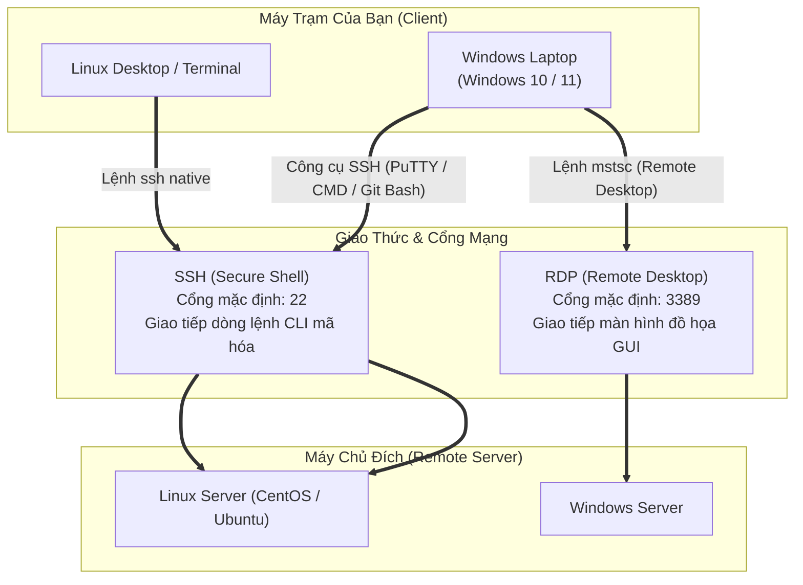

# 06 - Kết Nối Máy Chủ Linux Từ Xa Bằng PuTTY

> [!abstract] Mục Tiêu Bài Học
> - Hiểu rõ vị trí đặt máy chủ (**Data Center**) và sự khác biệt giữa **Physical Server** (máy chủ vật lý) và **Virtual Server** (máy chủ ảo).
> - Phân biệt các giao thức kết nối từ xa phổ biến: **SSH (Port 22)** cho Linux và **RDP (Port 3389)** cho Windows.
> - Nắm vững các công cụ kết nối từ Windows sang Linux: **PuTTY**, **MobaXterm**, **Git Bash** và **OpenSSH tích hợp sẵn** trên Windows 10/11.
> - Thực hành cấu hình kết nối vào máy chủ CentOS 7 và nắm bắt các lưu ý kỹ thuật thực tế về mạng và bảo mật SSH.

---

## 1. Máy Chủ Nằm Ở Đâu? (Data Center)

Trong môi trường doanh nghiệp, máy chủ không đặt tại văn phòng làm việc thông thường mà được quy hoạch tập trung tại các **Trung tâm dữ liệu (Data Center)** — nơi đảm bảo nguồn điện dự phòng (UPS/Máy phát), hệ thống làm mát công nghiệp và bảo mật vật lý 24/7.



| Khái Niệm | Giải Thích Chi Tiết |
| :--- | :--- |
| **Physical Server (Máy chủ vật lý)** | Thiết bị phần cứng thật (CPU, RAM, Mainboard server chuyên dụng), lắp trên các tủ Rack trong Data Center. |
| **Virtual Server (Máy chủ ảo)** | Máy ảo chạy trên nền tảng ảo hóa (VirtualBox, VMware, KVM, OVM), chia sẻ tài nguyên từ máy vật lý. |

> [!NOTE] Phân tích dải IP trong bài lab
> Trong video, giảng viên kết nối tới IP `192.168.56.111`. Đây là dải mạng **Host-Only Adapter** mặc định của Oracle VirtualBox (kết nối nội bộ giữa máy tính Windows của bạn và máy ảo trên cùng máy đó).  
> **Thực tế Production:** Nếu máy chủ thực sự nằm tại Data Center từ xa (như ví dụ Mumbai - Hyderabad trong bài giảng), bạn phải kết nối qua **Public IP** hoặc thông qua đường truyền mạng riêng ảo **VPN / Bastion Host**.

---

## 2. Kernel Là Gì?

**Kernel (Nhân hệ điều hành)** là thành phần cốt lõi nhất ("trái tim") của hệ điều hành Linux:
- **Cầu nối trung gian:** Giao tiếp trực tiếp giữa phần cứng (CPU, RAM, Ổ cứng, Card mạng) và các ứng dụng/phần mềm người dùng.
- **Quản lý tài nguyên:** Phân phối bộ nhớ, điều phối tiến trình và xử lý ngắt phần cứng.
- **Phiên bản trong bài:** `CentOS Linux 3.10.0` (phiên bản kernel chuẩn ổn định mặc định của CentOS 7).

---

## 3. Các Giao Thức Kết Nối Từ Xa Cốt Lõi



| Kịch Bản Kết Nối | Giao Thức Sử Dụng | Cổng (Port) Mặc Định | Phương Thức Truy Cập |
| :--- | :--- | :--- | :--- |
| **Linux → Linux** | **SSH** (Secure Shell) | **22** | Mở Terminal gõ lệnh `ssh` |
| **Windows → Windows** | **RDP** (Remote Desktop Protocol) | **3389** | Mở công cụ `mstsc` (Remote Desktop Connection) |
| **Windows → Linux** | **SSH** qua công cụ hỗ trợ | **22** | Dùng PuTTY, MobaXterm hoặc CMD/PowerShell |

---

## 4. SSH Là Gì & Các Công Cụ Kết Nối

### 4.1. Bản chất của SSH
* **SSH = Secure Shell:** Giao thức mạng cho phép người quản trị đăng nhập và điều khiển dòng lệnh (*CLI*) của máy chủ từ xa một cách bảo mật.
* **Cơ chế:** Toàn bộ dữ liệu truyền tải (bao gồm tên đăng nhập, mật khẩu và nội dung lệnh) đều được mã hóa, ngăn chặn hoàn toàn nguy cơ bị nghe lén trên đường truyền mạng (khắc phục nhược điểm mất an toàn của giao thức Telnet cũ).

### 4.2. Bảng so sánh các công cụ kết nối SSH trên Windows

| Công Cụ | Phân Loại | Ưu Điểm Nổi Bật | Trường Hợp Sử Dụng |
| :--- | :--- | :--- | :--- |
| **Windows Built-in OpenSSH** | Có sẵn trên OS | Tích hợp sẵn trong CMD/PowerShell trên Windows 10/11, không cần cài đặt thêm. | Kết nối nhanh, thao tác qua terminal tiện lợi. |
| **PuTTY** | Phần mềm bên thứ ba | Giao diện đồ họa (GUI) kinh điển, cực nhẹ, dễ đổi font/màu sắc, hoàn toàn miễn phí. | Dành cho người mới bắt đầu học quản trị Linux. |
| **MobaXterm** | Phần mềm bên thứ ba | Hỗ trợ nhiều tab, tích hợp sẵn cửa sổ SFTP kéo thả file đồ họa, hỗ trợ X11 forwarding. | Rất phổ biến và được ưa chuộng trong môi trường DevOps. |
| **mRemoteNG** | Phần mềm bên thứ ba | Quản trị tập trung nhiều kết nối cùng lúc (hỗ trợ cả SSH, RDP, VNC). | Quản lý đồng thời hệ thống gồm nhiều server hỗn hợp. |
| **Git Bash** | Đi kèm Git | Giả lập môi trường Unix trên Windows, gõ lệnh `ssh` quen thuộc như trên Linux. | Thích hợp cho lập trình viên đã cài sẵn Git. |

> [!IMPORTANT] Đính chính kỹ thuật hiện đại (Windows 10 & 11)
> Trong video bài giảng, giảng viên nhấn mạnh: *"Vì Windows và Linux khác nền tảng nên Windows bắt buộc phải dùng phần mềm bên thứ ba"*.  
> **Thực tế kỹ thuật:** Kể từ bản cập nhật Windows 10 (bản 1809) và Windows 11, Microsoft đã tích hợp sẵn **OpenSSH Client**. Bạn chỉ cần mở **PowerShell** hoặc **Command Prompt (CMD)** là có thể gõ lệnh `ssh` kết nối trực tiếp mà không bắt buộc phải cài PuTTY.

---

## 5. Hướng Dẫn Thực Hành Kết Nối Chi Tiết

### Cách 1: Kết nối bằng PuTTY (Phương pháp trong video)
1. **Tải và cài đặt:**
   - Truy cập trang web chính thức: [https://www.putty.org](https://www.putty.org)
   - Chọn gói cài đặt MSI bản **64-bit x86** (phù hợp Windows hiện đại).
   - Cài đặt theo luồng chuẩn: `Next` → `Next` → `Next` → `Install`.
2. **Cấu hình phiên kết nối:**
   - Khởi động **PuTTY**.
   - Tại mục **Host Name (or IP address)**: Nhập IP máy chủ (ví dụ trong bài: `192.168.56.111`).
   - Tại mục **Port**: Đảm bảo cổng là `22`.
   - Tại mục **Connection type**: Chọn `SSH`.
3. **Tùy chỉnh giao diện (Optional):**
   - Vào menu bên trái: `Window` → `Appearance` → bấm nút `Change...` tại mục Font settings để chỉnh cỡ chữ lớn (ví dụ: Font Consolas, Bold, 16pt - 18pt).
4. **Đăng nhập:**
   - Bấm **Open**. Nếu là lần đầu kết nối, PuTTY sẽ hiện cảnh báo *Host Key Verification* → bấm **Accept**.
   - Nhập thông tin đăng nhập:
     - `login as:` `root`
     - `Password:` *(Nhập mật khẩu - con trỏ chuột trên Linux sẽ ẩn đi vì lý do bảo mật, bạn cứ gõ bình thường rồi bấm Enter)*.

---

### Cách 2: Kết nối bằng Terminal (PowerShell / CMD / Git Bash)
Mở cửa sổ dòng lệnh và gõ cú pháp chuẩn:

```bash
# Cú pháp tổng quát:
ssh <tên_người_dùng>@<địa_chỉ_IP>

# Ví dụ kết nối vào bài lab:
ssh root@192.168.56.111

# Nếu máy chủ dùng cổng SSH tùy chỉnh khác cổng 22 (ví dụ cổng 2222):
ssh -p 2222 root@192.168.56.111
```

---

## 6. Cheatsheet Lệnh & Thao Tác Nhanh

| Lệnh / Thao Tác | Môi Trường | Ý Nghĩa Kỹ Thuật |
| :--- | :--- | :--- |
| `ssh user@IP` | Terminal / CMD / Git Bash | Kết nối dòng lệnh SSH tới máy chủ Linux |
| `ssh -p <port> user@IP` | Terminal / CMD / Git Bash | Kết nối SSH với cổng tùy biến (khác 22) |
| `mstsc` | Hộp thoại Windows `Win + R` | Mở ứng dụng Remote Desktop Connection kết nối máy chủ Windows qua RDP |
| `uname -r` | Trên máy chủ Linux | Lệnh kiểm tra phiên bản kernel hiện tại (ví dụ: `3.10.0-...`) |
| `ip addr` hoặc `ifconfig` | Trên máy chủ Linux | Lệnh xem địa chỉ IP của các card mạng |

---

> [!tip] Best Practices Cho Quản Trị Hệ Thống & Cloud / DevOps
> Trong môi trường doanh nghiệp và các nền tảng đám mây (AWS, Azure, Viettel Cloud):
> 1. **Cấm đăng nhập trực tiếp quyền `root` qua SSH:**  
>    Để tránh bị tấn công dò quét mật khẩu (*Brute-force attack*), file cấu hình `/etc/ssh/sshd_config` luôn được thiết lập:
>    ```text
>    PermitRootLogin no
>    ```
>    Quản trị viên đăng nhập bằng tài khoản người dùng thông thường, sau đó dùng lệnh `sudo -i` để thực thi quyền quản trị.
> 2. **Xác thực bằng SSH Key Pair (Khóa công khai & bí mật):**  
>    Không dùng mật khẩu thông thường. Người dùng tạo cặp khóa `ssh-keygen`:
>    - Khóa công khai (`id_rsa.pub`) đưa lên server đặt tại file `~/.ssh/authorized_keys`.
>    - Khóa bí mật (`id_rsa` hoặc file `.pem`) lưu an toàn trên máy cá nhân.
> 3. **Thay đổi cổng SSH mặc định:**  
>    Nhiều hệ thống đổi cổng SSH từ `22` sang một cổng ngẫu nhiên (ví dụ `2222` hoặc `52222`) để giảm thiểu các bot tự động quét cổng trên Internet.

---

## 7. Câu Hỏi Tự Kiểm Tra (Review Checklist)

- [ ] SSH viết tắt của từ gì? Cổng mạng (*Port*) mặc định của SSH là bao nhiêu?
- [ ] Sự khác biệt cơ bản giữa máy chủ vật lý (*Physical Server*) và máy chủ ảo (*Virtual Server*) là gì?
- [ ] Giao thức RDP hoạt động trên cổng nào và được dùng trong trường hợp nào?
- [ ] Trên Windows 10/11 hiện nay, bạn có bắt buộc phải cài đặt PuTTY để kết nối SSH hay không? Nếu không, bạn dùng công cụ nào có sẵn?
- [ ] Dải IP `192.168.56.x` thuộc loại mạng nào và tại sao không thể định tuyến trực tiếp qua Internet?

---
[[07 - Complete Linux Commands & Kernel Guide for Beginners]]
