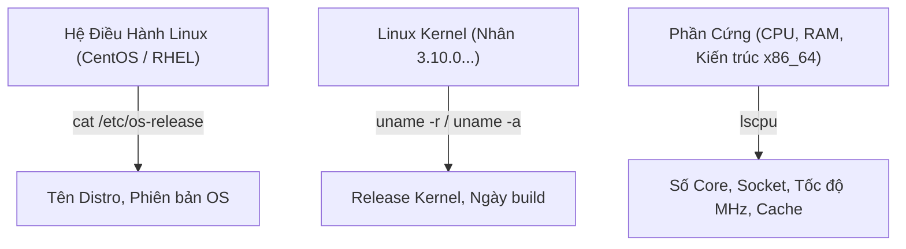
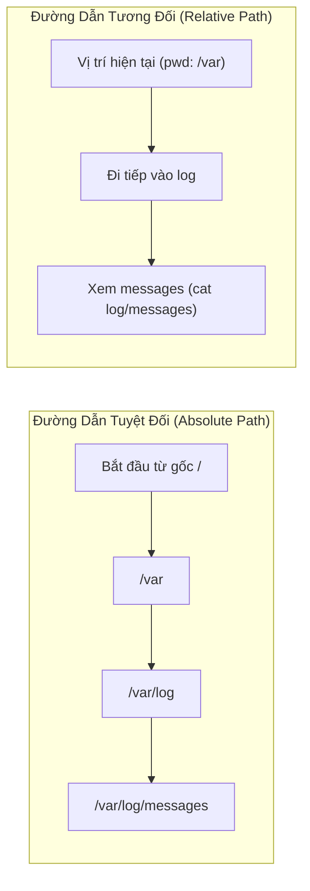

# 07 - Complete Linux Commands & Kernel Guide for Beginners

> [!abstract] Mục Tiêu Bài Học
> - Nắm vững phương pháp tra cứu thông tin hệ thống, CPU và phiên bản Linux Kernel (`uname`, `lscpu`, `/etc/os-release`).
> - Phân biệt bản chất và trường hợp sử dụng giữa **Đường dẫn tuyệt đối (Absolute Path)** và **Đường dẫn tương đối (Relative Path)**.
> - Thành thạo kỹ thuật điều hướng (`cd`, `pwd`), kỹ thuật tạo thư mục hàng loạt (*Brace Expansion*) và cây thư mục đệ quy (`mkdir -p`).
> - Mổ xẻ chi tiết lệnh `ls`, hiểu cách phân loại định dạng file (`-`, `d`, `l`) và làm chủ các cờ thực chiến như `ls -lrt`.

---

## 1. Kiểm Tra Thông Tin Hệ Thống & Kernel

Trong môi trường máy chủ Linux không có giao diện đồ họa (GUI), toàn bộ việc nhận diện hệ điều hành và phần cứng đều thực hiện qua dòng lệnh:



### 1.1. Tra cứu Kernel
* **`uname -r`**: In ra chính xác phiên bản Kernel đang chạy (ví dụ: `3.10.0-1160.el7.x86_64`).
* **`uname -a`**: In toàn bộ thông tin hệ thống gồm: Tên hệ điều hành (`Linux`), Hostname, phiên bản Kernel, kiến trúc phần cứng (`x86_64`).

### 1.2. Tra cứu bản phân phối hệ điều hành (Distribution)
* **`cat /etc/os-release`**: Chuẩn hiện đại trên hầu hết các bản phân phối Linux (Ubuntu, Debian, CentOS, RHEL, Rocky Linux, Alpine).
* **`cat /etc/redhat-release`**: Tệp tin chuyên biệt cho hệ sinh thái Red Hat (RHEL, CentOS, Fedora, Oracle Linux, Amazon Linux).

### 1.3. Tra cứu phần cứng CPU & Tiện ích Shell
* **`lscpu`**: Hiển thị bảng chi tiết kiến trúc CPU (Số core, socket, thread, virtualization flag, bộ nhớ đệm L1/L2/L3).
* **`clear`** hoặc tổ hợp phím **`Ctrl + L`**: Xóa sạch màn hình terminal để làm việc gọn gàng.
* **Ký tự `#` (Comment):** Mọi văn bản đứng sau dấu `#` trên terminal hoặc trong script sẽ bị Shell bỏ qua, không thực thi.

---

## 2. Đường Dẫn Tuyệt Đối vs Đường Dẫn Tương Đối

Mọi thao tác gọi file và chuyển thư mục trong Linux đều vận hành theo 2 cơ chế đường dẫn:



| Tiêu Chí | Đường Dẫn Tuyệt Đối (Absolute Path) | Đường Dẫn Tương Đối (Relative Path) |
| :--- | :--- | :--- |
| **Điểm bắt đầu** | Luôn bắt đầu bằng dấu gạch chéo gốc **`/`** (Root). | Bắt đầu từ vị trí thư mục hiện hành (**`pwd`**). |
| **Phụ thuộc vị trí** | **Không phụ thuộc.** Đang đứng ở bất kỳ đâu đều gọi được chính xác file đích. | **Có phụ thuộc.** Kết quả phụ thuộc vào việc bạn đang đứng ở thư mục nào. |
| **Ví dụ câu lệnh** | `cat /var/log/messages`<br>`cd /etc/ansible` | `cat messages` (nếu đang ở `/var/log`)<br>`cd ../etc` (lùi 1 cấp rồi vào etc) |
| **Ký hiệu đặc biệt** | Bắt đầu bằng `/` | `.` (thư mục hiện tại)<br>`..` (thư mục cha) |
| **Ứng dụng thực tế** | **Bắt buộc dùng trong Shell Script, Cron Job, Systemd Service** để tránh lỗi sai ngữ cảnh khi chạy nền tự động. | Dùng khi thao tác tương tác tay trên Terminal để gõ lệnh nhanh. |

---

## 3. Quản Trị & Điều Hướng Thư Mục (`pwd`, `cd`, `mkdir`)

### 3.1. Điều hướng với `cd` (Change Directory)
* **`pwd`** *(Print Working Directory)*: In ra đường dẫn đầy đủ của thư mục hiện bạn đang đứng.
* **`cd /duong/dan`**: Di chuyển đến một thư mục chỉ định.
* **`cd ..`**: Lùi về 1 cấp thư mục cha.
* **`cd ../..`**: Lùi về 2 cấp thư mục cha (có thể lùi nhiều cấp bằng cách ghép `../../..`).
* **`cd -`**: **Quay lại thư mục làm việc gần nhất trước đó** (tương tự nút "Back", cực kỳ tiện khi nhảy qua lại giữa 2 thư mục đường dẫn dài).
* **`cd`** (không tham số) hoặc **`cd ~`**: Nhảy ngay về thư mục Home của người dùng hiện tại (với `root` là `/root`, với user thường là `/home/<username>`).

### 3.2. Tạo thư mục với `mkdir` (Make Directory)
* **Tạo một hoặc nhiều thư mục:**
  ```bash
  mkdir dir1 dir2 dir3
  ```
* **Tạo cây thư mục đệ quy cha - con (`-p` / parents):**
  Nếu các thư mục cha chưa tồn tại, cờ `-p` sẽ tự động tạo toàn bộ chuỗi cây thư mục mà không báo lỗi:
  ```bash
  mkdir -p /root/project/app/module1
  ```
* **Kỹ thuật Brace Expansion (Tạo hàng loạt theo dải số/chữ cái):**
  Tạo hàng chục hoặc hàng trăm thư mục chỉ với một lệnh duy nhất:
  ```bash
  # Tạo 52 thư mục từ week-1 đến week-52:
  mkdir week-{1..52}

  # Tạo 30 thư mục từ day-1 đến day-30:
  mkdir day-{1..30}

  # Tạo các thư mục theo chữ cái:
  mkdir team-{A..E}
  ```

---

## 4. Mổ Xẻ Chi Tiết Lệnh `ls` & Nhận Diện Loại File

Lệnh **`ls`** *(List)* dùng để liệt kê danh sách tệp tin và thư mục.

### 4.1. Các cờ (Options) thực chiến quan trọng của `ls`

| Lệnh / Cờ | Ý Nghĩa Kỹ Thuật | Ứng Dụng Thực Tế |
| :--- | :--- | :--- |
| `ls` | Liệt kê tên file/thư mục theo hàng ngang, xếp theo bảng chữ cái. | Xem nhanh nội dung thư mục. |
| `ls -l` *(hoặc alias `ll`)* | Hiển thị dạng danh sách chi tiết dài (Long listing format). | Xem quyền hạn, owner, dung lượng, ngày sửa đổi. |
| `ls -a` | Hiển thị **tất cả**, bao gồm cả **file ẩn** (bắt đầu bằng dấu chấm `.`). | Tìm file cấu hình hệ thống (`.bashrc`, `.ssh`). |
| `ls -la` *(hoặc `ls -al`)* | Kết hợp: danh sách chi tiết + hiển thị cả file ẩn. | Quản trị viên sử dụng thường xuyên nhất. |
| `ls -t` | Sắp xếp theo thời gian sửa đổi mới nhất lên đầu. | Tìm file mới được cập nhật. |
| `ls -r` | Đảo ngược thứ tự sắp xếp (*Reverse*). | Dùng kết hợp với các cờ khác. |
| `ls -lrt` | **Danh sách chi tiết, sắp theo thời gian và đảo ngược.** | ⭐ **Bảo bối SysAdmin:** Đưa file/log vừa mới ghi xuống **dưới cùng màn hình**, không phải cuộn chuột tìm kiếm. |

### 4.2. Giải mã ký tự đầu tiên trong kết quả `ls -l` (File Type)

Khi chạy lệnh `ls -l`, ký tự đầu tiên của chuỗi 10 ký tự quyền hạn biểu thị **loại tệp tin**:

```text
drwxr-xr-x. 2 root root 4096 Sep  8 10:00 my_folder
-rw-r--r--. 1 root root  220 Sep  8 10:05 my_file.txt
lrwxrwxrwx. 1 root root   15 Sep  8 10:10 my_link -> /etc/hosts
▲
│
└─── Ký tự định danh loại File
```

| Ký Tự Đầu | Loại File | Giải Thích & Ví Dụ |
| :---: | :--- | :--- |
| **`-`** | **Regular File** (File thông thường) | File văn bản (`.txt`, `.log`), file thực thi binary, file ảnh, script. |
| **`d`** | **Directory** (Thư mục) | Chứa các file và thư mục con khác bên trong. |
| **`l`** | **Symbolic Link** (Liên kết mềm / Symlink) | Phím tắt (*shortcut*) trỏ đến một file/thư mục khác (có mũi tên `link -> target`). |

---

## 5. Cheatsheet Lệnh Nhanh Trong Bài

| Câu Lệnh | Chức Năng |
| :--- | :--- |
| `uname -r` | Kiểm tra phiên bản Kernel Linux |
| `uname -a` | Xem toàn bộ thông tin kiến trúc OS & Kernel |
| `cat /etc/os-release` | Kiểm tra phiên bản hệ điều hành chuẩn mọi distro |
| `cat /etc/redhat-release` | Kiểm tra phiên bản OS họ Red Hat (CentOS, RHEL) |
| `lscpu` | Xem thông số chi tiết CPU và phần cứng |
| `whoami` | Xem tên tài khoản đang đăng nhập hiện tại |
| `who` | Xem danh sách người dùng đang mở session vào server |
| `man <command>` | Mở sách hướng dẫn chi tiết của lệnh (bấm `q` để thoát) |
| `pwd` | In đường dẫn thư mục làm việc hiện hành |
| `cd -` | Nhảy về thư mục làm việc ngay trước đó |
| `cd ~` | Nhảy về thư mục Home của người dùng |
| `mkdir -p a/b/c` | Tạo đệ quy cây thư mục cha và con |
| `mkdir test-{1..10}` | Tạo tự động 10 thư mục từ `test-1` đến `test-10` |
| `ls -lrt` | Liệt kê file chi tiết, xếp file mới nhất xuống cuối cùng |

---

> [!tip] Góc Kỹ Thuật Viettel Cloud & Phỏng Vấn Tuyển Dụng
> 1. **Câu hỏi phỏng vấn Viettel:** *"Khi một tiến trình hoặc dịch vụ web bị lỗi lúc 14:00, bạn dùng lệnh gì để xác định file log nào vừa được sinh ra trong thư mục `/var/log`?"*  
>    👉 **Trả lời ăn điểm:** Dùng lệnh `ls -lrt /var/log`. Các file log được ghi mới nhất sẽ được đẩy xuống dòng cuối cùng ngay trước dấu nhắc lệnh, giúp kỹ sư phát hiện ngay file log liên quan mà không mất công tìm kiếm.
> 2. **File ẩn trong Linux:**  
>    Mọi file bắt đầu bằng dấu chấm (ví dụ: `.bash_profile`, `.ssh/authorized_keys`) đều là file ẩn. Mục đích là để ẩn các tệp cấu hình quan trọng khỏi tầm mắt khi dùng lệnh `ls` thông thường, tránh thao tác xóa nhầm. Phải dùng `ls -a` hoặc `ls -la` mới thấy.
> 3. **Quy tắc vàng trong Bash Automation:**  
>    Không bao giờ sử dụng đường dẫn tương đối (`cd app; ./start.sh`) trong các tiến trình chạy nền như **Crontab** hoặc **Systemd Service Unit**, vì môi trường cron không mặc định chạy từ thư mục của bạn. Luôn sử dụng đường dẫn tuyệt đối: `/usr/bin/python3 /opt/app/start.py`.

---

## 6. Câu Hỏi Tự Kiểm Tra (Review Checklist)

- [ ] Lệnh nào dùng để in ra chính xác phiên bản Kernel của máy chủ Linux?
- [ ] Sự khác biệt sống còn giữa đường dẫn tuyệt đối và đường dẫn tương đối là gì? Khi nào bắt buộc dùng tuyệt đối?
- [ ] Lệnh `cd -` có chức năng gì trong quá trình thao tác quản trị?
- [ ] Viết một lệnh duy nhất để tạo ra 100 thư mục có tên từ `student-01` đến `student-100`? *(Gợi ý: `mkdir student-{1..100}`)*
- [ ] Trong kết quả của lệnh `ls -l`, ký tự đầu tiên `-`, `d`, `l` biểu thị điều gì?
- [ ] Tại sao `ls -lrt` lại được coi là câu lệnh tra cứu log "bảo bối" của các kỹ sư vận hành hệ thống?

---
[[08. Essential Linux Commands – Hands-On]]
