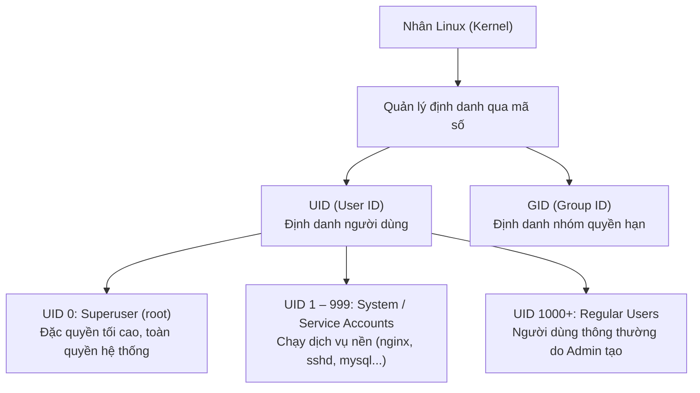
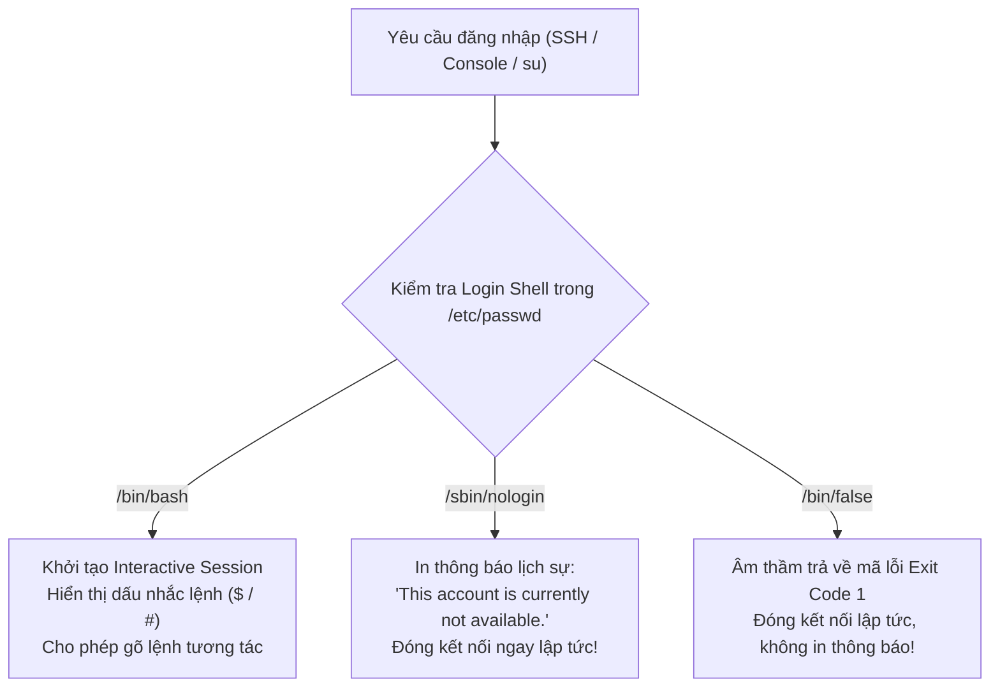
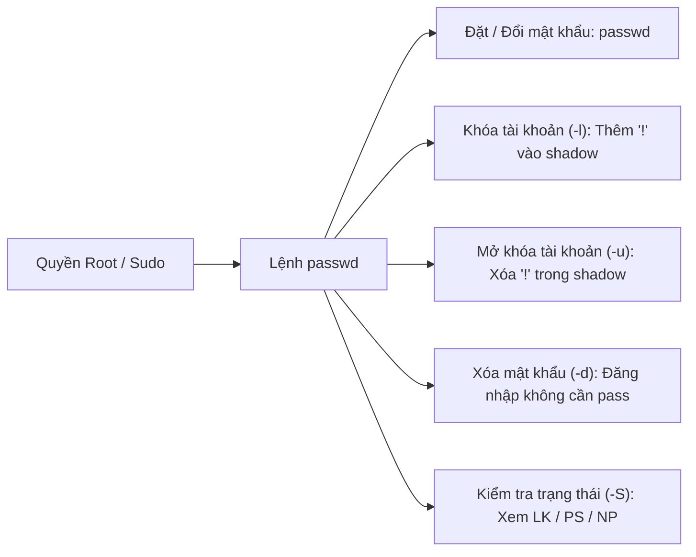

---
course: Linux From Beginner to System Administrator
module: "10 - Linux User Administration UID, GID, Groups, Shells & Account Security"
tags:
  - linux
  - user-management
  - uid
  - gid
  - groups
  - shells
  - account-security
  - sysadmin
  - devops
date: 2026-09-10
status: done
---

# 10 - Quản Trị Người Dùng Linux: UID, GID, Nhóm, Shell & Bảo Mật Tài Khoản
*Bản chất định danh người dùng, phân tách quyền hạn, kiểm soát shell đăng nhập và bảo mật tài khoản chuẩn Enterprise*

> [!abstract] Mục Tiêu Bài Học
> - **Nắm vững hệ thống định danh Linux:** Hiểu rõ cấu trúc và dải phân vùng của **UID (User ID)** và **GID (Group ID)** từ `root` (UID 0), tài khoản hệ thống (1 – 999) đến người dùng thông thường (1000+).
> - **Phân biệt rạch ròi Nhóm Chính vs Nhóm Phụ:** Cơ chế gán quyền hạn qua Primary Group (`-g`) và Secondary/Supplementary Groups (`-G`).
> - **Hiểu sâu về Shell & Cơ chế `/sbin/nologin`:** Phân biệt Interactive Shell (`/bin/bash`) và Non-login Shell (`/sbin/nologin`), lý do bảo mật tại sao tài khoản dịch vụ hệ thống bắt buộc phải gán `nologin`.
> - **Thành thạo công cụ quản trị người dùng:** Sử dụng linh hoạt lệnh `useradd`, `groupadd` kèm đầy đủ tham số (`-u`, `-g`, `-G`, `-d`, `-c`, `-s`) và lệnh quản lý mật khẩu `passwd` (`-l`, `-u`, `-d`, `-S`).
> - **Giải mã các tệp cơ sở dữ liệu tài khoản cốt lõi:** Phân tích từng trường trong `/etc/passwd`, `/etc/shadow`, `/etc/group` và `/etc/shells`.

---

## 1. Bản Chất Định Danh Trong Linux: User, UID & GID

Trong Linux, hệ điều hành **không nhận diện người dùng bằng tên chữ cái** (như `root`, `john`, `devops`), mà giao tiếp hoàn toàn thông qua các con số nguyên dương gọi là **UID (User Identifier)** và **GID (Group Identifier)**.



### 1.1. Phân loại dải UID chuẩn trên Linux (RHEL / CentOS 7+ & Ubuntu)

| Dải UID | Loại Tài Khoản | Shell Mặc Định | Mục Đích Sử Dụng |
| :--- | :--- | :--- | :--- |
| **`0`** | **Root (Superuser)** | `/bin/bash` | Tài khoản quản trị tối cao, can thiệp mọi tệp tin và tiến trình. |
| **`1 – 999`** *(CentOS 7+)*<br>**`1 – 499`** *(CentOS 6)* | **System / Service Accounts** | `/sbin/nologin`<br>hoặc `/bin/false` | Chạy các tiến trình dịch vụ (`sshd`, `mail`, `ftp`, `chrony`, `systemd`). Tuyệt đối không cho phép con người đăng nhập trực tiếp. |
| **`1000+`** *(CentOS 7+)*<br>**`500+`** *(CentOS 6)* | **Regular Users (Người dùng thường)** | `/bin/bash` | Các tài khoản cấp cho kỹ sư, lập trình viên để làm việc tương tác. |

> [!NOTE] Lưu ý về quy ước dải UID giữa các phiên bản Linux
> Trên hệ điều hành cũ (CentOS 6 trở về trước), UID người dùng thường bắt đầu từ `500`. Từ phiên bản **CentOS 7 / RHEL 7** và Ubuntu hiện đại, quy chuẩn được nâng lên bắt đầu từ **`1000`** để dành thêm không gian cho các tài khoản dịch vụ hệ sinh thái ngày càng mở rộng.

---

### 1.2. Phân biệt Primary Group vs Secondary (Supplementary) Group

Một người dùng trong Linux có thể thuộc về **duy nhất 1 Nhóm chính** nhưng có thể tham gia vào **nhiều Nhóm phụ**:

```mermaid
flowchart LR
    subgraph User["Người dùng: user3 (UID: 1003)"]
        direction TB
    end

    User ===|Gán qua cờ -g (Chỉ 1 nhóm)| PG["Primary Group: linuxcng (GID: 1003)<br>Mặc định sở hữu khi user tạo file mới"]
    User -.->|Gán qua cờ -G (Nhiều nhóm)| SG1["Secondary Group: devops (GID: 2001)<br>Quyền truy cập dự án DevOps"]
    User -.->|Gán qua cờ -G| SG2["Secondary Group: docker (GID: 998)<br>Quyền chạy lệnh Docker không cần sudo"]
    User -.->|Gán qua cờ -G| SG3["Secondary Group: wheel (GID: 10)<br>Quyền thực thi lệnh sudo"]
```

| Tiêu chí | Primary Group (Nhóm chính) | Secondary Group (Nhóm phụ / bổ sung) |
| :--- | :--- | :--- |
| **Tham số khi tạo** | Cờ **`-g`** (thường viết thường). | Cờ **`-G`** (bắt buộc viết hoa). |
| **Số lượng** | **Chỉ đúng 1 nhóm duy nhất** cho mỗi user. | **Nhiều nhóm** (ngăn cách bằng dấu phẩy `,`). |
| **Quyền sở hữu tệp tin** | Khi user tạo file/thư mục mới, **Group Owner** của file đó mặc định thuộc về Primary Group. | Dùng để cấp phát quyền hạn bổ sung (quyền đọc ghi folder chung, quyền chạy docker, quyền sudo qua nhóm `wheel`). |
| **Vị trí lưu trữ** | Cột thứ 4 trong file `/etc/passwd`. | Danh sách thành viên ở cột thứ 4 trong file `/etc/group`. |

---

## 2. Giải Mã Các Tệp Cấu Hình Tài Khoản Cốt Lõi

Linux lưu trữ toàn bộ cơ sở dữ liệu người dùng và mật khẩu dưới dạng các tệp văn bản thuần (Plain-text flat files) trong thư mục `/etc`.

### 2.1. Tệp `/etc/passwd` (Cơ sở dữ liệu người dùng)
- **Quyền hạn tệp:** `rw-r--r--` (`644`) — Tất cả tiến trình và người dùng trên hệ thống đều có quyền đọc file này để phân giải UID thành username.
- **Cấu trúc 7 trường:** Mỗi dòng đại diện cho một user, các trường ngăn cách bởi dấu hai chấm (`:`).

```text
user2 : x : 5050 : 1001 : DevOps Engineer : /home/user2 : /bin/bash
  [1]  [2]   [3]    [4]          [5]             [6]         [7]
```

1. **`[1] Username`**: Tên đăng nhập của tài khoản (`user2`).
2. **`[2] Password placeholder`**: Ký tự `x` chỉ thị rằng mật khẩu đã được mã hóa an toàn và chuyển sang lưu trữ tại `/etc/shadow`.
3. **`[3] UID`**: Mã số định danh người dùng (`5050`).
4. **`[4] GID`**: Mã số nhóm chính (Primary Group ID: `1001`).
5. **`[5] GECOS / Comment`**: Thông tin mô tả, tên thật, phòng ban (`DevOps Engineer`).
6. **`[6] Home Directory`**: Đường dẫn thư mục cá nhân (`/home/user2`).
7. **`[7] Login Shell`**: Shell được khởi chạy khi đăng nhập (`/bin/bash`).

---

### 2.2. Tệp `/etc/shadow` (Cơ sở dữ liệu mật khẩu & Bảo mật)
- **Quyền hạn tệp:** `----------` (`000`) hoặc `r--------` (`400`/`640` thuộc sở hữu của `root`) — **Chỉ duy nhất tiến trình root mới có quyền đọc**, ngăn chặn triệt để người dùng thường tiếp cận chuỗi băm mật khẩu.
- **Cấu trúc 9 trường:**

```text
user2 : $6$rounds=5000$... : 19800 : 0 : 90 : 7 :   :   : 
 [1]              [2]         [3]   [4]  [5]  [6] [7] [8] [9]
```

1. **`[1] Username`**: Tên người dùng.
2. **`[2] Encrypted Password`**: Chuỗi băm mật khẩu (tiền tố `$6$` là SHA-512, `$1$` là MD5, `$y$` là Yescrypt). Nếu có dấu `!` hoặc `*` ở đầu, tài khoản đang bị **KHÓA (Locked)**.
3. **`[3] Last password change`**: Số ngày tính từ ngày 01/01/1970 (Epoch) đến lần đổi pass gần nhất.
4. **`[4] Min days`**: Số ngày tối thiểu phải chờ trước khi được phép đổi lại mật khẩu (`0` = đổi lúc nào cũng được).
5. **`[5] Max days`**: Số ngày mật khẩu có hiệu lực (`90` = sau 90 ngày phải đổi pass).
6. **`[6] Warning days`**: Số ngày cảnh báo trước khi mật khẩu hết hạn (`7` = cảnh báo trước 7 ngày).
7. **`[7] Inactive days`**: Số ngày tài khoản bị vô hiệu hóa sau khi mật khẩu hết hạn mà không đổi.
8. **`[8] Expiration date`**: Ngày tài khoản bị vô hiệu hóa hoàn toàn.
9. **`[9] Reserved`**: Trường dành riêng cho phát triển trong tương lai.

---

### 2.3. Tệp `/etc/group` (Cơ sở dữ liệu nhóm)
- **Cấu trúc 4 trường:**
  ```text
  devops : x : 2001 : user3,user5,user7
    [1]   [2]   [3]            [4]
  ```
  1. `[1] Group Name`: Tên nhóm.
  2. `[2] Group Password`: Ký tự `x` (hiếm khi đặt pass cho nhóm).
  3. `[3] GID`: Mã số nhóm.
  4. `[4] Group Members`: Danh sách các user tham gia nhóm này với vai trò **nhóm phụ (Secondary Group)**.

---

## 3. Bản Chất Về Shell: Interactive Shell vs `/sbin/nologin`

### 3.1. Shell là gì?
**Shell** là chương trình phiên dịch dòng lệnh (Command Interpreter) đóng vai trò làm cầu nối giữa người dùng và nhân Linux (Kernel). Khi bạn gõ một lệnh, Shell đọc, kiểm tra cú pháp, gọi System Call xuống Kernel để thực thi phần cứng và trả kết quả về màn hình.

- Lệnh kiểm tra shell hiện tại đang hoạt động:
  ```bash
  echo $SHELL
  ```
  *Kết quả thường thấy:* `/bin/bash`
- Lệnh kiểm tra danh sách tất cả các shell hợp lệ được cài đặt trên hệ điều hành:
  ```bash
  cat /etc/shells
  ```
  *Danh sách xuất ra:*
  ```text
  /bin/sh
  /bin/bash
  /usr/bin/sh
  /usr/bin/bash
  /bin/tcsh
  /bin/csh
  ```

---

### 3.2. So sánh `/bin/bash` vs `/sbin/nologin` vs `/bin/false`

Trong video bài giảng, giảng viên nhấn mạnh sự khác biệt giữa shell thông thường và shell dịch vụ:



| Tiêu chí | `/bin/bash` | `/sbin/nologin` | `/bin/false` |
| :--- | :--- | :--- | :--- |
| **Loại Shell** | **Interactive Login Shell** | **Non-login Shell** (Có thông báo) | **Non-login Shell** (Im lặng) |
| **Khả năng đăng nhập**| Cho phép đăng nhập bình thường qua SSH, Console, Terminal. | **Chặn hoàn toàn** việc đăng nhập tương tác. | **Chặn hoàn toàn** việc đăng nhập tương tác. |
| **Hành vi khi login** | Cung cấp dấu nhắc lệnh (`bash$`) để người dùng tương tác. | In dòng chữ: *"This account is currently not available."* rồi ngắt phiên. | Thoát ngay lập tức với mã lỗi `1` mà không in bất kỳ thông báo nào. |
| **Đối tượng áp dụng** | Sysadmin, Developers, End-users cần làm việc trên hệ thống. | **Service accounts** (`sshd`, `nginx`, `ftp`, `postfix`, `mysql`). | Các tài khoản bị khóa cứng hoặc các daemon siêu nhạy cảm. |

> [!TIP] Góc nhìn Bảo Mật & Hardening (Account Security)
> **Tại sao Service Accounts (UID 1 - 999) bắt buộc phải mang shell `/sbin/nologin`?**  
> Các dịch vụ mạng như Nginx, Apache, MySQL chỉ cần một user định danh trên hệ thống để sở hữu tiến trình và kiểm soát quyền truy cập tệp tin theo nguyên tắc đặc quyền tối thiểu (*Principle of Least Privilege*).  
> Nếu hacker phát hiện lỗ hổng thực thi mã từ xa (RCE) trên ứng dụng Web và cố gắng "spawn" một interactive reverse shell để gõ lệnh chiếm quyền điều khiển server, nhân Linux sẽ phát hiện user này mang shell `/sbin/nologin` và **chặn đứng cuộc tấn công ngay lập tức!**

---

## 4. Thực Hành Quản Trị Người Dùng & Nhóm (Hands-on CLI)

### 4.1. Lệnh tạo người dùng `useradd` & Các tham số quan trọng

Cú pháp tổng quát:
```bash
useradd [OPTIONS] <username>
```

#### Bảng tổng hợp các cờ (Options) cốt lõi của `useradd`:

| Cờ (Option) | Ý Nghĩa Kỹ Thuật | Ví Dụ Thực Tế | Giải Thích |
| :---: | :--- | :--- | :--- |
| **`-u`** | Gán **UID** tùy biến | `sudo useradd -u 5050 user2` | Tạo `user2` với mã số UID cố định là `5050`. |
| **`-g`** | Gán **Primary Group** | `sudo useradd -g devops user4` | Tạo `user4` thuộc nhóm chính `devops` (nhóm phải tồn tại trước). |
| **`-G`** | Gán **Secondary Group(s)** | `sudo useradd -G devops,wheel user3` | Tạo `user3` tham gia thêm vào 2 nhóm phụ: `devops` và `wheel`. |
| **`-d`** | Chỉ định **Home Directory** | `sudo useradd -d /data/ftpuser user6` | Đổi thư mục chính sang `/data/ftpuser` thay vì `/home/user6`. |
| **`-c`** | Thêm **Comment (GECOS)** | `sudo useradd -c "FTP Service Account" user7` | Lưu ghi chú thông tin người dùng vào trường số 5 của `/etc/passwd`. |
| **`-s`** | Chỉ định **Login Shell** | `sudo useradd -s /sbin/nologin user6` | Tạo tài khoản dịch vụ, cấm đăng nhập tương tác vào hệ thống. |
| **`-m`** | Bắt buộc tạo Home Dir | `sudo useradd -m user1` | Tự động copy skeleton (`/etc/skel`) vào `/home/user1`. |
| **`-r`** | Tạo **System Account** | `sudo useradd -r -s /sbin/nologin nginx` | Tự động chọn UID trong dải hệ thống (< 1000) và không tạo home dir. |

---

### 4.2. Bài tập thực hành theo luồng bài giảng

#### Kịch bản 1: Tạo nhóm hệ thống
Trước khi gán nhóm chính hoặc nhóm phụ cho người dùng, nhóm đó phải tồn tại trên hệ thống:
```bash
# 1. Tạo nhóm mới tên là devops
sudo groupadd devops

# 2. Tạo nhóm với GID cụ thể
sudo groupadd -g 2000 linuxcng

# 3. Kiểm tra xem nhóm đã tạo thành công trong /etc/group chưa
grep -E "devops|linuxcng" /etc/group
```

#### Kịch bản 2: Tạo người dùng cơ bản và nâng cao
```bash
# Tạo user thông thường mặc định
sudo useradd user1

# Tạo user với UID cụ thể (UID 5050)
sudo useradd -u 5050 user2

# Tạo user có Primary Group là linuxcng và Secondary Group là devops
sudo useradd -g linuxcng -G devops user3

# Tạo tài khoản dịch vụ FTP có comment và cấm đăng nhập shell
sudo useradd -c "FTP Service User" -s /sbin/nologin user6

# Kiểm tra kết quả tạo user trong /etc/passwd
tail -n 5 /etc/passwd
```

#### Kịch bản 3: Xác minh bằng lệnh `id`
Lệnh `id` là công cụ nhanh nhất để xem toàn bộ thông số định danh của một người dùng:
```bash
id user3
```
*Mẫu kết quả:*
```text
uid=1003(user3) gid=2000(linuxcng) groups=2000(linuxcng),2001(devops)
```
- `uid=1003`: Mã số người dùng.
- `gid=2000(linuxcng)`: Nhóm chính (Primary Group).
- `groups=...`: Danh sách tất cả các nhóm mà user tham gia.

---

## 5. Quản Trị Mật Khẩu & Bảo Mật Tài Khoản (`passwd`)

Lệnh `passwd` được sử dụng để quản lý xác thực và trạng thái kích hoạt của tài khoản.



### 5.1. Cú pháp và các tùy chọn bảo mật cốt lõi

```bash
passwd [OPTIONS] <username>
```

| Lệnh & Tham số | Tác Vụ Quản Trị | Cơ Chế Tác Động Dưới Nhân (Under the Hood) |
| :--- | :--- | :--- |
| **`passwd`** | Tự đổi mật khẩu của mình | Người dùng nhập mật khẩu cũ để xác thực, sau đó nhập 2 lần mật khẩu mới. |
| **`sudo passwd <user>`** | Root đặt/đổi pass cho user | Root có quyền đặt pass bất kỳ mà **không cần nhập mật khẩu cũ** của user và bỏ qua cảnh báo mật khẩu yếu. |
| **`sudo passwd -l <user>`** | **Lock (Khóa) tài khoản** | Thêm ký tự `!` vào trước chuỗi băm mật khẩu trong `/etc/shadow`. Người dùng không thể xác thực bằng password. |
| **`sudo passwd -u <user>`** | **Unlock (Mở khóa)** | Gỡ bỏ ký tự `!` ở đầu chuỗi băm trong `/etc/shadow`, khôi phục đăng nhập. |
| **`sudo passwd -d <user>`** | **Delete (Xóa mật khẩu)** | Xóa trắng trường mật khẩu trong `/etc/shadow`. Tài khoản có thể đăng nhập mà không cần gõ mật khẩu (cực kỳ nguy hiểm!). |
| **`sudo passwd -S <user>`** | **Status (Xem trạng thái)** | Hiển thị trạng thái mật khẩu của user: `LK` (Locked), `PS` (Password Set), `NP` (No Password). |

---

### 5.2. Thực hành kiểm tra trạng thái khóa tài khoản

```bash
# 1. Đặt mật khẩu cho user2
sudo passwd user2

# 2. Kiểm tra trạng thái mật khẩu của user2
sudo passwd -S user2
# Kết quả hiển thị: user2 PS 2026-09-10 0 90 7 -1 (PS = Password Set)

# 3. Khóa tài khoản user2 (ngăn không cho đăng nhập tạm thời)
sudo passwd -l user2

# 4. Kiểm tra lại trạng thái sau khi khóa
sudo passwd -S user2
# Kết quả hiển thị: user2 LK 2026-09-10 0 90 7 -1 (LK = Locked)

# Quan sát trực tiếp chuỗi mã hóa trong /etc/shadow:
sudo grep user2 /etc/shadow
# Kết quả: user2:!$6$rounds=5000$... (Dấu '!' đứng đầu đã vô hiệu hóa băm)

# 5. Mở khóa lại tài khoản
sudo passwd -u user2
sudo passwd -S user2
# Kết quả: Trở lại trạng thái PS
```

---

## 6. Kỹ Thuật Lọc & Truy Vấn Tài Khoản Nâng Cao Với `grep`

Để kiểm tra nhanh hệ thống có bao nhiêu tài khoản hợp lệ, bao nhiêu tài khoản hệ thống không được phép login, kỹ sư Linux sử dụng các bộ lọc dòng lệnh:

### 6.1. Liệt kê danh sách người dùng KHÔNG CÓ shell đăng nhập (`nologin`)
```bash
# Lọc tất cả các tài khoản mang shell /sbin/nologin
grep "nologin" /etc/passwd

# Đếm số lượng tài khoản dịch vụ nologin trên server
grep -c "nologin" /etc/passwd
```

### 6.2. Liệt kê danh sách người dùng CÓ THỂ đăng nhập tương tác (`/bin/bash`)
```bash
# Lọc tất cả người dùng có shell đăng nhập bash
grep "/bin/bash" /etc/passwd

# Lọc các tài khoản thông thường (loại trừ root và các shell nologin/false)
grep -v -E "nologin|false" /etc/passwd
```

### 6.3. Tìm nhanh thông tin của một người dùng bất kỳ
```bash
grep "^user2:" /etc/passwd
```
*(Dấu mũ `^` neo ở đầu dòng đảm bảo chỉ tìm chính xác username `user2`, tránh khớp nhầm với `user20`, `test_user2`).*

---

## 7. Bảng So Sánh Kỹ Thuật Tổng Hợp

### Bảng so sánh: `useradd` vs `adduser`

| Tiêu chí | `useradd` | `adduser` |
| :--- | :--- | :--- |
| **Bản chất** | Lệnh nhị phân cấp thấp chuẩn (Low-level Native Binary) của gói `shadow-utils`. | Thường là tập lệnh Perl cấp cao (High-level Perl Wrapper) trên Debian/Ubuntu; trên CentOS/RHEL chỉ là symlink trỏ tới `useradd`. |
| **Tính tương tác** | **Không tương tác:** Chỉ tạo user âm thầm dựa trên các cờ dòng lệnh (phù hợp tuyệt đối cho Bash Script, Ansible, Dockerfile). | **Có tương tác (trên Ubuntu):** Tự động hỏi mật khẩu, họ tên, số phòng, số điện thoại và tự động tạo thư mục `/home`. |
| **Môi trường sử dụng** | Chuẩn hóa trên **mọi bản phân phối Linux** (Red Hat, CentOS, Rocky Linux, Ubuntu, Debian, Alpine, SUSE). | Chủ yếu phổ biến trên hệ sinh thái Debian / Ubuntu Desktop/Server. |

---

## 8. Cheatsheet Lệnh Quản Trị Người Dùng & Mật Khẩu

| Câu Lệnh CLI | Chức Năng Chi Tiết |
| :--- | :--- |
| `echo $SHELL` | Kiểm tra shell hiện tại đang tương tác. |
| `cat /etc/shells` | Liệt kê toàn bộ các shell hợp lệ trên hệ thống. |
| `id <username>` | Xem chi tiết UID, Primary GID và tất cả Secondary Groups của tài khoản. |
| `sudo useradd <user>` | Tạo người dùng mới với các giá trị mặc định. |
| `sudo useradd -u <UID> <user>` | Tạo người dùng với mã UID chỉ định. |
| `sudo useradd -g <group> <user>` | Tạo người dùng với Primary Group chỉ định. |
| `sudo useradd -G <g1,g2> <user>` | Tạo người dùng và thêm vào các Secondary Groups. |
| `sudo useradd -s /sbin/nologin <user>` | Tạo người dùng dịch vụ, cấm đăng nhập shell tương tác. |
| `sudo useradd -c "Ghi chú" <user>` | Thêm mô tả thông tin người dùng (GECOS field). |
| `sudo groupadd <group>` | Tạo nhóm người dùng mới. |
| `sudo groupadd -g <GID> <group>` | Tạo nhóm người dùng với GID cụ thể. |
| `sudo passwd <user>` | Đặt hoặc thay đổi mật khẩu cho người dùng. |
| `sudo passwd -l <user>` | Khóa tài khoản người dùng (chèn `!` vào shadow). |
| `sudo passwd -u <user>` | Mở khóa tài khoản người dùng. |
| `sudo passwd -S <user>` | Kiểm tra trạng thái mật khẩu của người dùng (LK, PS, NP). |
| `sudo passwd -d <user>` | Xóa mật khẩu của người dùng. |
| `grep "/bin/bash" /etc/passwd` | Lọc danh sách người dùng có quyền đăng nhập tương tác. |
| `grep "nologin" /etc/passwd` | Lọc danh sách tài khoản dịch vụ bị cấm đăng nhập. |

---

## 9. Checklist Tự Đánh Giá Kiến Thức

Hãy tự kiểm tra mức độ nắm vững bài học bằng cách đánh dấu vào các ô dưới đây:

- [ ] Tôi hiểu rõ ý nghĩa của các dải **UID**: UID 0 (root), UID 1 – 999 (hệ thống/dịch vụ) và UID 1000+ (người dùng thường).
- [ ] Tôi phân biệt được sự khác biệt giữa **Primary Group (`-g`)** và **Secondary Group (`-G`)** khi tạo user.
- [ ] Tôi giải thích được lý do bảo mật tại sao các tài khoản dịch vụ bắt buộc phải gán shell **`/sbin/nologin`**.
- [ ] Tôi nắm vững cấu trúc 7 trường của file `/etc/passwd` và 9 trường của file `/etc/shadow`.
- [ ] Tôi thực hành thành thạo lệnh `useradd` với đầy đủ các cờ `-u`, `-g`, `-G`, `-s`, `-c`.
- [ ] Tôi biết cách khóa (`passwd -l`), mở khóa (`passwd -u`) và kiểm tra trạng thái (`passwd -S`) của một tài khoản.
- [ ] Tôi biết dùng lệnh `grep` để lọc nhanh người dùng có quyền đăng nhập bash và người dùng nologin.

---

**Bài tiếp theo trong khóa học:**  
👉 [[11 - Linux User & Password Administration (Real-Time)]]
