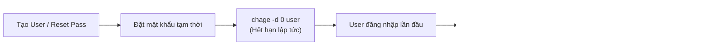
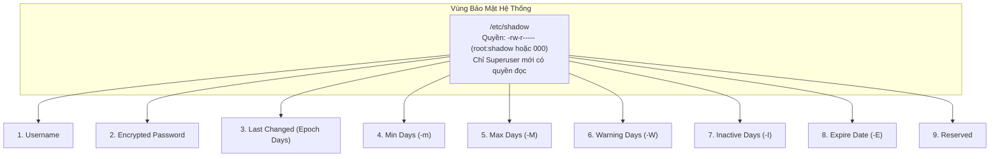
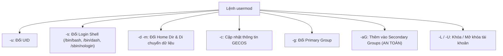
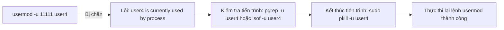
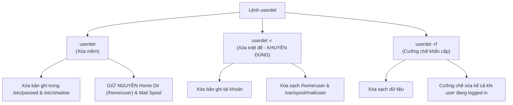

# 11 - Quản Trị Người Dùng & Chính Sách Mật Khẩu Linux Thực Chiến (Real-Time)
*Thiết lập vòng đời mật khẩu (Password Aging) với `chage`, giải mã 9 trường `/etc/shadow`, tinh chỉnh tài khoản qua `usermod` và dọn dẹp an toàn với `userdel`*

> [!abstract] Mục Tiêu Bài Học
> - **Kiểm soát vòng đời mật khẩu với lệnh `chage`:** Nắm vững các tham số quản trị thời hạn mật khẩu (`-m`, `-M`, `-W`, `-I`, `-E`), hiểu rõ kịch bản thực tế bắt buộc người dùng đổi mật khẩu ngay lần đầu đăng nhập (`chage -d 0`).
> - **Giải mã tường tận 9 trường trong tệp `/etc/shadow`:** Phân tích chi tiết cơ chế lưu trữ mật khẩu mã hóa, mốc thời gian Unix Epoch (01/01/1970) và cách hệ thống tự động tính toán số ngày hết hạn.
> - **Sửa đổi thuộc tính người dùng với `usermod`:** Thành thạo đổi UID (`-u`), Primary Group (`-g`), thêm nhóm phụ an toàn (`-aG`), thay đổi Shell (`-s`), Home Directory (`-d -m`) và xử lý xung đột tiến trình đang chạy (`process in use`).
> - **Xóa bỏ tài khoản chuẩn xác với `userdel`:** Phân biệt rạch ròi giữa xóa mềm giữ lại dữ liệu (`userdel`), xóa sạch đệ quy (`userdel -r`), và xóa cưỡng bức (`userdel -rf`), hiểu rõ hiểm họa từ các tập tin mồ côi (Orphan Files).
> - **Áp dụng chuẩn bảo mật Enterprise:** Xây dựng quy trình Offboarding nhân sự và tích hợp chính sách mật khẩu tuân thủ tiêu chuẩn an toàn thông tin (PCI-DSS, ISO 27001).

---

## 1. Bản Chất Của Password Aging & Lệnh `chage`

Trong môi trường doanh nghiệp, việc để mật khẩu tồn tại vô thời hạn là lỗ hổng bảo mật nghiêm trọng. **Password Aging** (Lão hóa mật khẩu) là cơ chế của nhân Linux nhằm kiểm soát chu kỳ thay đổi mật khẩu định kỳ của người dùng, giới hạn thời gian tồn tại và ngăn chặn việc tái sử dụng mật khẩu cũ.



### 1.1. Cú pháp và các tham số cốt lõi của lệnh `chage`

Lệnh `chage` (**CH**ange **AGE**) là công cụ chuyên dụng của Quản trị viên (yêu cầu quyền `root` / `sudo`) để điều chỉnh các chính sách thời hạn mật khẩu.

```bash
sudo chage [options] <username>
```

| Cờ (Option) | Tên đầy đủ | Ý nghĩa kỹ thuật | Ví dụ thực tế |
| :--- | :--- | :--- | :--- |
| **`-l`** | `--list` | Hiển thị toàn bộ thông số vòng đời mật khẩu hiện tại của người dùng. | `sudo chage -l user1` |
| **`-d`** | `--lastday` | Đặt ngày đổi mật khẩu gần nhất (tính bằng số ngày từ 01/01/1970 hoặc `YYYY-MM-DD`). Nếu đặt bằng `0`, **bắt buộc đổi mật khẩu ngay lần đăng nhập tới**. | `sudo chage -d 0 user5` |
| **`-m`** | `--mindays` | Số ngày **tối thiểu** phải chờ giữa 2 lần đổi mật khẩu (ngăn user đổi mật khẩu nhiều lần liên tiếp để quay lại pass cũ). | `sudo chage -m 3 user4` |
| **`-M`** | `--maxdays` | Số ngày **tối đa** mật khẩu có hiệu lực trước khi bị đánh dấu hết hạn. | `sudo chage -M 50 user4` |
| **`-W`** | `--warndays` | Số ngày hệ thống **phát cảnh báo** trước khi mật khẩu chính thức hết hạn. | `sudo chage -W 5 user4` |
| **`-I`** | `--inactive` | Số ngày **ân hạn (inactivity)** sau khi mật khẩu hết hạn mà tài khoản chưa đổi trước khi bị khóa (disable). | `sudo chage -I 5 user4` |
| **`-E`** | `--expiredate` | Ngày tài khoản hết hạn hoàn toàn (`YYYY-MM-DD` hoặc số ngày Epoch). Quá ngày này, tài khoản bị vô hiệu hóa bất kể mật khẩu còn hạn hay không. | `sudo chage -E 2026-12-31 user4` |

---

### 1.2. Kịch bản thực tế 1: Bắt buộc đổi mật khẩu lần đầu đăng nhập (`chage -d 0`)

> [!IMPORTANT] Quy Tắc Bất Khả Xâm Phạm Của SysAdmin
> Khi Admin khởi tạo tài khoản mới cho nhân viên (ví dụ `user6`) và thiết lập mật khẩu ban đầu bằng lệnh `passwd`, chính Admin là người biết mật khẩu đó. Để đảm bảo **tính bất khả phủ nhận (Non-repudiation)** và bảo mật riêng tư, Admin **không bao giờ được phép** để user tiếp tục sử dụng mật khẩu khởi tạo này.

**Quy trình thực thi:**
```bash
# 1. Admin tạo tài khoản và đặt mật khẩu khởi tạo
sudo useradd user6
sudo passwd user6

# 2. Ép buộc mật khẩu hết hạn ngay lập tức
sudo chage -d 0 user6

# 3. Kiểm tra lại cấu hình aging
sudo chage -l user6
```

**Kết quả khi kiểm tra với `chage -l user6`:**
```text
Last password change                                    : password must be changed
Password expires                                        : password must be changed
Password inactive                                       : password must be changed
Account expires                                         : never
Minimum number of days between password change          : 0
Maximum number of days between password change          : 99999
Number of days of warning before password expires       : 7
```

**Trải nghiệm phía người dùng (Client Console / SSH):**
Khi `user6` vừa đăng nhập vào hệ thống, Linux PAM (Pluggable Authentication Modules) sẽ chặn truy cập ngay trước khi mở Shell và yêu cầu:
```text
WARNING: Your password has expired.
You must change your password now and login again!
Changing password for user6.
Current password: <nhập pass do admin cấp>
New password: <nhập pass mới của riêng mình>
Retype new password: <xác nhận lại pass mới>
passwd: all authentication tokens updated successfully.
Connection to server closed.
```

---

### 1.3. Kịch bản thực tế 2: Thiết lập chính sách bảo mật doanh nghiệp chuẩn

Giả sử chính sách bảo mật công ty yêu cầu:
- Mỗi mật khẩu chỉ được dùng tối đa **50 ngày** (`-M 50`).
- Người dùng chỉ được phép đổi mật khẩu sau ít nhất **3 ngày** kể từ lần đổi gần nhất (`-m 3`).
- Trước khi hết hạn **5 ngày**, hệ thống bắt đầu hiển thị thông báo nhắc nhở (`-W 5`).
- Sau khi hết hạn, người dùng có thêm **5 ngày ân hạn** để đổi; nếu không đổi thì tài khoản bị khóa cứng (`-I 5`).

```bash
sudo chage -m 3 -M 50 -W 5 -I 5 user4
```

Kiểm tra lại sau khi cấu hình:
```bash
sudo chage -l user4
```
```text
Last password change                                    : May 18, 2026
Password expires                                        : Jul 07, 2026
Password inactive                                       : Jul 12, 2026
Account expires                                         : never
Minimum number of days between password change          : 3
Maximum number of days between password change          : 50
Number of days of warning before password expires       : 5
```

---

## 2. Giải Mã Tệp `/etc/shadow` - Bản Đồ 9 Trường Dữ Liệu

Tệp `/etc/shadow` là nơi lưu trữ mật khẩu mã hóa và toàn bộ thông số Password Aging của mọi tài khoản cục bộ trên hệ thống Linux.



### 2.1. Cấu trúc 9 trường trong `/etc/shadow`

Một dòng điển hình trong `/etc/shadow`:
```text
user4:$6$qR7z...$k8X2...:20224:3:50:5:5::
 [1]         [2]          [3]  [4][5][6][7][8][9]
```

| Thứ tự | Tên trường | Ý nghĩa kỹ thuật | Ánh xạ cờ `chage` |
| :---: | :--- | :--- | :---: |
| **1** | **Username** | Tên tài khoản đăng nhập trên hệ thống (`user4`). | `<username>` |
| **2** | **Encrypted Password** | Chuỗi băm mật khẩu (dạng `$id$salt$hash`). Ký tự `!` hoặc `*` đại diện cho tài khoản bị khóa/chưa đặt mật khẩu. | `passwd` |
| **3** | **Last Password Change** | Số ngày tính từ **Unix Epoch (01/01/1970)** đến ngày đổi pass lần cuối. Nếu là `0`, bắt buộc đổi ngay. | `chage -d` |
| **4** | **Minimum Days** | Số ngày tối thiểu giữa 2 lần thay đổi mật khẩu. | `chage -m` |
| **5** | **Maximum Days** | Số ngày tối đa mật khẩu có hiệu lực (thường là `99999` nếu không đặt giới hạn). | `chage -M` |
| **6** | **Warning Days** | Số ngày cảnh báo trước khi mật khẩu hết hạn (mặc định thường là `7`). | `chage -W` |
| **7** | **Inactive Days** | Số ngày ân hạn sau khi hết hạn trước khi vô hiệu hóa tài khoản (để trống là không áp dụng). | `chage -I` |
| **8** | **Account Expiration** | Ngày hết hạn tuyệt đối của tài khoản (tính theo số ngày kể từ Epoch 01/01/1970). Để trống là không bao giờ hết hạn. | `chage -E` |
| **9** | **Reserved** | Trường dự trữ cho các tính năng tương lai của nhân Linux (hiện tại để trống). | *(Trống)* |

> [!NOTE] Khái niệm Unix Epoch Date trong Linux
> Ngày **01/01/1970** được định nghĩa là **Unix Epoch**. Tất cả các giá trị ngày tháng trong `/etc/shadow` (trường 3 và trường 8) không lưu dạng ngày tháng thông thường mà lưu dưới dạng số ngày nguyên tính từ mốc này.  
> *Ví dụ:* Số `20224` tương ứng với: `1970-01-01 + 20224 ngày = 2025-05-18`.

---

## 3. Tinh Chỉnh Thuộc Tính Người Dùng Bằng Lệnh `usermod`

Lệnh `usermod` (**USER MOD**ify) dùng để thay đổi các thuộc tính đã thiết lập của tài khoản người dùng trong `/etc/passwd`, `/etc/shadow` và `/etc/group` **mà không cần phải xóa và tạo lại tài khoản**.



### 3.1. Các cờ lệnh `usermod` thiết yếu

```bash
sudo usermod [options] <username>
```

| Cờ lệnh | Mục đích | Cú pháp mẫu |
| :--- | :--- | :--- |
| **`-u <UID>`** | Thay đổi mã định danh UID của người dùng. | `sudo usermod -u 11111 user4` |
| **`-g <GID/Group>`** | Thay đổi Primary Group (nhóm chính) của người dùng. | `sudo usermod -g developers user4` |
| **`-aG <Group>`** | **Append Group:** Thêm người dùng vào nhóm phụ mới mà **không xóa** các nhóm phụ hiện có. | `sudo usermod -aG docker,wheel user4` |
| **`-s <Shell>`** | Thay đổi Login Shell mặc định. | `sudo usermod -s /bin/bash user6` |
| **`-c <Comment>`** | Thay đổi trường ghi chú GECOS (họ tên, bộ phận). | `sudo usermod -c "Lead DevOps Engineer" user4` |
| **`-d <path> -m`** | Thay đổi đường dẫn thư mục Home và di dời toàn bộ dữ liệu cũ sang thư mục mới (`-m` = move). | `sudo usermod -d /data/home/user4 -m user4` |
| **`-l <NewName>`** | Đổi tên đăng nhập (Login Name). | `sudo usermod -l tu_do user4` |
| **`-L`** | Khóa tài khoản (Lock password bằng cách thêm `!` vào shadow). | `sudo usermod -L user4` |
| **`-U`** | Mở khóa tài khoản (Unlock password). | `sudo usermod -U user4` |

---

### 3.2. Cảnh báo thực chiến: Xung đột `currently used by process`

Khi thay đổi UID (`-u`) hoặc đổi tên user (`-l`), nếu người dùng đang đăng nhập hoặc có tiến trình nền đang chạy dưới UID đó, lệnh sẽ báo lỗi:
```text
usermod: user user4 is currently used by process 14205
```



**Cách xử lý an toàn:**
```bash
# 1. Liệt kê các tiến trình đang chạy của user4
sudo pgrep -u user4 -l
# hoặc
sudo lsof -u user4

# 2. Buộc người dùng thoát phiên làm việc và dừng các tiến trình liên quan
sudo pkill -u user4
# hoặc buộc dừng khẩn cấp:
sudo killall -9 -u user4

# 3. Thực hiện lại lệnh usermod
sudo usermod -u 11111 user4
```

> [!CAUTION] Cập nhật quyền sở hữu tệp sau khi đổi UID
> Khi đổi UID từ `1012` sang `11111`, các file cũ của `user4` trong `/home/user4` và trên toàn hệ thống vẫn mang mã chủ sở hữu cũ là `1012` (trở thành Orphan Files). Bạn **phải** chạy lệnh cập nhật lại quyền sở hữu:
> ```bash
> sudo chown -R user4:user4 /home/user4
> sudo find / -uid 1012 -exec chown user4 {} + 2>/dev/null
> ```

---

### 3.3. Phân biệt `usermod -G` vs `usermod -aG` & Cách gỡ nhóm phụ

> [!WARNING] Cạm bẫy phá vỡ quyền hạn với cờ `-G` đơn độc
> Cờ `-G` mặc định là **ghi đè hoàn toàn** danh sách nhóm phụ:
> - Nếu bạn gõ: `sudo usermod -G docker user4`, user sẽ được thêm vào `docker`, nhưng **bị xóa khỏi toàn bộ các nhóm phụ khác** (kể cả nhóm `wheel` / `sudo`)!
> - Muốn bổ sung an toàn, **bắt buộc** phải dùng cặp cờ **`-aG`** (`-a` = append).

```bash
# Thêm an toàn vào nhóm phụ docker
sudo usermod -aG docker user4
```

**Làm sao để xóa một người dùng khỏi nhóm phụ?**  
Lệnh `usermod` không hỗ trợ cờ xóa trực tiếp một nhóm đơn lẻ mà không phải khai báo lại toàn bộ danh sách. Cách chuẩn mực và nhanh nhất là dùng công cụ **`gpasswd`**:
```bash
# Cú pháp: sudo gpasswd -d <username> <groupname>
sudo gpasswd -d user4 docker
```

---

## 4. Xóa Bỏ Tài Khoản Đúng Cách Với `userdel`

Lệnh `userdel` (**USER DEL**ete) được sử dụng để loại bỏ người dùng khỏi hệ thống. Tuy nhiên, hành vi xóa phụ thuộc hoàn toàn vào các cờ đi kèm.



### 4.1. So sánh chi tiết các chế độ xóa của `userdel`

| Lệnh | Phạm vi xóa | Số phận của thư mục `/home` | Trạng thái khi user đang login |
| :--- | :--- | :--- | :--- |
| **`sudo userdel user1`** | Chỉ xóa tài khoản trong `/etc/passwd`, `/etc/shadow`, `/etc/group`. | **Vẫn còn nguyên vẹn** tại `/home/user1`. | Bị hệ thống chặn lại nếu có tiến trình active. |
| **`sudo userdel -r user4`** | Xóa tài khoản + Xóa thư mục Home + Xóa Mail Spool. | **Bị xóa hoàn toàn** (`-r` = recursive). | Bị hệ thống chặn lại nếu đang đăng nhập. |
| **`sudo userdel -rf user4`** | Xóa tài khoản + Xóa Home + Ép buộc dừng can thiệp. | **Bị xóa hoàn toàn**. | **Xóa cưỡng chế ngay lập tức** kể cả khi đang có process chạy. |

---

### 4.2. Mối nguy từ Orphan Files (Tập tin mồ côi)

Khi chạy `userdel user1` (không có cờ `-r`), thư mục `/home/user1` vẫn nằm lại trên ổ cứng. Tuy nhiên:
1. Bản ghi tên `user1` đã biến mất khỏi `/etc/passwd`.
2. Lệnh `ls -l /home` sẽ không còn hiển thị tên `user1` ở cột Owner mà hiển thị mã số UID cũ:
   ```text
   drwx------. 2 1001 1001 4096 May 18 10:00 user1
   ```
3. **Lỗ hổng chiếm quyền:** Nếu sau này Admin tạo một tài khoản mới `user_new` và vô tình được hệ thống cấp đúng UID `1001`, `user_new` đương nhiên sẽ sở hữu toàn bộ dữ liệu, mã nguồn và tài liệu mật cũ của `user1` còn sót lại!

> [!TIP] Lệnh tìm kiếm tập tin mồ côi trên hệ thống
> Định kỳ quét các tệp không còn thuộc về bất kỳ user hay group nào:
> ```bash
> # Tìm các file không có chủ sở hữu hợp lệ
> sudo find / -nouser -o -nogroup 2>/dev/null
> ```

---

## 5. Bảng So Sánh & Đối Chiếu Cốt Lõi

### 5.1. `chage` vs `passwd`

| Tiêu chí | `chage` | `passwd` |
| :--- | :--- | :--- |
| **Mục đích chính** | Quản lý chính sách thời hạn mật khẩu (Aging & Expiration). | Thiết lập / thay đổi chuỗi mật khẩu hoặc khóa tài khoản. |
| **Cờ kiểm tra trạng thái** | `chage -l <user>` (chi tiết đầy đủ các ngày hết hạn, cảnh báo, ân hạn). | `passwd -S <user>` (ngắn gọn: trạng thái LK, PS, NP và ngày đổi pass). |
| **Bắt buộc đổi pass lần tới** | `chage -d 0 <user>` | `passwd -e <user>` (viết tắt của `--expire`). |
| **Khóa tài khoản** | `chage -E 0 <user>` (hết hạn tài khoản). | `passwd -l <user>` (thêm `!` vào hash trong shadow). |

---

### 5.2. `usermod -G` vs `usermod -aG`

| Thao tác | Cú pháp | Hành vi hệ thống | Nguy cơ |
| :--- | :--- | :--- | :--- |
| **Replace (Ghi đè)** | `usermod -G groupA user` | Thay thế toàn bộ nhóm phụ cũ thành duy nhất `groupA`. | **Rất cao!** Vô tình tước mất quyền sudo (`wheel`) hoặc quyền chạy `docker` của user. |
| **Append (Thêm mới)** | `usermod -aG groupA user` | Giữ nguyên các nhóm phụ hiện tại và bổ sung thêm `groupA`. | **An toàn.** Khuyên dùng làm chuẩn mực cho mọi tác vụ quản trị. |

---

## 6. Khối Lời Khuyên Kỹ Thuật (Enterprise & DevOps Tips)

> [!TIP] Thiết Lập Chính Sách Mật Khẩu Toàn Cục Qua `/etc/login.defs`
> Thay vì chạy lệnh `chage` thủ công cho từng người dùng sau khi tạo, Quản trị viên nên cấu hình sẵn các giá trị mặc định cho toàn bộ tài khoản mới trong file `/etc/login.defs`:
> ```bash
> sudo vim /etc/login.defs
> ```
> Các tham số tiêu chuẩn doanh nghiệp khuyến nghị:
> ```text
> PASS_MAX_DAYS   90      # Bắt buộc đổi mật khẩu sau mỗi 90 ngày
> PASS_MIN_DAYS   7       # Phải sử dụng pass ít nhất 7 ngày mới được đổi tiếp
> PASS_WARN_AGE   14      # Cảnh báo trước 14 ngày khi mật khẩu sắp hết hạn
> ```
> *Lưu ý:* Các thay đổi trong `/etc/login.defs` chỉ có hiệu lực với những user được tạo **sau thời điểm cấu hình**. Với user đã có từ trước, bắt buộc dùng `chage` để áp dụng.

> [!TIP] Quản Trị Người Dùng Tự Động Hóa Với Ansible
> Trong hạ tầng DevOps hàng trăm máy chủ Cloud, tài khoản và chính sách mật khẩu luôn được khai báo qua Infrastructure as Code (IaC):
> ```yaml
> - name: Khởi tạo tài khoản kỹ sư với chính sách bảo mật
>   hosts: all
>   become: yes
>   tasks:
>     - name: Tạo user devops_lead với shell bash và nhóm wheel
>       ansible.builtin.user:
>         name: devops_lead
>         uid: 2001
>         shell: /bin/bash
>         groups: wheel,docker
>         append: yes
>         password_expire_max: 60
>         password_expire_min: 3
>         password_expire_warn: 7
> ```

---

## 7. Cheatsheet Lệnh Quản Trị Người Dùng & Mật Khẩu Thực Chiến

| Lệnh CLI | Cú pháp hoàn chỉnh | Mục đích sử dụng |
| :--- | :--- | :--- |
| `chage -l` | `sudo chage -l <user>` | Xem chi tiết toàn bộ vòng đời mật khẩu của người dùng. |
| `chage -d 0` | `sudo chage -d 0 <user>` | Ép buộc người dùng phải đổi mật khẩu ngay trong lần đăng nhập kế tiếp. |
| `chage -M` | `sudo chage -M 60 <user>` | Đặt thời hạn mật khẩu tối đa là 60 ngày. |
| `chage -m` | `sudo chage -m 3 <user>` | Đặt số ngày tối thiểu trước khi được phép đổi pass tiếp theo là 3 ngày. |
| `chage -W` | `sudo chage -W 7 <user>` | Phát cảnh báo trước ngày hết hạn 7 ngày. |
| `chage -I` | `sudo chage -I 5 <user>` | Khóa tài khoản sau 5 ngày nếu mật khẩu hết hạn mà không chịu đổi. |
| `chage -E` | `sudo chage -E 2026-12-31 <user>` | Đặt ngày hết hạn tuyệt đối cho tài khoản nhân viên hợp đồng ngắn hạn. |
| `usermod -s` | `sudo usermod -s /bin/bash <user>` | Thay đổi Shell đăng nhập sang Bash. |
| `usermod -aG` | `sudo usermod -aG <group> <user>` | Bổ sung người dùng vào nhóm phụ mới một cách an toàn. |
| `gpasswd -d` | `sudo gpasswd -d <user> <group>` | Xóa người dùng ra khỏi nhóm phụ chỉ định. |
| `usermod -u` | `sudo usermod -u <UID> <user>` | Đổi UID định danh người dùng. |
| `usermod -d -m`| `sudo usermod -d <path> -m <user>` | Đổi thư mục Home và di dời toàn bộ file sang nơi mới. |
| `usermod -L / -U` | `sudo usermod -L <user>` | Khóa (`-L`) hoặc mở khóa (`-U`) tài khoản người dùng. |
| `userdel` | `sudo userdel <user>` | Xóa tài khoản nhưng vẫn giữ lại thư mục `/home`. |
| `userdel -r` | `sudo userdel -r <user>` | Xóa sạch sẽ toàn bộ tài khoản, thư mục Home và Mail Spool. |
| `userdel -rf` | `sudo userdel -rf <user>` | Ép buộc xóa tài khoản và dữ liệu kể cả khi user đang đăng nhập. |
| `pkill -u` | `sudo pkill -u <user>` | Dừng tất cả tiến trình đang chạy của người dùng. |

---

## 8. Bài Tập Thực Hành Vận Dụng Thực Tế (Hands-on Production Labs)

Dưới đây là 5 kịch bản thực hành giả lập môi trường doanh nghiệp thực tế. Bạn có thể mở máy ảo Linux (CentOS/RHEL hoặc Ubuntu) để gõ lệnh trực tiếp theo từng bước.

### Lab 1: Quy trình Onboarding nhân viên mới (Bắt buộc đổi mật khẩu lần đầu)
* **Bối cảnh:** Công ty tuyển dụng kỹ sư mới tên `hieu_dev`. Bạn là SysAdmin cần tạo tài khoản tạm, cấp mật khẩu ban đầu nhưng theo chuẩn an toàn SOC 2, người dùng bắt buộc phải tự đặt mật khẩu riêng ngay lần đầu đăng nhập.
* **Các bước thực hiện:**
  ```bash
  # Bước 1: Tạo user kèm thư mục home và shell Bash
  sudo useradd -m -s /bin/bash hieu_dev

  # Bước 2: Đặt mật khẩu tạm thời do Admin quy định (ví dụ: 'Temp@123456')
  echo "hieu_dev:Temp@123456" | sudo chpasswd

  # Bước 3: Kích hoạt chính sách ép đổi mật khẩu ngay lần tới
  sudo chage -d 0 hieu_dev

  # Bước 4: Kiểm tra trạng thái aging
  sudo chage -l hieu_dev
  ```
* **Kiểm chứng kết quả:** Mở một terminal khác (hoặc giả lập bằng lệnh đăng nhập):
  ```bash
  su - hieu_dev
  ```
  Hệ thống sẽ ngay lập tức chặn lại với thông báo:
  `WARNING: Your password has expired. You must change your password now and login again!`
  Nhập mật khẩu tạm `Temp@123456` và thiết lập mật khẩu cá nhân mới.

---

### Lab 2: Thiết lập chính sách mật khẩu tuân thủ chuẩn PCI-DSS / Ngân hàng
* **Bối cảnh:** Nhóm kiểm toán bảo mật yêu cầu tài khoản quản trị cơ sở dữ liệu `db_operator` phải đáp ứng các tiêu chuẩn nghiêm ngặt:
  1. Mật khẩu có hiệu lực tối đa **60 ngày**.
  2. Người dùng phải dùng mật khẩu ít nhất **7 ngày** mới được phép đổi tiếp (ngăn vòng lặp pass cũ).
  3. Hệ thống phải cảnh báo trước ngày hết hạn **10 ngày**.
  4. Sau ngày hết hạn, nếu quá **7 ngày** mà không đổi mật khẩu, tài khoản sẽ bị vô hiệu hóa (Inactive).
* **Các bước thực hiện:**
  ```bash
  # Bước 1: Tạo user
  sudo useradd -m -s /bin/bash db_operator
  echo "db_operator:DBpass@2026" | sudo chpasswd

  # Bước 2: Áp dụng toàn bộ chính sách bảo mật trong một lệnh chage
  sudo chage -m 7 -M 60 -W 10 -I 7 db_operator
  ```
* **Kiểm chứng kết quả:**
  ```bash
  # Cách 1: Xem qua giao diện thân thiện của chage
  sudo chage -l db_operator

  # Cách 2: Soi trực tiếp vào tệp /etc/shadow để đối chiếu các trường
  sudo grep "db_operator" /etc/shadow
  ```
  *Kết quả mong đợi trong `/etc/shadow`:*
  `db_operator:$6$...:<epoch_day>:7:60:10:7::`  
  (Quan sát các trường: `min=7`, `max=60`, `warn=10`, `inactive=7`).

---

### Lab 3: Khắc phục lỗi xung đột `process in use` & Cập nhật quyền sở hữu khi đổi UID
* **Bối cảnh:** Bạn cần đổi UID của người dùng `nam_ops` từ mặc định thành `5001` theo quy hoạch phân vùng Container. Tuy nhiên, khi gõ lệnh thì bị báo lỗi do người dùng đang chạy tiến trình ngầm.
* **Các bước thực hiện:**
  ```bash
  # Bước 1: Tạo user thử nghiệm
  sudo useradd -m -s /bin/bash nam_ops

  # Bước 2: Giả lập một tiến trình chạy ngầm dưới danh nghĩa nam_ops
  sudo -u nam_ops nohup sleep 9999 &>/dev/null &

  # Bước 3: Thử chạy lệnh đổi UID -> Sẽ bị lỗi 'currently used by process'
  sudo usermod -u 5001 nam_ops

  # Bước 4: Khắc phục bằng cách truy lùng và chấm dứt tiến trình
  sudo pgrep -u nam_ops -l
  sudo pkill -9 -u nam_ops

  # Bước 5: Thực thi lại lệnh usermod đổi UID
  sudo usermod -u 5001 nam_ops
  ```
* **Xử lý tập tin mồ côi (Bắt buộc):**
  Khi đổi UID, các file cũ trong `/home/nam_ops` vẫn mang UID cũ. Chạy lệnh đồng bộ lại quyền sở hữu:
  ```bash
  sudo chown -R nam_ops:nam_ops /home/nam_ops
  ls -ld /home/nam_ops
  ```

---

### Lab 4: Cấp quyền dự án an toàn qua nhóm phụ & Thu hồi quyền hạn
* **Bối cảnh:** Kỹ sư QA `lan_qa` cần tham gia đợt kiểm thử hiệu năng. Bạn cần cấp quyền chạy `docker` và xem log hệ thống `adm` cho `lan_qa` mà không làm mất các quyền hạn khác. Sau khi đợt test kết thúc, bạn cần thu hồi quyền `docker`.
* **Các bước thực hiện:**
  ```bash
  # Bước 1: Chuẩn bị user và nhóm
  sudo useradd -m -s /bin/bash lan_qa
  sudo groupadd docker 2>/dev/null || true

  # Bước 2: Thêm an toàn vào nhóm phụ docker và adm (BẮT BUỘC dùng -aG)
  sudo usermod -aG docker,adm lan_qa

  # Bước 3: Kiểm tra các nhóm hiện tại
  id lan_qa
  ```
* **Thu hồi quyền hạn:**
  ```bash
  # Bước 4: Xóa lan_qa khỏi nhóm docker bằng công cụ gpasswd
  sudo gpasswd -d lan_qa docker

  # Bước 5: Xác nhận lại danh sách nhóm (nhóm adm vẫn còn, nhóm docker đã biến mất)
  id lan_qa
  ```

---

### Lab 5: Quy trình Offboarding nhân sự an toàn & Săn lùng Orphan Files
* **Bối cảnh:** Nhân viên `quang_temp` nghỉ việc. Quy trình công ty yêu cầu: Khóa tài khoản lập tức -> Sao lưu thư mục cá nhân -> Xóa sạch tài khoản và dữ liệu -> Quét toàn bộ hệ thống để đảm bảo không còn file mồ côi mang UID cũ.
* **Các bước thực hiện:**
  ```bash
  # Bước 1: Tạo user thử nghiệm và một vài file dữ liệu
  sudo useradd -m -s /bin/bash quang_temp
  sudo -u quang_temp touch /home/quang_temp/project_report.docx

  # Bước 2: KHÓA TÀI KHOẢN NGAY LẬP TỨC (Không cho phép đăng nhập mới)
  sudo usermod -L quang_temp
  sudo chage -E 0 quang_temp

  # Bước 3: Ngắt toàn bộ phiên làm việc và tiến trình đang mở
  sudo pkill -9 -u quang_temp 2>/dev/null || true

  # Bước 4: Sao lưu dữ liệu thư mục home trước khi xóa
  sudo tar -czf /tmp/backup_quang_temp_$(date +%F).tar.gz /home/quang_temp

  # Bước 5: Xóa triệt để tài khoản và thư mục Home (-r)
  sudo userdel -r quang_temp
  ```
* **Thực hành săn tìm Orphan Files:**
  Giả sử có ai đó đã xóa một user bằng `userdel` thường (không có `-r`), bạn dùng lệnh sau để phát hiện các tệp vô chủ:
  ```bash
  sudo find / -nouser -o -nogroup 2>/dev/null
  ```

---

## 9. Checklist Tự Đánh Giá Kiến Thức

Hãy tự kiểm tra mức độ nắm vững bài học bằng cách đánh dấu vào các ô dưới đây:

- [ ] Tôi hiểu bản chất của **Password Aging** và biết cách xem thông số bằng lệnh `chage -l <user>`.
- [ ] Tôi giải thích được tại sao trong thực tế Admin phải chạy `chage -d 0 <user>` khi bàn giao tài khoản mới.
- [ ] Tôi hiểu rõ vai trò của từng cờ `-m`, `-M`, `-W`, `-I`, `-E` trong lệnh `chage`.
- [ ] Tôi thuộc nằm lòng ý nghĩa của **9 trường dữ liệu** trong tệp `/etc/shadow` và khái niệm mốc thời gian Unix Epoch.
- [ ] Tôi phân biệt được sự khác nhau chí mạng giữa `usermod -G` (ghi đè) và `usermod -aG` (bổ sung).
- [ ] Tôi biết cách dùng `gpasswd -d <user> <group>` để rút quyền của người dùng khỏi nhóm phụ.
- [ ] Tôi biết cách xử lý lỗi `user is currently used by process` bằng lệnh `pgrep`/`pkill` trước khi can thiệp tài khoản.
- [ ] Tôi phân biệt được 3 mức độ xóa của `userdel`, `userdel -r` và `userdel -rf`, cùng mối nguy từ Orphan Files.

---

**Bài tiếp theo trong khóa học:**  
👉 [[12 - Linux File Permissions – Basics]]
