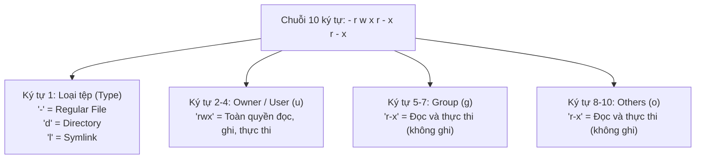
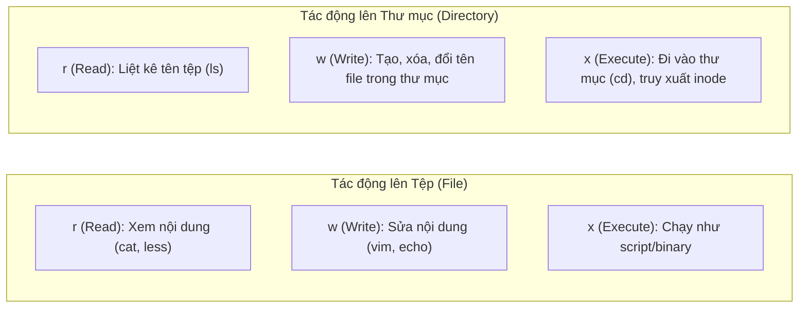
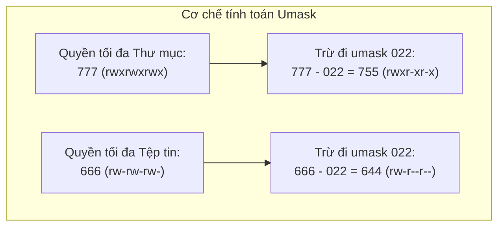
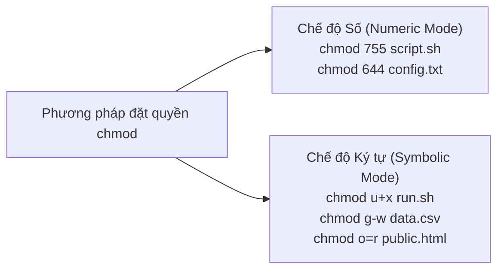
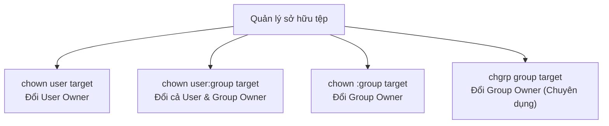

# 12 - Quản Trị Quyền Tệp Tin Linux Cơ Bản (File Permissions – Basics)
*Giải mã chuỗi 10 ký tự `ls -l`, cơ chế tính toán `umask` (644/755), thay đổi quyền hạn với `chmod` và điều chuyển sở hữu qua `chown`/`chgrp`*

> [!abstract] Mục Tiêu Bài Học
> - **Nắm vững mô hình phân quyền Linux:** Hiểu thấu đáo cấu trúc chuỗi 10 ký tự trong lệnh `ls -l`, 3 nhóm đối tượng (`User`, `Group`, `Others`) và 3 loại quyền cơ bản (`Read`, `Write`, `Execute`).
> - **Hiểu sâu sự khác biệt giữa File vs Directory:** Phân biệt rõ quyền `r`, `w`, `x` tác động lên tệp tin khác biệt hoàn toàn như thế nào so với tác động lên thư mục (đặc biệt là quyền `x` trên thư mục).
> - **Giải mã bí ẩn giá trị `umask`:** Hiểu tại sao tệp mới tạo có quyền `644` và thư mục có quyền `755`, công thức toán học trừ bit mask từ quyền tối đa (`666` cho file và `777` cho directory).
> - **Thành thạo công cụ phân quyền `chmod`:** Sử dụng linh hoạt chế độ số (Octal/Numeric Mode: `755`, `644`) và chế độ ký tự (Symbolic Mode: `u+x`, `g-w`, `o=r`), cùng cờ đệ quy `-R`.
> - **Điều chuyển quyền sở hữu với `chown` & `chgrp`:** Quản lý User Owner và Group Owner, thực hiện chuyển quyền cả thư mục và tệp tin con an toàn.
> - **Tuân thủ nguyên tắc bảo mật tối thiểu (PoLP):** Nhận diện mối nguy từ `chmod 777` trong môi trường doanh nghiệp và áp dụng giải pháp phân tách quyền file/thư mục chuẩn Production.

---

## 1. Mô Hình Phân Quyền Linux: Chuỗi 10 Ký Tự Trong `ls -l`

Khi thực thi lệnh `ls -l` (hoặc `ll`) trong Linux, hệ thống hiển thị danh sách chi tiết các tệp và thư mục. Cột đầu tiên luôn là một chuỗi gồm **10 ký tự** định nghĩa thuộc tính và quyền hạn.



### 1.1. Cấu trúc 3 nhóm đối tượng (Who)

Mọi đối tượng file trong Linux đều thuộc về 3 cấp độ đối tượng:

| Ký hiệu | Tên đối tượng | Ý nghĩa trong hệ thống |
| :---: | :--- | :--- |
| **`u`** | **User (Owner)** | Người dùng sở hữu tệp tin (thường là người tạo ra tệp đó). |
| **`g`** | **Group** | Nhóm sở hữu tệp tin. Tất cả người dùng thuộc nhóm này đều hưởng chung quyền hạn nhóm. |
| **`o`** | **Others (World)** | Tất cả những người dùng khác trong hệ thống (không phải chủ sở hữu, không thuộc nhóm). |
| **`a`** | **All** | Đại diện cho cả 3 đối tượng trên (`a = u + g + o`). |

---

### 1.2. Ý nghĩa quyền `r`, `w`, `x`: Tệp tin (File) vs Thư mục (Directory)

> [!IMPORTANT] Sự Khác Biệt Chí Mạng Giữa File và Directory
> Rất nhiều người mới nhầm lẫn quyền trên thư mục giống như trên tệp. Đây là nguyên nhân hàng đầu gây ra lỗi không truy cập được webserver hoặc không chạy được lệnh:



| Quyền | Giá trị số | Tác động lên Tệp tin (File) | Tác động lên Thư mục (Directory) |
| :---: | :---: | :--- | :--- |
| **`r` (Read)** | **4** | Đọc/xem nội dung bên trong tệp (`cat`, `nano`, `head`). | Xem danh sách tên các tệp nằm trong thư mục (`ls`). |
| **`w` (Write)** | **2** | Chỉnh sửa, ghi đè nội dung tệp (`vim`, `>>`). *Lưu ý: Quyền xóa file phụ thuộc vào thư mục chứa nó!* | Tạo file mới (`touch`), xóa file (`rm`), đổi tên file (`mv`) nằm bên trong thư mục. |
| **`x` (Execute)**| **1** | Thực thi tệp như một chương trình, nhị phân hoặc shell script (`./run.sh`). | Quyền **đi vào thư mục (`cd`)** và truy cập metadata của các tệp bên trong. |
| **`-` (None)** | **0** | Không có quyền. | Không có quyền. |

> [!WARNING] Rủi ro mất quyền `x` trên thư mục
> Nếu một thư mục có quyền `r` nhưng **mất quyền `x`** (ví dụ `r--` = 4):
> - Bạn vẫn gõ `ls` được nhưng hệ thống sẽ báo lỗi `Permission denied` với từng thuộc tính (size, owner, timestamp sẽ hiện dấu `?`).
> - Bạn **hoàn toàn không thể** dùng lệnh `cd` để bước vào thư mục đó!

---

## 2. Hệ Thống Giá Trị Bát Phân (Octal / Numeric Mode)

Linux ánh xạ trực tiếp 3 quyền `r`, `w`, `x` sang hệ nhị phân 3-bit và cộng lại thành một số nguyên từ `0` đến `7`:

$$\text{Quyền hạn} = r (4) + w (2) + x (1)$$

| Ký tự | Biểu diễn Nhị phân | Giá trị Bát phân | Quyền tương ứng |
| :---: | :---: | :---: | :--- |
| `---` | `000` | **0** | Hoàn toàn không có quyền |
| `--x` | `001` | **1** | Chỉ thực thi (Execute only) |
| `-w-` | `010` | **2** | Chỉ ghi (Write only) |
| `-wx` | `011` | **3** | Ghi và thực thi (2 + 1 = 3) |
| `r--` | `100` | **4** | Chỉ đọc (Read only) |
| `r-x` | `101` | **5** | Đọc và thực thi (4 + 1 = 5) |
| `rw-` | `110` | **6** | Đọc và ghi (4 + 2 = 6) |
| `rwx` | `111` | **7** | Toàn quyền đọc, ghi, thực thi (4 + 2 + 1 = 7) |

**Các bộ quyền kinh điển trong quản trị Linux:**
- **`755` (`rwxr-xr-x`):** Chuẩn mực cho thư mục và script thực thi. Owner có toàn quyền (7), Group và Others chỉ được đọc và vào thư mục (5).
- **`644` (`rw-r--r--`):** Chuẩn mực cho tệp văn bản/dữ liệu thông thường. Owner đọc/ghi (6), Group và Others chỉ đọc (4).
- **`700` (`rwx------`):** Dành riêng cho thư mục cá nhân bí mật (như `~/.ssh`). Chỉ duy nhất Owner được truy cập.
- **`600` (`rw-------`):** Dành riêng cho file nhạy cảm (Private SSH Key `id_rsa`, file database credentials). Chỉ Owner đọc/ghi.
- **`777` (`rwxrwxrwx`):** Mọi người đều có toàn quyền. **Cực kỳ nguy hiểm, cấm dùng trong Production!**

---

## 3. Bản Chất Của `umask` & Cách Tính Quyền Mặc Định (644 & 755)

Tại sao khi dùng `touch file.txt`, quyền sinh ra luôn là `644`? Tại sao khi dùng `mkdir dir1`, quyền sinh ra luôn là `755` mà không phải `777`? Câu trả lời nằm ở **`umask`** (**U**ser **Mask**).



### 3.1. Quyền tối đa khởi điểm (Base Permissions)
1. **Thư mục (Directory):** Khởi điểm là **`777`** (`rwxrwxrwx`) vì thư mục bắt buộc cần quyền `x` để người dùng có thể duyệt vào bên trong.
2. **Tệp tin (File):** Khởi điểm là **`666`** (`rw-rw-rw-`). **Quy tắc an toàn của nhân Linux:** Không bao giờ tự động cấp quyền thực thi (`x`) cho tệp mới tạo để tránh mã độc vô tình tự chạy.

---

### 3.2. Bảng đối chiếu Umask theo loại tài khoản

Kiểm tra umask hiện tại bằng lệnh:
```bash
umask
# Output trên root thường là: 0022
# Output trên user thường (CentOS/Ubuntu) thường là: 0002 hoặc 0022
```

| Loại tài khoản | Giá trị `umask` | Quyền Thư mục mới (`777 - umask`) | Quyền Tệp tin mới (`666 - umask`) |
| :--- | :---: | :---: | :---: |
| **Root (Superuser)** | **`022`** | $777 - 022 =$ **`755`** (`rwxr-xr-x`) | $666 - 022 =$ **`644`** (`rw-r--r--`) |
| **User thường (với UPG)** | **`002`** | $777 - 002 =$ **`775`** (`rwxrwxr-x`) | $666 - 002 =$ **`664`** (`rw-rw-r--`) |

> [!NOTE] Cơ chế bitwise chính xác của Umask
> Trong toán học nhị phân, umask không phải là phép trừ đại số đơn thuần mà là phép toán:  
> $$\text{Default Permission} = \text{Base} \ \& \ (\sim\text{umask})$$  
> Nếu bạn đặt `umask 027`:
> - Thư mục: `777 & ~027 = 750` (`rwxr-x---`)
> - Tệp tin: `666 & ~027 = 640` (`rw-r-----`) — hoàn toàn tước quyền của nhóm Others (`o=---`).

---

## 4. Quản Trị Quyền Tệp Tin Với Lệnh `chmod`

Lệnh `chmod` (**CH**ange **MOD**e) dùng để thay đổi quyền truy cập của tệp tin hoặc thư mục.

```bash
chmod [options] <mode> <target>
```



### 4.1. Cách 1: Chế độ số (Numeric / Octal Mode)
Cách này nhanh gọn, được dùng phổ biến nhất khi bạn muốn thiết lập lại toàn bộ quyền cho cả 3 nhóm:
```bash
# Cấp quyền đọc ghi cho owner, đọc cho group & others (644)
chmod 644 readme.txt

# Cấp toàn quyền cho owner, đọc và thực thi cho group & others (755)
chmod 755 deploy.sh

# Cấp quyền riêng tư tuyệt đối chỉ owner được đọc ghi (600)
chmod 600 id_rsa
```

---

### 4.2. Cách 2: Chế độ ký tự (Symbolic Mode)
Cách này tối ưu khi bạn chỉ muốn **thêm (`+`)**, **bớt (`-`)**, hoặc **ấn định (`=`)** một quyền cụ thể mà không làm ảnh hưởng đến các quyền khác:

$$\text{[Đối tượng: u, g, o, a]} \quad \text{[Toán tử: +, -, =]} \quad \text{[Quyền: r, w, x]}$$

```bash
# Thêm quyền thực thi (x) cho chủ sở hữu (u)
chmod u+x script.sh

# Thu hồi quyền ghi (w) của nhóm (g) và người khác (o)
chmod go-w database.sql

# Thêm quyền thực thi cho tất cả mọi người (a = all)
chmod +x app.bin
# (Tương đương: chmod a+x app.bin)

# Ấn định chính xác nhóm Others chỉ có quyền đọc
chmod o=r config.yml
```

---

### 4.3. Phân quyền đệ quy với cờ `-R` (Recursive)

Khi muốn áp dụng quyền cho một thư mục và **toàn bộ cây thư mục/tệp tin con bên trong**, sử dụng cờ **`-R`** (viết hoa):
```bash
# Thay đổi quyền toàn bộ cây thư mục class2
chmod -R 755 class2
```

> [!CAUTION] Cạm bẫy phá hỏng hệ thống khi chạy `chmod -R`
> - Nếu chạy `chmod -R 755 /var/www`: Tất cả file dữ liệu bình thường (`.jpg`, `.php`, `.html`) cũng bị biến thành file thực thi (`x`) $\rightarrow$ Lỗ hổng bảo mật nghiêm trọng.
> - Nếu chạy `chmod -R 644 /var/www`: Toàn bộ các thư mục bên trong bị mất cờ `x` $\rightarrow$ Webserver bị tê liệt lập tức (không thể `cd` hay duyệt thư mục).
> 
> **Giải pháp chuẩn Enterprise (Tách biệt quyền file và dir):**
> ```bash
> # Chỉ cấp 755 cho THƯ MỤC
> find /var/www -type d -exec chmod 755 {} +
> 
> # Chỉ cấp 644 cho TỆP TIN
> find /var/www -type f -exec chmod 644 {} +
> ```

---

## 5. Thay Đổi Quyền Sở Hữu Với `chown` & `chgrp`

Một tệp tin luôn có hai chủ thể sở hữu: **User Owner** và **Group Owner**. Chỉ có Superuser (`root`) mới có quyền chuyển giao quyền sở hữu tệp sang người dùng khác.



### 5.1. Lệnh `chown` (Change Owner)
`chown` là công cụ đa năng và mạnh mẽ nhất để quản lý chủ sở hữu:

```bash
# 1. Chỉ đổi User Owner sang 'hari' (giữ nguyên group cũ)
sudo chown hari class1

# 2. Đổi đồng thời User Owner sang 'hari' và Group Owner sang 'devops'
sudo chown hari:devops class1

# 3. Chỉ đổi Group Owner (dùng dấu hai chấm ':' ở trước tên nhóm)
sudo chown :developers class1

# 4. Đổi đệ quy cho toàn bộ thư mục và tệp con bên trong (-R)
sudo chown -R hari:devops /data/projects
```

---

### 5.2. Lệnh `chgrp` (Change Group)
Lệnh chuyên biệt chỉ dùng để đổi Group Owner:
```bash
# Đổi nhóm sở hữu của class1 sang 'developers'
sudo chgrp developers class1

# Đổi nhóm sở hữu đệ quy cho thư mục
sudo chgrp -R developers /data/projects
```

---

## 6. Bảng So Sánh Cốt Lõi

### 6.1. Numeric Mode vs Symbolic Mode trong `chmod`

| Tiêu chí | Chế độ Số (Numeric Mode) | Chế độ Ký tự (Symbolic Mode) |
| :--- | :--- | :--- |
| **Cú pháp** | `chmod 755 file` | `chmod u+x,g-w,o=r file` |
| **Ưu điểm** | Thiết lập tức thì trạng thái quyền hoàn chỉnh cho cả 3 đối tượng; cực kỳ ngắn gọn. | Cho phép thêm/bớt một quyền đơn lẻ mà **không cần nhớ hoặc làm thay đổi** các quyền còn lại. |
| **Nhược điểm** | Phải tính toán nhẩm giá trị bát phân; dễ vô tình ghi đè quyền của nhóm khác nếu tính sai. | Dài dòng hơn nếu cần thiết lập lại toàn bộ quyền từ đầu. |
| **Mục đích khuyên dùng**| Dùng khi khởi tạo quyền chuẩn mực (`644`, `755`, `600`). | Dùng khi cần cấp thêm quyền chạy script (`+x`) hoặc thu hồi nhanh quyền ghi (`-w`). |

---

### 6.2. `chown` vs `chgrp`

| Tiêu chí | `chown` | `chgrp` |
| :--- | :--- | :--- |
| **Mục đích** | Thay đổi User Owner, hoặc đồng thời cả User & Group Owner. | Chỉ thay đổi duy nhất Group Owner. |
| **Độ phổ biến** | Rất cao (chuẩn thực tế trong SysAdmin/DevOps). | Thường dùng trong kịch bản người dùng thường muốn đổi group sở hữu sang nhóm phụ của mình. |
| **Cú pháp đổi nhóm** | `sudo chown :group target` hoặc `sudo chown user:group target` | `sudo chgrp group target` |

---

## 7. Khối Lời Khuyên Kỹ Thuật (Enterprise & Security Tips)

> [!CAUTION] Tuyệt Đối Không Sử Dụng `chmod 777` Trong Production
> Trong các diễn đàn hỗ trợ lập trình, rất nhiều người khuyên gõ `chmod 777` để giải quyết nhanh các lỗi "Permission Denied". Đây là một **thói quen tai hại cực độ**:
> - `777` cho phép bất kỳ tiến trình hoặc người dùng nào (kể cả hacker xâm nhập qua lỗ hổng web) có thể sửa đổi, chèn mã độc, hoặc xóa sạch dữ liệu.
> - **Cách tiếp cận chuẩn DevOps:** Thay vì mở toang quyền bằng `777`, hãy đưa User chạy dịch vụ (như `nginx`, `www-data`) vào đúng Group sở hữu, sau đó cấp quyền tối thiểu `755` hoặc `775`.

> [!TIP] Bảo Mật File Cấu Hình Chứa Thông Tin Nhạy Cảm
> Mọi tệp chứa mật khẩu database, Token hoặc Khóa bí mật (như `.env`, `wp-config.php`, `id_rsa`) phải luôn được siết quyền về **`600`** (`rw-------`) hoặc **`400`** (`r--------`):
> ```bash
> chmod 600 /app/config/.env
> sudo chown appuser:appuser /app/config/.env
> ```
> Điều này đảm bảo những người dùng khác trên cùng máy chủ không thể đọc trộm bí mật thương mại.

---

## 8. Cheatsheet Lệnh Phân Quyền & Sở Hữu Tệp Tin

| Lệnh CLI | Cú pháp mẫu | Mục đích sử dụng thực tế |
| :--- | :--- | :--- |
| `ls -ld` | `ls -ld <folder>` | Xem thông tin quyền hạn và chủ sở hữu của chính thư mục (không xem ruột). |
| `chmod 755` | `chmod 755 <script.sh>` | Cấp quyền chạy script cho mọi người nhưng chỉ owner được sửa. |
| `chmod 644` | `chmod 644 <file.txt>` | Cấp quyền đọc ghi cho owner, mọi người khác chỉ đọc. |
| `chmod 600` | `chmod 600 ~/.ssh/id_rsa` | Siết chặt quyền bảo vệ khóa riêng tư (Private Key) SSH. |
| `chmod +x` | `chmod +x <script.sh>` | Thêm quyền thực thi nhanh cho file script. |
| `chmod -R` | `chmod -R 755 <dir>` | Thay đổi quyền hạn đệ quy toàn bộ thư mục và tệp con. |
| `chown` | `sudo chown hari <file>` | Chuyển quyền User Owner cho người dùng `hari`. |
| `chown :group` | `sudo chown :devops <file>` | Chuyển quyền Group Owner cho nhóm `devops`. |
| `chown user:group`| `sudo chown -R hari:devops <dir>` | Đổi cả User Owner và Group Owner đệ quy toàn thư mục. |
| `chgrp` | `sudo chgrp developers <file>` | Đổi nhóm sở hữu tệp sang `developers`. |
| `umask` | `umask` | Xem giá trị mặt nạ tạo tệp hiện tại. |
| `umask 027` | `umask 027` | Đặt umask nghiêm ngặt (tước bỏ toàn bộ quyền của nhóm Others). |
| `find dir 755` | `find . -type d -exec chmod 755 {} +` | Chuẩn hóa toàn bộ thư mục thành 755 an toàn. |
| `find file 644`| `find . -type f -exec chmod 644 {} +` | Chuẩn hóa toàn bộ tệp tin thành 644 an toàn. |

---

## 9. Bài Tập Thực Hành Vận Dụng Thực Tế (Hands-on Production Labs)

### Lab 1: Khắc phục sự cố không thể `cd` vào thư mục (Lỗi thiếu cờ Execute)
* **Bối cảnh:** Một lập trình viên than phiền rằng họ có quyền đọc trên thư mục dự án `/opt/app` nhưng khi gõ `cd /opt/app` lại bị báo lỗi `Permission denied`.
* **Thực hành:**
  ```bash
  # Bước 1: Tạo thư mục và chỉ cấp quyền đọc (r-- = 4)
  sudo mkdir -p /opt/app
  sudo chmod 744 /opt/app

  # Bước 2: Thử chuyển sang user thường và bước vào thư mục
  su - ec2-user -c "cd /opt/app"
  # => Kết quả: Bị từ chối truy cập vì thiếu quyền 'x'!

  # Bước 3: Khắc phục sự cố bằng cách thêm quyền 'x' cho group & others
  sudo chmod 755 /opt/app
  su - ec2-user -c "cd /opt/app && pwd"
  # => Kết quả: Truy cập thành công!
  ```

---

### Lab 2: Bảo vệ tệp chứa chuỗi kết nối Database (`chmod 600`)
* **Bối cảnh:** Ứng dụng Backend lưu tệp cấu hình chứa mật khẩu database tại `/var/www/html/.env`. Bạn cần thiết lập quyền để duy nhất user chạy ứng dụng `app_user` đọc được, các user khác bị cấm tuyệt đối.
* **Thực hành:**
  ```bash
  # Bước 1: Tạo tệp nhạy cảm
  sudo touch /var/www/html/.env
  echo "DB_PASSWORD=SuperSecretPass2026" | sudo tee /var/www/html/.env

  # Bước 2: Phân quyền sở hữu và siết quyền 600
  sudo chown app_user:app_user /var/www/html/.env
  sudo chmod 600 /var/www/html/.env

  # Bước 3: Kiểm chứng
  ls -l /var/www/html/.env
  # Output: -rw-------. 1 app_user app_user ... .env
  ```

---

### Lab 3: Chuẩn hóa quyền Web Root an toàn (Tách biệt Files 644 & Dirs 755)
* **Bối cảnh:** Một junior dev lỡ tay chạy `chmod -R 777 /var/www/myweb`. Bạn là DevOps Lead cần phục hồi lại chuẩn bảo mật: toàn bộ thư mục là `755`, toàn bộ tệp là `644`.
* **Thực hành:**
  ```bash
  # Bước 1: Chuẩn hóa đệ quy cho toàn bộ THƯ MỤC
  sudo find /var/www/myweb -type d -exec chmod 755 {} +

  # Bước 2: Chuẩn hóa đệ quy cho toàn bộ TỆP TIN
  sudo find /var/www/myweb -type f -exec chmod 644 {} +

  # Bước 3: Kiểm tra cấu trúc phân quyền sau khi sửa
  ls -la /var/www/myweb
  ```

---

### Lab 4: Bàn giao quyền sở hữu dự án với `chown -R`
* **Bối cảnh:** Dự án phân tích dữ liệu được chuyển giao từ nhóm cũ sang cho kỹ sư `hari` và nhóm `data_eng`. Toàn bộ mã nguồn nằm tại `/opt/analytics`.
* **Thực hành:**
  ```bash
  # Thực thi chuyển giao cả User và Group sở hữu đệ quy
  sudo chown -R hari:data_eng /opt/analytics

  # Kiểm chứng quyền sở hữu mới
  ls -ld /opt/analytics
  ```

---

### Lab 5: Tùy biến `umask` để tăng cường bảo mật hệ thống
* **Bối cảnh:** Bạn muốn đảm bảo trong phiên làm việc hiện tại, bất kỳ file hay folder nào được tạo ra đều **không cho phép người ngoài (Others) đọc hoặc truy cập** (`Others: ---`).
* **Thực hành:**
  ```bash
  # Bước 1: Đặt umask thành 027
  umask 027

  # Bước 2: Tạo tệp và thư mục mới
  mkdir secure_folder
  touch secure_file.txt

  # Bước 3: Kiểm chứng quyền sinh ra
  ls -ld secure_folder secure_file.txt
  # secure_folder: drwxr-x--- (750)
  # secure_file.txt: -rw-r----- (640)
  ```

---

## 10. Checklist Tự Đánh Giá Kiến Thức

Hãy tự kiểm tra mức độ nắm vững bài học bằng cách đánh dấu vào các ô dưới đây:

- [ ] Tôi hiểu rõ ý nghĩa 10 ký tự của lệnh `ls -l` và phân biệt được 3 nhóm `User`, `Group`, `Others`.
- [ ] Tôi giải thích được tại sao quyền `x` trên thư mục lại quyết định khả năng thực thi lệnh `cd`.
- [ ] Tôi biết cách tính nhẩm giá trị bát phân từ các ký tự (`r=4`, `w=2`, `x=1`).
- [ ] Tôi hiểu tại sao tệp mặc định có quyền `644` và thư mục là `755` thông qua cơ chế trừ `umask`.
- [ ] Tôi sử dụng thành thạo cả 2 chế độ số (`chmod 755`) và ký tự (`chmod u+x,go-w`).
- [ ] Tôi hiểu rõ nguy cơ của `chmod 777` và biết cách dùng `find` để tách biệt phân quyền file vs directory.
- [ ] Tôi biết cách dùng `chown` và `chgrp` để điều chuyển quyền sở hữu dự án.
- [ ] Tôi biết cách áp dụng quyền `600` để bảo vệ các tệp tin cấu hình nhạy cảm.

---

**Bài tiếp theo trong khóa học:**  
👉 [[13 - Linux Disk Management Partitions, Mounting, and Storage Tools]]
