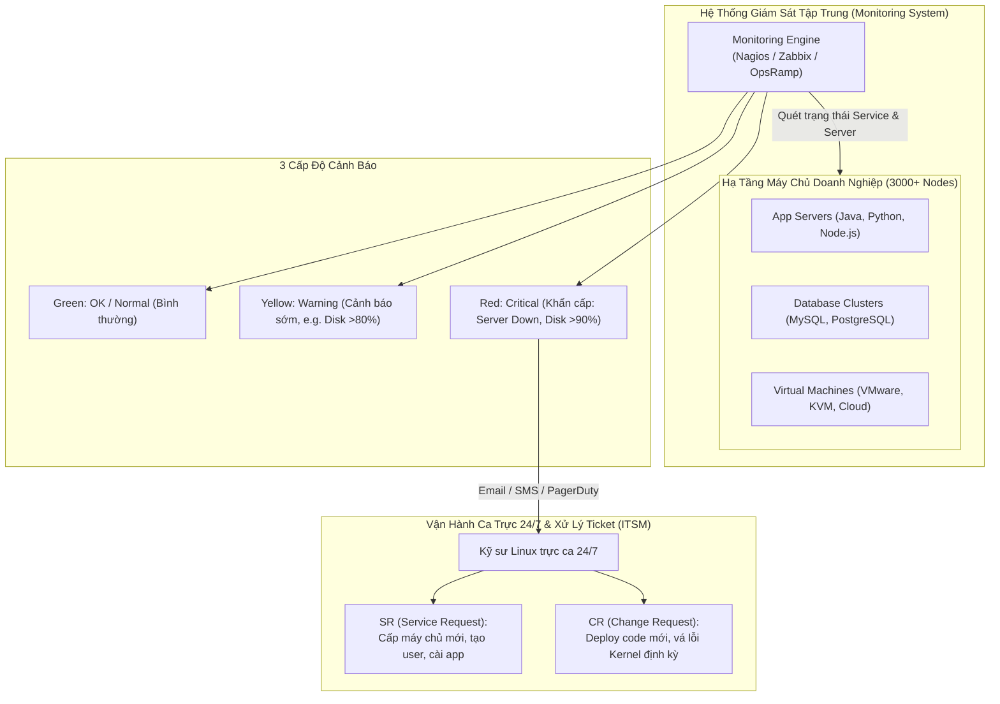
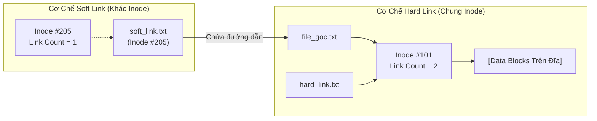
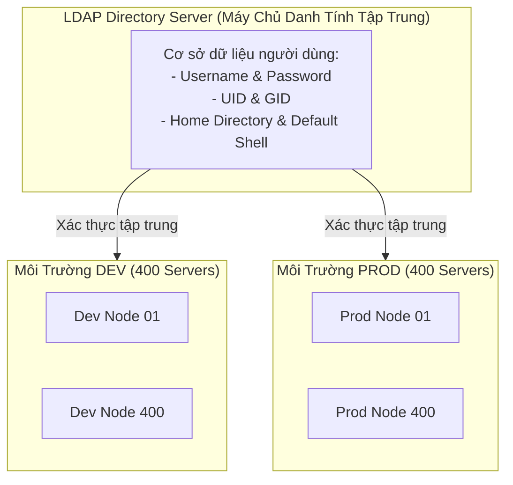

# 21 - Linux Essentials Deep Dive: Quản Trị Hệ Thống Nâng Cao, Phân Quyền & Mạng Cơ Bản
*Lập lịch tự động hóa với Crontab, vai trò L3 Sysadmin trong doanh nghiệp, phân quyền Sudoers an toàn, bộ nhớ Swap, giải mã Inode (Soft Link vs Hard Link), cổng mạng (Port) và xác thực tập trung LDAP.*

> [!abstract] Mục Tiêu Bài Học
> - **Tự động hóa tác vụ định thời với Crontab:** Nắm vững cấu trúc 5 trường thời gian (`* * * * *`), các toán tử chu kỳ, và quy tắc sử dụng an toàn `crontab -l`, `crontab -e`, tránh rủi ro từ `crontab -r`.
> - **Hiểu sâu vai trò L3 Linux Administrator / System Engineer:** Nắm rõ quy trình vận hành trực ca 24/7, cơ chế giám sát hạ tầng quy mô lớn (Nagios, Zabbix) với 3 cấp độ cảnh báo, và quy trình xử lý ticket ITSM (Service Request vs Change Request).
> - **Ủy quyền quản trị hệ thống với Sudo & Visudo:** Phân biệt thư mục nhị phân `/bin` vs `/sbin`, cấu hình phân quyền chi tiết trong `/etc/sudoers`, cấp quyền NOPASSWD cho công cụ tự động hóa (Ansible).
> - **Quản trị bộ nhớ ảo Swap & Paging:** Cơ chế giải phóng RAM vật lý cho các tiến trình đang hoạt động bằng cách chuyển trang nhớ idle/zombie sang Swap, công thức sizing Swap chuẩn.
> - **Giải mã Inode - So sánh Soft Link vs Hard Link:** Thấu hiểu bản chất liên kết dữ liệu ở cấp độ Inode, cơ chế hoạt động của Link Count, và các trường hợp ứng dụng thực tế.
> - **Cổng mạng (Ports) & Xác thực tập trung LDAP:** Phân loại dải port theo IANA, bảng danh mục port chuẩn phổ biến, câu lệnh kiểm tra `netstat`/`ss`, và bài toán quản lý tài khoản tập trung cho hàng ngàn server bằng LDAP.

---

## 1. Tự Động Hóa Tác Vụ Với Crontab (Task Scheduling)

**Cron Daemon (`crond`)** là một tiến trình dịch vụ nền (background daemon) chạy liên tục trong Linux, thức dậy mỗi phút một lần để kiểm tra xem có tác vụ nào khớp với lịch trình đã khai báo trong bảng cấu hình `crontab` hay không.

### 1.1. Cấu Trúc 5 Trường Thời Gian Của Crontab

Cú pháp chuẩn của một dòng mục nhập (entry) trong Crontab:

```text
*     *     *     *     *     [Lệnh hoặc đường dẫn tập lệnh thực thi]
│     │     │     │     │
│     │     │     │     └───── Thứ trong tuần (Day of Week: 0 - 7, trong đó 0 và 7 đều là Chủ Nhật)
│     │     │     └─────────── Tháng trong năm (Month: 1 - 12)
│     │     └───────────────── Ngày trong tháng (Day of Month: 1 - 31)
│     └─────────────────────── Giờ trong ngày (Hour: 0 - 23, định dạng 24h)
└───────────────────────────── Phút trong giờ (Minute: 0 - 59)
```

**Các toán tử biểu thức thời gian:**
- `*` (Mọi giá trị): Khớp với mọi đơn vị thời gian (mỗi phút, mỗi giờ, mỗi ngày...).
- `,` (Liệt kê): Xác định danh sách các mốc rời rạc (ví dụ: `15,30,45`).
- `-` (Dải liên tục): Xác định khoảng thời gian liên tục (ví dụ: `1-5` là từ thứ Hai đến thứ Sáu, hoặc `9-17` là từ 9h đến 17h).
- `/` (Bước nhảy): Xác định khoảng lặp chu kỳ (ví dụ: `*/10` tại trường phút = lặp lại sau mỗi 10 phút).

---

### 1.2. Các Kịch Bản Crontab Mẫu Chuẩn Production

| Nhu cầu lịch trình | Biểu thức Crontab | Phân tích chi tiết |
| :--- | :--- | :--- |
| **Mỗi phút một lần** | `* * * * * /root/monitor.sh` | Chạy liên tục mỗi khi bước sang phút tiếp theo |
| **02:30 sáng hàng ngày** | `30 2 * * * /root/backup.sh` | Phút 30, Giờ 2 (02:30 AM), ngày/tháng/thứ đều là `*` |
| **05:00 sáng mỗi Chủ nhật** | `0 5 * * 0 /root/dba_backup.sh` | Phút 0, Giờ 5, trường thứ là `0` (Sunday) |
| **Cứ mỗi 10 phút một lần** | `*/10 * * * * /root/alert_check.sh` | Chạy tại các phút: 0, 10, 20, 30, 40, 50 |
| **Cứ mỗi 15 phút một lần** | `*/15 * * * * /root/sync.sh` | Chạy tại các phút: 0, 15, 30, 45 |
| **00:00 ngày đầu tiên mỗi tháng** | `0 0 1 * * /root/monthly_cleanup.sh` | Phút 0, Giờ 0, Ngày trong tháng là `1`, áp dụng cho mọi tháng |

---

### 1.3. Các Lệnh Quản Trị Crontab CLI

```bash
# 1. Liệt kê danh sách tác vụ crontab của người dùng hiện tại
crontab -l

# 2. Mở trình soạn thảo để thêm hoặc sửa đổi tác vụ crontab
crontab -e

# 3. Xóa TOÀN BỘ file crontab của người dùng hiện tại (HẾT SỨC CẨN TRỌNG)
crontab -r

# 4. Quản trị viên root xem hoặc sửa crontab của một user cụ thể
sudo crontab -u username -l
sudo crontab -u username -e
```

---

## 2. Vai Trò Kỹ Sư Linux / Quản Trị Hệ Thống Trong Doanh Nghiệp

Kỹ sư Linux (Linux Engineer / System Administrator cấp bậc L3+) làm việc tại cả các công ty phát triển sản phẩm (**Product-based**) và công ty cung cấp dịch vụ dịch chuyển/hạ tầng (**Service-based**).



### 2.1. Quản Trị Giám Sát Tập Trung (Centralized Monitoring)
- **Bài toán quy mô:** Trong một hạ tầng doanh nghiệp có từ hàng trăm đến hàng ngàn server (`500 - 4000+` servers), quản trị viên không thể SSH thủ công vào từng máy để kiểm tra tình trạng.
- **Hệ thống giám sát chuyên dụng:** Nagios, Zabbix, Centreon, OpsRamp. Hệ thống tự động theo dõi sức khỏe CPU, RAM, ổ đĩa, tiến trình mạng và cơ sở dữ liệu.
- **3 Cấp độ trạng thái tiêu chuẩn:**
  1. `OK (Green)`: Mọi chỉ số tài nguyên hoạt động trong ngưỡng an toàn.
  2. `Warning (Yellow)`: Ngưỡng cảnh báo sớm (ví dụ: ổ cứng chạm mốc 80%), chưa gây sập dịch vụ nhưng cần theo dõi.
  3. `Critical (Red)`: Nguy cơ dừng hoạt động tức thì (Server Down, ổ cứng chạm 90-95%, Out of Memory). Hệ thống phát tín hiệu khẩn cấp qua Email/PagerDuty đến kỹ sư trực ca.

### 2.2. Vận Hành Theo Quy Trình Vé (ITSM Ticketing System)
- **Công cụ theo dõi công việc:** Jira, ServiceNow, Salesforce, Bugzilla.
- **Hai loại phiếu yêu cầu nòng cốt của Sysadmin:**
  - **Service Request (SR - Yêu cầu cấp phát dịch vụ):** Lập trình viên gửi yêu cầu cấp mới một môi trường máy chủ (ví dụ: RHEL/CentOS 9, 2 vCPU, 2GB RAM, 20GB HDD, mount point bổ sung, cấu hình user/password và cài đặt gói phần mềm nền).
  - **Change Request (CR - Yêu cầu thay đổi):** Phiếu kiểm soát rủi ro trước khi triển khai bản cập nhật mã nguồn ứng dụng, bảo trì hệ thống, cấu hình lại mạng hoặc nâng cấp bản vá Kernel OS.

---

## 3. Phân Quyền Sudo, Quản Lý Swap & Cấu Trúc Inode (Links)

### 3.1. Phân Quyền Quản Trị Hệ Thống (`sudo` & `/etc/sudoers`)

Trong hệ điều hành Linux, các tập tin thực thi được chia tách theo thẩm quyền người dùng:

| Thư mục | Tên viết tắt | Đối tượng sử dụng | Ví dụ lệnh tiêu biểu |
| :--- | :--- | :--- | :--- |
| `/bin` (`/usr/bin`) | User Binaries | Mọi người dùng (Normal User & Root) | `ls`, `cat`, `mkdir`, `cp`, `pwd` |
| `/sbin` (`/usr/sbin`) | System Binaries | Chỉ dành riêng cho quyền quản trị Root | `systemctl`, `fdisk`, `iptables`, `reboot` |

- **Tiện ích Sudo:** Cơ chế ủy quyền tạm thời theo nguyên lý đặc quyền tối thiểu (*Principle of Least Privilege*). Người dùng thông thường có thể chạy các lệnh quản trị trong `/sbin` mà **không cần biết mật khẩu của tài khoản root**.

#### Quy Tắc Chỉnh Sửa File Cấu Hình `/etc/sudoers`
> [!WARNING] Cảnh Báo An Toàn Sudoers
> Không bao giờ mở file `/etc/sudoers` bằng lệnh `vi` hoặc `nano` thông thường! Hãy luôn dùng lệnh **`visudo`**. Lệnh `visudo` cung cấp cơ chế khóa file độc quyền và tự động kiểm tra lỗi cú pháp trước khi lưu. Nếu file sudoers bị lỗi cú pháp, toàn bộ tài khoản trên máy chủ sẽ mất quyền `sudo`.

**Cấu hình phân quyền trong `/etc/sudoers`:**
```text
# 1. Cấu trúc khai báo tổng quát:
# [User/Group]  [Hosts]=([RunAs_User]:[RunAs_Group])  [NOPASSWD:]  [Commands]

# 2. Cấp toàn quyền cho tài khoản root
root    ALL=(ALL:ALL) ALL

# 3. Cấp toàn quyền cho nhóm người dùng (dấu % quy ước cho group)
%wheel  ALL=(ALL) ALL

# 4. Cấp toàn quyền KHÔNG cần nhập mật khẩu cho tài khoản tự động hóa (Ansible)
ansible ALL=(ALL) NOPASSWD: ALL

# 5. Giới hạn chỉ cho phép chạy những lệnh cụ thể (ngăn chạy các lệnh khác)
peter   ALL=(ALL) /usr/bin/systemctl restart httpd, /usr/bin/kill, /usr/bin/pkill
```

---

### 3.2. Quản Lý Bộ Nhớ Swap (Paging Space)

**Swap** là vùng nhớ ảo mở rộng được tạo ra trên ổ đĩa cứng (dưới dạng một phân vùng hoặc file swap).
- **Cơ chế vận hành:** Tương tự tính năng Virtual Memory (Paging) trên hệ điều hành Windows. Khi bộ nhớ RAM vật lý bị chiếm dụng cao, Linux Kernel sẽ di chuyển các trang bộ nhớ của các tiến trình không hoạt động (idle/sleep/zombie) từ RAM xuống Swap. Nhờ đó, RAM vật lý được giải phóng để phục vụ các tác vụ xử lý trực tiếp.
- **Dung lượng khuyến nghị:** Thông thường từ 1 đến 2 lần dung lượng RAM vật lý (ví dụ: máy chủ 2GB RAM thường cấu hình từ 2GB - 4GB Swap).

```bash
# Kiểm tra tình trạng RAM và Swap theo đơn vị MB
free -m

# Kiểm tra tình trạng chi tiết định dạng dễ đọc (GB, MB)
free -h
```

---

### 3.3. So Sánh Bản Chất: Soft Link (Symbolic Link) vs Hard Link

Mọi đối tượng tập tin trên Linux Filesystem được quản lý bằng một cấu trúc dữ liệu gọi là **Inode** (chứa metadata: quyền hạn, user/group sở hữu, kích thước, thời gian truy cập, và con trỏ trỏ tới các khối dữ liệu Data Blocks trên ổ đĩa).



| Tiêu chí so sánh | Soft Link (Symbolic Link / Symlink) | Hard Link |
| :--- | :--- | :--- |
| **Cú pháp khởi tạo** | `ln -s <file_nguon> <ten_link>` | `ln <file_nguon> <ten_link>` |
| **Mã số Inode** | Sở hữu **Inode riêng** biệt với file gốc | Dùng **chung mã số Inode** với file gốc |
| **Bản chất kỹ thuật** | Tương tự file Shortcut trên Windows (chứa chuỗi đường dẫn tới file đích) | Tạo thêm một tên gọi trực tiếp trỏ vào cùng Inode và Data Block trên đĩa |
| **Bộ đếm Link Count** | Không thay đổi Link Count của file gốc | Làm **tăng bộ đếm Link Count** (+1) trên Inode |
| **Khi xóa file gốc** | Soft link bị gãy (**broken/dangling link**), không còn đọc được dữ liệu | Dữ liệu **vẫn an toàn tuyệt đối**; dữ liệu chỉ bị xóa khi Link Count = 0 |
| **Liên kết xuyên Partition?** | **Có thể** liên kết giữa các phân vùng / ổ đĩa khác nhau | **Không thể** (chỉ tạo được trong cùng một Filesystem/Partition) |
| **Liên kết Thư mục?** | **Có thể** liên kết đến thư mục | **Không cho phép** (để chống việc tạo thành vòng lặp vô tận trong cây thư mục) |

---

## 4. Cổng Mạng (Network Ports), Dịch Vụ Mạng & Xác Thực Tập Trung LDAP

### 4.1. Khái Niệm Cổng Mạng (Port) & Phân Loại IANA

**Port (Cổng kết nối mạng)** là một định danh logic số nguyên 16-bit nằm trong dải từ **0 đến 65535** ($2^{16} - 1$). Port kết hợp với địa chỉ IP tạo thành một **Socket** định danh duy nhất cho tiến trình ứng dụng đang truyền thông qua mạng.

**Phân loại 3 nhóm cổng theo tổ chức IANA (Internet Assigned Numbers Authority):**

| Nhóm cổng | Dải Port | Đặc điểm & Thẩm quyền |
| :--- | :--- | :--- |
| **Well-known / System Ports** | `0 - 1023` | Dành riêng cho các dịch vụ cốt lõi của hệ thống; **bắt buộc quyền root** mới được phép lắng nghe (bind) |
| **Registered Ports** | `1024 - 49151` | Dành cho các ứng dụng của bên thứ ba đã đăng ký với IANA (Database, Web Server, Message Queue) |
| **Dynamic / Ephemeral Ports** | `49152 - 65535` | Cổng động/tạm thời do OS cấp phát tự động cho các kết nối outbound từ client |

---

### 4.2. Danh Mục Các Cổng Tiêu Chuẩn Phổ Biến

| Số Port | Giao thức | Dịch vụ tương ứng | Mục đích sử dụng thực tế |
| :--- | :--- | :--- | :--- |
| **20 / 21** | TCP | FTP | Truyền tải tập tin (Data / Control) |
| **22** | TCP | SSH / SFTP | Đăng nhập và quản trị máy chủ từ xa có mã hóa |
| **23** | TCP | Telnet | Quản trị từ xa truyền văn bản thô (không mã hóa, không bảo mật) |
| **25** | TCP | SMTP | Gửi thư điện tử giữa các Mail Server |
| **53** | TCP / UDP | DNS | Phân giải tên miền thành địa chỉ IP |
| **67 / 68** | UDP | DHCP Server / Client | Cấp phát cấu hình IP tự động trong mạng LAN |
| **80** | TCP | HTTP | Truyền tải trang web chuẩn không mã hóa |
| **443** | TCP | HTTPS | Truyền tải trang web bảo mật mã hóa qua TLS/SSL |
| **110 / 143** | TCP | POP3 / IMAP | Giao thức nhận và đồng bộ thư điện tử |
| **389 / 636** | TCP | LDAP / LDAPS | Dịch vụ xác thực danh mục người dùng tập trung (Plain / SSL) |
| **2049** | TCP / UDP | NFS | Chia sẻ file qua mạng nội bộ giữa Linux với Linux |
| **139 / 445** | TCP | Samba / SMB | Chia sẻ file và máy in giữa máy chủ Linux với máy khách Windows |
| **3306** | TCP | MySQL / MariaDB | Cổng lắng nghe kết nối cơ sở dữ liệu quan hệ |
| **8080** | TCP | Apache Tomcat / Proxy | Cổng mặc định cho ứng dụng web Java hoặc Proxy |

> [!NOTE] Tra Cứu Danh Mục Cổng Hệ Thống
> File `/etc/services` trên Linux lưu trữ đầy đủ toàn bộ danh mục quy đổi từ tên dịch vụ sang số port và giao thức tương ứng.

---

### 4.3. Mô Hình Quản Trị Danh Tính Tập Trung Bằng LDAP



- **Thực tế doanh nghiệp:** Một tổ chức có 1200 máy chủ chia đều cho môi trường Development, QA và Production. Nếu tạo tài khoản cục bộ bằng lệnh `useradd`, quản trị viên phải đăng nhập vào 1200 máy, gây nguy cơ bảo mật nghiêm trọng khi nhân viên nghỉ việc hoặc cần đổi mật khẩu.
- **Giải pháp LDAP (Lightweight Directory Access Protocol):**
  - Đóng vai trò tương tự dịch vụ **Active Directory (AD)** trong môi trường Windows.
  - Quản trị viên chỉ cần khai báo thông tin người dùng một lần duy nhất trên máy chủ LDAP (UID, GID, Home dir, Shell, Password).
  - Khi người dùng đăng nhập vào bất kỳ node nào trong số 1200 máy chủ, node đó sẽ tự động gửi truy vấn xác thực về máy chủ LDAP trung tâm.

---

### 4.4. Kiểm Tra Cổng Mạng Bằng Công Cụ Dòng Lệnh CLI

```bash
# 1. Liệt kê toàn bộ các cổng TCP đang lắng nghe kết nối
# -n: Hiển thị IP và Port dạng số (Numeric)
# -t: Lọc kết nối TCP
# -u: Lọc kết nối UDP
# -l: Chỉ lấy các socket đang lắng nghe (Listening)
# -p: Hiển thị PID và tên chương trình (Program Name)
sudo netstat -ntlp

# 2. Lọc kiểm tra xem một cổng cụ thể (ví dụ: SSH port 22) có đang chạy không
sudo netstat -ntlp | grep :22

# 3. Sử dụng công cụ hiện đại 'ss' (nhanh hơn netstat rất nhiều)
sudo ss -ntlp
sudo ss -ntlp | grep :22

# 4. Quét trạng thái cổng mở từ xa hoặc cục bộ bằng công cụ nmap
nmap -sT localhost
```

---

## 5. Bảng Cheatsheet Lệnh Tổng Hợp

| Câu lệnh CLI | Phân loại | Mục đích & Giải thích kỹ thuật |
| :--- | :--- | :--- |
| `crontab -l` | Crontab | Xem toàn bộ các tác vụ định thời của người dùng hiện tại |
| `crontab -e` | Crontab | Mở trình soạn thảo sửa đổi crontab an toàn |
| `crontab -r` | Crontab | Xóa toàn bộ file cấu hình crontab của user |
| `visudo` | Sudo | Chỉnh sửa `/etc/sudoers` có kiểm tra lỗi cú pháp tự động |
| `free -m` | Bộ nhớ | Xem thông số RAM, Buff/Cache và Swap theo Megabytes |
| `ln -s <nguon> <link>` | Filesystem | Tạo Soft Link (Symbolic link) |
| `ln <nguon> <link>` | Filesystem | Tạo Hard Link (chung Inode, tăng link count) |
| `ls -li` | Filesystem | Liệt kê chi tiết file kèm số hiệu Inode ở cột đầu tiên |
| `netstat -ntlp` | Network | Liệt kê các cổng TCP đang lắng nghe kèm PID tiến trình |
| `ss -ntlp` | Network | Lệnh hiện đại thay thế netstat, truy vấn trực tiếp từ kernel |
| `grep :<port> /etc/services` | Network | Tra cứu tên dịch vụ tương ứng với số hiệu port |

---

> [!tip] Lời Khuyên Kỹ Thuật & Thực Chiến DevOps / SRE
> 1. **Biện pháp phòng ngừa tai họa `crontab -r`:** Phím `e` và `r` nằm liền kề trên bàn phím. Rất nhiều quản trị viên muốn gõ `crontab -e` đã bấm nhầm thành `crontab -r`, dẫn đến việc xóa trắng lịch chạy sản xuất mà không có cảnh báo. **Giải pháp:** Thêm vào file `~/.bashrc`: `alias crontab="crontab -i"` (bắt buộc xác nhận trước khi xóa), hoặc luôn sao lưu trước: `crontab -l > ~/my_cron.bak`.
> 2. **Quản lý Sudoers theo chuẩn Module:** Tránh sửa trực tiếp file `/etc/sudoers`. Hãy đặt các cấu hình phân quyền riêng biệt vào thư mục `/etc/sudoers.d/` (ví dụ: tạo file `/etc/sudoers.d/ansible` với nội dung `ansible ALL=(ALL) NOPASSWD: ALL`). Cách này giúp hệ thống cập nhật gói mà không ghi đè cấu hình riêng.
> 3. **Cấu hình Swap trên môi trường Cloud (AWS/GCP):** Các máy ảo Cloud thường không tạo sẵn Swap để tối ưu I/O. Với các máy chủ nhỏ (1GB - 2GB RAM), hãy luôn chủ động tạo một Swapfile dung lượng 2GB để phòng ngừa tiến trình **OOM Killer (Out Of Memory)** bắn hạ ứng dụng quan trọng.
> 4. **Tối ưu hóa kiểm tra mạng với `ss`:** Gói `net-tools` (chứa `netstat`) đã bị đánh dấu lỗi thời (deprecated). Khi máy chủ có hàng chục ngàn kết nối TCP đồng thời, `netstat` xử lý file `/proc/net/tcp` rất chậm, trong khi lệnh `ss` sử dụng giao diện Netlink của Kernel cho tốc độ phản hồi tức thì.

---

## 6. Câu Hỏi Tự Kiểm Tra (Review Checklist)

- [ ] Bạn có thể đọc hiểu ngay biểu thức crontab `*/10 1-5 * * 1-5 /opt/script.sh` chạy vào những thời điểm nào không?
- [ ] Khi một file có 2 Hard Link và 1 Soft Link trỏ tới: Nếu ta xóa file gốc thì Hard Link và Soft Link sẽ thay đổi ra sao?
- [ ] Tại sao ta không bao giờ nên dùng lệnh `vi /etc/sudoers` trực tiếp mà bắt buộc phải sử dụng `visudo`?
- [ ] Dải port Well-known (0 - 1023) có đặc điểm bảo mật gì khác biệt so với Registered Ports (1024 - 49151)?
- [ ] Giả sử doanh nghiệp có 800 máy chủ Linux, giải pháp nào giúp quản lý thông tin đăng nhập tập trung mà không cần tạo tài khoản cục bộ trên từng node?

---

Bài học tiếp theo: [[22 - Linux Archiving and Task Automation]]
