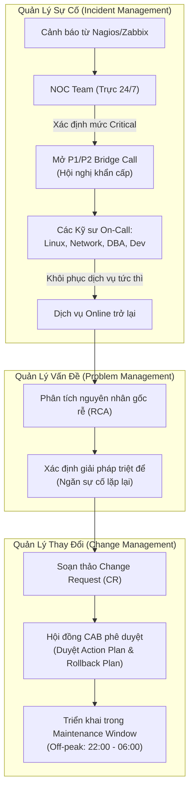
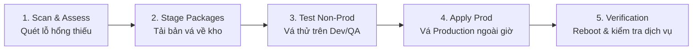
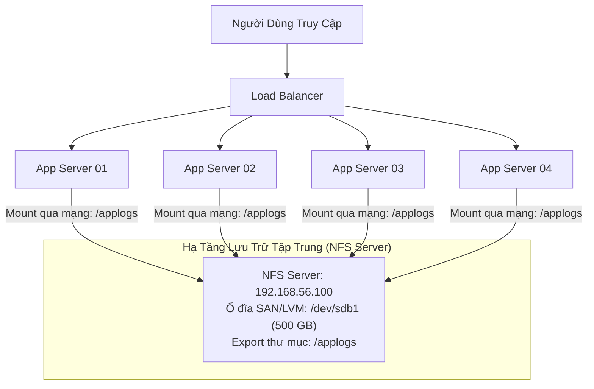

# 22 - Linux Archiving and Task Automation: Lưu Trữ Tập Tin, Tự Động Hóa & Vận Hành Doanh Nghiệp
*Vận hành hạ tầng theo chuẩn ITIL (Change/Incident/Problem), quy trình OS Patching & Migration, chia sẻ tệp mạng tập trung NFS/Samba, nén dữ liệu Tarball và tự động hóa sao lưu định thời.*

> [!abstract] Mục Tiêu Bài Học
> - **Hiểu sâu quy trình ITIL trong vận hành doanh nghiệp:** Phân biệt rành mạch Change Management (với kế hoạch Rollback, Root Cause Analysis, Maintenance Window), Incident Management (vai trò NOC, ca trực 24/7, Bridge Call xử lý sự cố khẩn cấp) và Problem Management.
> - **Làm chủ quy trình OS Migration & OS Patching:** Nắm vững chiến lược dịch chuyển hệ điều hành từ CentOS 7 lên CentOS 9 (phân tầng Dev $\rightarrow$ QA $\rightarrow$ Prod), vòng đời 5 bước vá lỗi bảo mật (OS Security Patching), và kỹ thuật loại trừ gói nhạy cảm bằng `--exclude`.
> - **Thiết kế hạ tầng lưu trữ mạng tập trung với NFS:** Hiểu rõ bài toán chia sẻ log tập trung cho cụm máy chủ ứng dụng phía sau Load Balancer, cơ chế AutoFS phục hồi kết nối, so sánh NFS vs Samba vs Cloud Storage (AWS EFS/S3), và cấu hình `/etc/exports` & `mount`.
> - **Thành thạo đóng gói & nén dữ liệu Tarball:** Phân biệt rõ giữa đóng gói (`.tar`) và nén (`gzip`, `bzip2`), ghi nhớ trọn bộ cờ lệnh (`-c`, `-x`, `-v`, `-f`, `-z`, `-j`, `-t`), và xây dựng kịch bản kẹp lệnh tự động hóa sao lưu định thời với Crontab.

---

## 1. Vận Hành Doanh Nghiệp Theo Chuẩn ITIL (IT Service Management)

Trong các tổ chức công nghệ quy mô lớn, **ITIL (Information Technology Infrastructure Library)** là bộ khung thực hành chuẩn giúp quản trị và cung cấp dịch vụ CNTT ổn định, an toàn và có thể kiểm soát rủi ro.



### 1.1. Change Management (Quản Lý Thay Đổi)

Mọi thay đổi trên môi trường Production (triển khai mã nguồn mới, cập nhật cấu hình mạng, nâng cấp Kernel) đều tiềm ẩn nguy cơ làm sập dịch vụ đang phục vụ hàng triệu người dùng.

**Bài toán triển khai thực tế (Ví dụ ứng dụng WhatsApp):**
- **Phiên bản hiện tại:** `wa-1.0.jar` (chỉ có tính năng Chat & Danh bạ).
- **Yêu cầu kinh doanh:** Triển khai phiên bản `wa-2.0.jar` bổ sung tính năng "Trạng thái" (Status).
- **Yêu cầu bắt buộc của một phiếu Change Request (CR):**
  1. **Action Plan (Kế hoạch thực hiện):** Từng bước sao lưu mã cũ, đẩy mã mới, kiểm tra dịch vụ.
  2. **Rollback Plan (Kế hoạch hoàn nguyên):** Nếu mã mới bị lỗi hoặc crash ứng dụng, quy trình khôi phục bản chạy ổn định trước đó diễn ra thế nào và trong bao lâu.
  3. **RCA (Root Cause Analysis - Phân tích nguyên nhân gốc):** Nếu đợt triển khai thất bại, phải tìm ra nguyên nhân do mã nguồn (Dev) hay hạ tầng (Infra) để khắc phục trước đợt triển khai tiếp theo.
  4. **Maintenance Window (Khung giờ bảo trì):** Thay đổi chỉ được phép thực hiện ngoài giờ cao điểm (**Off-peak hours**, ví dụ từ 22:00 đêm đến 06:00 sáng) khi lượng truy cập người dùng thấp nhất.

---

### 1.2. Incident Management vs Problem Management

| Tiêu chí | Quản Lý Sự Cố (Incident Management) | Quản Lý Vấn Đề (Problem Management) |
| :--- | :--- | :--- |
| **Mục tiêu chính** | **Khôi phục dịch vụ nhanh nhất có thể** (Workaround/Quick Fix) để giảm thiểu thời gian gián đoạn (Downtime). | **Tìm ra nguyên nhân gốc rễ** (Root Cause) để triệt tiêu vĩnh viễn, ngăn sự cố tái diễn. |
| **Bản chất sự việc** | Một sự kiện bất thường làm suy giảm hoặc gián đoạn dịch vụ (ví dụ: máy chủ đột ngột tắt 1 lần). | Nguyên nhân tiềm ẩn của một hoặc nhiều sự cố lặp đi lặp lại (ví dụ: máy chủ cứ đúng 1 tiếng lại crash 1 lần). |
| **Nhân sự xử lý** | NOC Team, Kỹ sư trực ca On-Call, phòng họp khẩn cấp (Bridge Call). | Kỹ sư L3, Chuyên gia hệ thống, Kiến trúc sư hạ tầng. |
| **Đầu ra chính** | Hệ thống hoạt động trở lại bình thường. | Tài liệu RCA, Bản vá vĩnh viễn, Phiếu Change Request (CR). |

### 1.3. Đội Ngũ NOC & Cuộc Gọi Khẩn Cấp (Bridge Call)
- **NOC (Network Operations Center):** Bộ phận trực ca 24/7 theo dõi bảng điều khiển giám sát (Nagios, Zabbix).
- **Bridge Call (War Room / Triage Room):** Khi có sự cố nghiêm trọng (P1/P2 - máy chủ sản xuất ngừng hoạt động), NOC sẽ thiết lập ngay một phòng họp thoại trực tuyến và triệu tập đồng thời các kỹ sư On-Call liên quan:
  - **Linux Engineer:** Kiểm tra tài nguyên OS, CPU, RAM, Disk I/O, Services.
  - **Network Engineer:** Kiểm tra Gateway, Firewall, Routing, DNS, Băng thông.
  - **DBA (Database Administrator):** Kiểm tra tình trạng kết nối DB, Deadlock, Tablespace.
  - **Dev On-Call:** Kiểm tra Exception trong file log của ứng dụng.

---

## 2. Nâng Cấp Hệ Điều Hành & Quy Trình Vá Lỗi An Ninh (OS Migration & Patching)

### 2.1. OS Migration (Dịch Chuyển Hệ Điều Hành)

Khi một bản phân phối Linux bước vào giai đoạn End-of-Life (EOL) hoặc không còn nhận được các bản vá bảo mật (ví dụ: CentOS 7), doanh nghiệp phải lên chiến lược nâng cấp toàn bộ hạ tầng (ví dụ: lên CentOS Stream 9 hoặc RHEL 9).

**Chiến lược triển khai theo phân tầng môi trường (Phased Rollout):**
```text
[Môi trường Development] ──(Kiểm thử thành công)──> [Môi trường QA / Staging] ──(Nghiệm thu UAT)──> [Môi trường Production]
  (Xác thực tương thích mã nguồn)                     (Mô phỏng tải & tích hợp thực tế)                (Bảo trì trong Maintenance Window)
```
- Đối với hệ thống hàng trăm máy chủ (ví dụ `500+` nodes), không bao giờ nâng cấp đồng loạt mà thực hiện theo từng cụm (Batch rollout) để đảm bảo tính sẵn sàng cao.

---

### 2.2. OS Patching (Vá Lỗi Bảo Mật Hệ Điều Hành)

#### Tại Sao Phải Thực Hiện Vá Lỗi Định Kỳ?
- **Khắc phục lỗ hổng an ninh (Security Vulnerabilities / CVEs):** Ngăn chặn tin tặc khai thác các điểm yếu đã được công bố trên phần mềm hoặc Linux Kernel để xâm nhập máy chủ.
- **Sửa lỗi hệ thống (Bug Fixes):** Khắc phục các lỗi logic gây rò rỉ bộ nhớ (memory leak), xung đột driver hoặc treo hệ thống.
- **Tối ưu hóa hiệu năng & Tính năng mới (Performance & Features):** Bổ sung các bản vá vi mã (microcode), thuật toán điều phối CPU và quản lý tài nguyên tốt hơn.
- **Tuân thủ tiêu chuẩn an toàn thông tin (Compliance):** Đáp ứng các yêu cầu kiểm toán an ninh nghiêm ngặt như PCI-DSS, ISO 27001, SOC 2.

#### So Sánh: OS Patching vs Application Patching
- **OS Patching (Vá hệ điều hành):** Được thực hiện đều đặn **hàng tháng** (Monthly Patching Cycle) do nhóm Sysadmin/DevOps đảm nhiệm.
- **Application Patching (Vá ứng dụng):** Thực hiện không cố định, phụ thuộc vào chu kỳ phát hành tính năng (Release Sprint) của nhóm phát triển phần mềm.

---

### 2.3. Vòng Đời 5 Bước Của Quy Trình Vá Lỗi Chuẩn Doanh Nghiệp



1. **Scan (Rà quét):** Sử dụng các công cụ rà soát để phát hiện các bản cập nhật an ninh còn thiếu trên hệ thống.
2. **Download & Stage (Tải về & Chuẩn bị):** Tải các gói phần mềm tương ứng về kho lưu trữ nội bộ (Local Mirror Repository).
3. **Test trên Non-Production (Thử nghiệm):** Áp dụng cập nhật trên môi trường Dev và QA để thẩm định xem có phát sinh lỗi xung đột thư viện không.
4. **Apply trên Production (Thực hiện):** Tiến hành cập nhật trên cụm máy chủ thật trong khung giờ bảo trì có phiếu Change Request phê duyệt.
5. **Verify & Validate (Xác thực):** Khởi động lại máy chủ (nếu cập nhật Kernel), kiểm tra trạng thái dịch vụ và bảo đảm không làm hỏng chức năng nghiệp vụ.

#### Kỹ Thuật Loại Trừ Gói Nhạy Cảm Bằng Cờ `--exclude`
Khi chạy lệnh cập nhật toàn bộ hệ thống (`yum update`), công cụ quản lý gói có thể tự động nâng cấp các phiên bản Runtime cốt lõi của ứng dụng (như Java OpenJDK, Apache Tomcat) khiến ứng dụng nghiệp vụ bị lỗi không khởi động được.

```bash
# Kiểm tra các bản vá an ninh khả dụng
sudo yum check-update --security

# Cập nhật toàn bộ các bản vá bảo mật cho hệ thống
sudo yum update --security -y

# Cập nhật hệ điều hành nhưng BỎ QUA không cho nâng cấp Java và Tomcat
sudo yum update -y --exclude=java* --exclude=tomcat*

# Cấu hình loại trừ vĩnh viễn trong file cấu hình /etc/yum.conf:
# Thêm dòng: exclude=java* tomcat* mysql*
```

---

## 3. Hệ Thống Tập Tin Mạng NFS & Lưu Trữ Tập Trung (Network File System)

### 3.1. Bài Toán Thực Tế: Thu Thập Log Ứng Dụng Trên Cụm Máy Chủ Phân Tán

Giả sử doanh nghiệp triển khai một ứng dụng web lớn gồm **4 máy chủ ứng dụng (App Servers)** nằm phía sau một bộ cân bằng tải (**Load Balancer**):
- Mỗi App Server được cấp ổ cứng cục bộ khiêm tốn: **25 GB**.
- Lượng người dùng truy cập liên tục khiến mỗi máy chủ sinh ra trung bình **10 GB log/ngày**.
- **Hệ quả nếu lưu log cục bộ:** Chỉ sau 2 ngày, ổ cứng của các máy chủ sẽ bị đầy 100%, làm sập ứng dụng. Hơn nữa, khi cần phân tích log người dùng, kỹ sư phải SSH vào từng máy riêng lẻ để tìm kiếm rất mất thời gian.



**Giải pháp:** Xây dựng một **Máy chủ NFS tập trung**:
- NFS Server được gắn ổ cứng dung lượng lớn (ví dụ: 500GB gắn tại `/applogs`).
- Thư mục `/applogs` được chia sẻ qua mạng nội bộ cho cả 4 máy chủ ứng dụng gắn kết (**mount**) vào cây thư mục của riêng mình.
- Mọi nhật ký từ lúc người dùng đăng nhập đến khi đăng xuất được ghi thẳng về ổ đĩa của NFS Server.

---

### 3.2. So Sánh Các Giải Pháp Chia Sẻ Tập Tin Mạng

| Tiêu chuẩn | NFS (Network File System) | Samba (SMB / CIFS) | Cloud Storage (AWS EFS / S3) |
| :--- | :--- | :--- | :--- |
| **Giao thức chính** | NFS Protocol (NFSv3, **NFSv4**) | SMB / CIFS | NFS (cho EFS) / HTTPS REST (cho S3) |
| **Mục đích chia sẻ** | **Linux $\rightarrow$ Linux** | **Linux $\leftrightarrow$ Windows** | Môi trường Cloud phân tán |
| **Cổng mạng (Port)** | **Port 2049** (TCP/UDP) | **Port 139, 445** (TCP) | Port 2049 (EFS) / Port 443 (S3) |
| **Trường hợp điển hình** | Cụm máy chủ lưu log, data chung cho Web Server, Docker volume. | Chia sẻ thư mục nội bộ văn phòng (tài liệu HR, chính sách, file nhân viên). | Hạ tầng điện toán đám mây co giãn tự động không giới hạn dung lượng. |

---

### 3.3. Hướng Dẫn Cấu Hình Triển Khai NFS Server & Client

#### Phía Máy Chủ NFS (NFS Server - IP: 192.168.56.100)
```bash
# 1. Cài đặt gói dịch vụ NFS
sudo yum install -y nfs-utils

# 2. Khởi tạo thư mục cần chia sẻ và phân quyền
sudo mkdir -p /applogs
sudo chmod 777 /applogs

# 3. Cấu hình quyền chia sẻ trong tệp /etc/exports
# Cú pháp: [Thư_mục_chia_sẻ] [IP_Client_hoặc_Subnet](tùy_chọn)
# rw: Cho phép đọc và ghi (Read-Write)
# sync: Đồng bộ tức thì dữ liệu xuống đĩa cứng trước khi phản hồi
# no_root_squash: Cho phép user root từ client giữ nguyên quyền root trên thư mục
echo "/applogs 192.168.56.0/24(rw,sync,no_root_squash)" | sudo tee -a /etc/exports

# 4. Kích hoạt cấu hình mà không cần khởi động lại dịch vụ
sudo exportfs -arv

# 5. Khởi động và kích hoạt dịch vụ chạy cùng hệ thống
sudo systemctl enable --now nfs-server
```

#### Phía Máy Khách (NFS Client - App Servers)
```bash
# 1. Cài đặt gói công cụ NFS client
sudo yum install -y nfs-utils

# 2. Tạo điểm gắn kết cục bộ
sudo mkdir -p /applogs

# 3. Gắn kết thủ công từ máy chủ NFS
sudo mount -t nfs 192.168.56.100:/applogs /applogs

# 4. Kiểm tra điểm gắn kết thành công
df -h | grep /applogs

# 5. Cấu hình tự động gắn kết khi khởi động máy trong /etc/fstab:
# 192.168.56.100:/applogs  /applogs  nfs  defaults  0  0
```

> [!NOTE] Cơ Chế AutoFS (Automounter)
> Nếu mạng bị đứt tạm thời, kết nối NFS mount tĩnh thông thường có thể bị treo (**hang**) khiến tiến trình đọc ghi bị nghẽn. Tiện ích **AutoFS** cho phép máy khách chỉ tự động mount thư mục NFS khi có yêu cầu truy cập và tự động unmount khi không sử dụng, giúp hệ thống chịu lỗi mạng tốt hơn.

---

## 4. Đóng Gói Dữ Liệu Tarball & Tự Động Hóa Với Crontab

### 4.1. Bản Chất Của Tarball (Tape Archive)

Một quan niệm sai phổ biến là coi `tar` là công cụ nén. Thực tế:
- **Đóng gói (Archiving - `tar`):** Gộp hàng trăm tập tin và thư mục nhỏ thành **một tập tin duy nhất** (`.tar`) mà không làm giảm dung lượng dữ liệu.
- **Nén (Compression - `gzip`, `bzip2`, `xz`):** Áp dụng thuật toán toán học để loại bỏ tính dư thừa của dữ liệu, giúp giảm dung lượng tập tin trên đĩa.

```mermaid
flowchart LR
    files["Nhiều file & thư mục rời rạc"] -->|tar -cvf| tarfile["File đóng gói duy nhất (.tar)<br>(Dung lượng giữ nguyên)"]
    tarfile -->|gzip (-z)| targz["Tarball hoàn chỉnh (.tar.gz)<br>(Dung lượng giảm 60-80%)"]
```

### 4.2. Bảng Ý Nghĩa Các Cờ Lệnh Tar Thiết Yếu

| Cờ lệnh (Option) | Tên tiếng Anh | Chức năng kỹ thuật chi tiết |
| :---: | :--- | :--- |
| **`-c`** | Create | Tạo mới một tập tin lưu trữ (Create archive) |
| **`-x`** | Extract | Giải nén/xả các tập tin từ file lưu trữ ra đĩa |
| **`-v`** | Verbose | Hiển thị chi tiết danh sách tập tin đang được xử lý ra màn hình |
| **`-f`** | File | Chỉ định tên của tập tin lưu trữ (phải đặt ngay trước tên file tar) |
| **`-z`** | Gzip | Sử dụng thuật toán nén `gzip` (đuôi `.tar.gz` hoặc `.tgz` - tốc độ nhanh, phổ biến nhất) |
| **`-j`** | Bzip2 | Sử dụng thuật toán nén `bzip2` (đuôi `.tar.bz2` - nén chặt hơn gzip nhưng tốn CPU hơn) |
| **`-J`** | Xz | Sử dụng thuật toán nén `xz` (đuôi `.tar.xz` - tỷ lệ nén cao nhất) |
| **`-t`** | List / Test | Xem trước danh sách các file bên trong tập tin tar mà không cần giải nén |
| **`-C`** | Directory | Chỉ định thư mục đích để xả nén file vào đó |

#### Các Câu Lệnh Thao Tác Thực Chiến:
```bash
# 1. Đóng gói thông thường (không nén)
tar -cvf backup.tar /var/www/html

# 2. Đóng gói VÀ nén bằng gzip (chuẩn tarball phổ biến nhất)
tar -czvf website_backup.tar.gz /var/www/html

# 3. Đóng gói VÀ nén bằng bzip2 (tối ưu dung lượng đĩa)
tar -cjvf database_dump.tar.bz2 /var/lib/mysql

# 4. Xem trước danh sách file bên trong mà KHÔNG giải nén
tar -tvf website_backup.tar.gz

# 5. Giải nén file tarball vào thư mục hiện tại
tar -xzvf website_backup.tar.gz

# 6. Giải nén vào một thư mục đích cụ thể (/opt/restore)
tar -xzvf website_backup.tar.gz -C /opt/restore
```

---

### 4.3. Kịch Bản Tự Động Hóa Sao Lưu Với Crontab

**Bài toán thực tế của Quản trị viên:**
- Thời gian làm việc hành chính của kỹ sư là từ `10:00 sáng đến 19:00 tối`.
- Bản sao lưu dữ liệu toàn vẹn của ứng dụng bắt buộc phải thực hiện vào khung giờ vắng khách nhất: **02:00 sáng hàng ngày**.
- Kỹ sư không thể thức lúc 2h sáng để gõ lệnh thủ công $\rightarrow$ Sử dụng **Shell Script kết hợp Crontab**.

#### Bước 1: Viết Script Sao Lưu Tự Động (`/opt/scripts/auto_backup.sh`)
```bash
#!/bin/bash
# ==============================================================================
# Script sao lưu tự động mã nguồn và nén định dạng Tarball
# Tác giả: Linux Administrator
# ==============================================================================

# Lấy biến ngày tháng hiện tại dạng YYYY-MM-DD
DATE=$(date +%F)
BACKUP_DIR="/backup/daily"
SOURCE_DIR="/var/www/html"
LOG_FILE="/var/log/backup.log"

# Tạo thư mục lưu backup nếu chưa tồn tại
mkdir -p ${BACKUP_DIR}

echo "[$(date '+%Y-%m-%d %H:%M:%S')] Bắt đầu tiến trình sao lưu..." >> ${LOG_FILE}

# Đóng gói và nén tarball với tên file chứa ngày động
tar -czf ${BACKUP_DIR}/web_backup_${DATE}.tar.gz ${SOURCE_DIR} 2>> ${LOG_FILE}

if [ $? -eq 0 ]; then
    echo "[$(date '+%Y-%m-%d %H:%M:%S')] Sao lưu THÀNH CÔNG: web_backup_${DATE}.tar.gz" >> ${LOG_FILE}
else
    echo "[$(date '+%Y-%m-%d %H:%M:%S')] Sao lưu THẤT BẠI!" >> ${LOG_FILE}
fi

# Xóa bớt các bản sao lưu cũ hơn 30 ngày để tiết kiệm dung lượng đĩa
find ${BACKUP_DIR} -name "web_backup_*.tar.gz" -mtime +30 -delete
```

#### Bước 2: Cấp Quyền Thực Thi Cho Kịch Bản
```bash
sudo chmod +x /opt/scripts/auto_backup.sh
```

#### Bước 3: Lập Lịch Định Thời Trong Crontab
Mở bảng quản trị crontab bằng lệnh `crontab -e` và thêm dòng cấu hình:
```text
# Chạy script sao lưu vào lúc 02:00 sáng hàng ngày từ Thứ Hai đến Chủ Nhật
0 2 * * * /opt/scripts/auto_backup.sh > /dev/null 2>&1
```

---

## 5. Bảng Cheatsheet Lệnh Tổng Hợp

| Câu lệnh CLI | Danh mục | Ý nghĩa và tác dụng kỹ thuật |
| :--- | :--- | :--- |
| `yum check-update --security` | Patching | Liệt kê các gói cập nhật vá lỗ hổng an ninh khả dụng |
| `yum update --security -y` | Patching | Cài đặt toàn bộ các bản vá bảo mật đã xác thực |
| `yum update -y --exclude=pkg*` | Patching | Nâng cấp hệ thống nhưng giữ nguyên gói phần mềm chỉ định |
| `systemctl status nfs-server` | NFS | Kiểm tra trạng thái hoạt động của dịch vụ máy chủ NFS |
| `exportfs -arv` | NFS | Nạp lại toàn bộ cấu hình `/etc/exports` tức thì |
| `exportfs -s` | NFS | Liệt kê danh sách các thư mục đang được export ra mạng |
| `showmount -e <IP_Server>` | NFS | Tra cứu danh sách thư mục NFS từ phía máy khách client |
| `mount -t nfs <IP>:/src /dst` | NFS | Gắn kết thư mục mạng NFS vào cây thư mục cục bộ |
| `tar -czvf file.tar.gz /path` | Tarball | Đóng gói và nén thư mục bằng thuật toán Gzip |
| `tar -xzvf file.tar.gz -C /dir` | Tarball | Giải nén file Tarball vào thư mục đích chỉ định |
| `tar -tvf file.tar.gz` | Tarball | Liệt kê danh sách nội dung bên trong file tarball |
| `crontab -e` | Automation | Mở trình biên tập cấu hình tác vụ tự động hóa |

---

> [!tip] Lời Khuyên Kỹ Thuật & Thực Chiến DevOps / SRE
> 1. **Nguyên tắc "Bất Khả Xâm Phạm" của Maintenance Window:** Trong quản trị doanh nghiệp, tuyệt đối không bao giờ cập nhật Kernel hay restart dịch vụ quan trọng trong giờ làm việc (Peak hours) nếu không có sự cố khẩn cấp (Emergency Change). Mọi thao tác phải có phiếu CR đã duyệt và chuẩn bị sẵn kế hoạch Rollback từng bước.
> 2. **Bẫy Mount Treo Ổ (Hard Mount vs Soft Mount NFS):** Khi cấu hình NFS trong `/etc/fstab`, nếu máy chủ NFS gặp sự cố, các lệnh như `df -h` hoặc tiến trình ghi trên Client sẽ bị đứng vĩnh viễn (hang). Hãy cân nhắc bổ sung các tham số tối ưu: `defaults,soft,timeo=60,retrans=2,_netdev` để client tự ngắt sau khoảng thời gian timeout thay vì treo hệ thống.
> 3. **Phân biệt `tar` tuyệt đối vs tương đối:** Khi nén dữ liệu, hãy chú ý thông báo *"tar: Removing leading '/' from member names"*. `tar` mặc định tự xóa dấu gạch chéo `/` ở đầu đường dẫn để khi người dùng giải nén, file không vô tình ghi đè thẳng vào các thư mục hệ thống gốc như `/etc` hoặc `/var`.
> 4. **Quản lý Vòng Đời Bản Sao Lưu (Retention Policy):** Việc tự động nén và tạo file sao lưu hàng ngày mà không có bước dọn dẹp định kỳ (bằng lệnh `find ... -mtime +N -delete`) sẽ khiến phân vùng lưu trữ bị tràn chỉ sau vài tháng. Luôn tích hợp cơ chế xoay vòng dữ liệu (Rotate) trong các script tự động.

---

## 6. Câu Hỏi Tự Kiểm Tra (Review Checklist)

- [ ] Trong chuẩn ITIL, khi một sự cố nghiêm trọng (Critical) xảy ra trên môi trường Production, quy trình mở "Bridge Call" diễn ra như thế nào và có sự tham gia của những ai?
- [ ] Tại sao khi thực hiện lệnh cập nhật bảo mật hệ điều hành (`yum update`), ta thường phải sử dụng cờ `--exclude` cho các gói ứng dụng như Java hay Tomcat?
- [ ] Sự khác biệt cốt lõi giữa NFS và Samba là gì? Khi nào bạn bắt buộc phải dùng Samba thay vì NFS?
- [ ] Phân biệt sự khác nhau giữa file `.tar` đơn thuần và file `.tar.gz`? Cờ lệnh nào của `tar` kích hoạt thuật toán nén `gzip`?
- [ ] Bạn hãy viết một dòng cấu hình Crontab để chạy một file script dọn dẹp log vào lúc 03:15 sáng vào các ngày Thứ Hai, Thứ Tư và Thứ Sáu hàng tuần?

---

> [!success] Chúc Mừng Bạn Đã Hoàn Thành Khóa Học!
> Bạn đã hoàn thành toàn bộ chương trình huấn luyện **Linux from Beginner to System Administrator** (từ bài 01 đến bài 22). Các bài học đã trang bị nền tảng vững chắc từ kiến trúc phần cứng, phân quyền, lưu trữ LVM, mạng, SSH, bảo mật, đến các quy trình vận hành hạ tầng doanh nghiệp theo chuẩn ITIL.
>
> ⬅️ Bài học trước: [[21 - Linux Essentials Deep Dive]]
