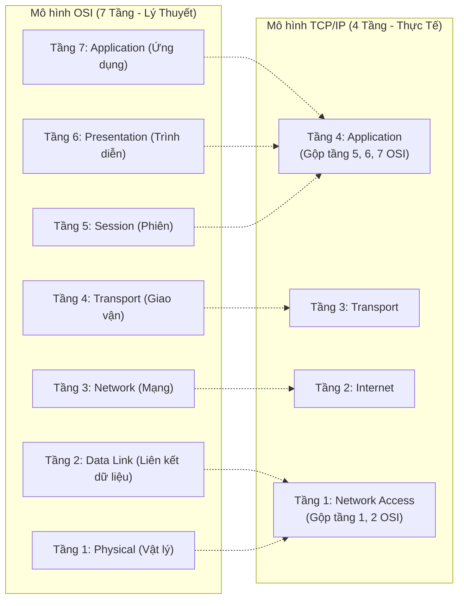
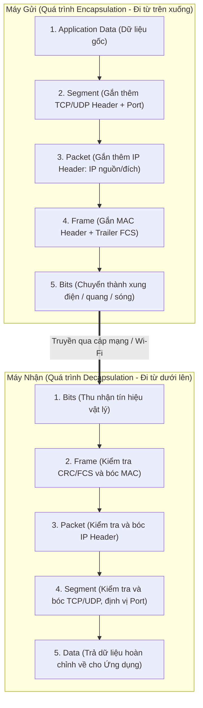

# 🌐 MÔ HÌNH OSI 7 TẦNG VS TCP/IP 4 TẦNG

> [!abstract] Tóm Tắt Cốt Lõi
> - **Nguyên lý phân tầng:** Chia quá trình truyền thông phức tạp thành các tầng độc lập (*Modularity*), giúp các thiết bị khác hãng có thể giao tiếp với nhau mà không phụ thuộc vào công nghệ riêng biệt.
> - **Mô hình OSI (7 tầng):** Mô hình **tham chiếu lý thuyết** do ISO chuẩn hóa. Đóng vai trò là "ngôn ngữ chung" cho kỹ sư khi trao đổi và khoanh vùng sự cố mạng (*Troubleshooting*).
> - **Mô hình TCP/IP (4 tầng):** Mô hình **thực thi thực tế**, là kiến trúc nền tảng đang vận hành 100% mạng Internet ngày nay.

---

## 1. Tại Sao Cần Mô Hình Phân Tầng?

Trước thập niên 1970, các hãng công nghệ (như IBM, DEC) phát triển hệ thống mạng độc quyền (*proprietary*). Máy tính của hãng này không thể nói chuyện với máy tính hãng khác.

Mô hình phân tầng áp dụng nguyên lý **"chia để trị"**:
- Mỗi tầng chỉ đảm nhận một nhóm nhiệm vụ cụ thể.
- Tầng trên sử dụng dịch vụ của tầng ngay dưới mà không cần biết chi tiết cài đặt phần cứng bên dưới.
- Tương tự việc gửi bưu phẩm: Người viết thư không cần biết xe bưu điện chạy tuyến đường nào, và người lái xe tải chở hàng cũng không cần mở thư ra đọc nội dung.

---

## 2. Sơ Đồ Đối Chiếu: OSI 7 Tầng vs TCP/IP 4 Tầng

> [!NOTE]
> Trong các giáo trình hiện đại (như Cisco CCNA), tầng **Network Access** của TCP/IP thường được tách đôi thành **Data Link** và **Physical** để tạo thành **mô hình TCP/IP 5 tầng**, giúp người học dễ đối chiếu với thiết bị thực tế hơn.

---

## 3. Chi Tiết Từng Tầng Của Mô Hình OSI

### 🔹 Layer 7: Application (Tầng Ứng dụng)
- **Nhiệm vụ:** Cung cấp giao diện mạng trực tiếp cho các chương trình ứng dụng của người dùng.
- **Lưu ý:** Không phải là bản thân ứng dụng (như Chrome, Skype), mà là **các giao thức** phần mềm đó dùng để truyền dữ liệu.
- **Giao thức tiêu biểu:** `HTTP`, `HTTPS`, `DNS`, `DHCP`, `FTP`, `SMTP`, `SSH`.

### 🔹 Layer 6: Presentation (Tầng Trình diễn)
- **Nhiệm vụ:** Đảm bảo dữ liệu từ ứng dụng máy gửi được máy nhận hiểu và hiển thị đúng định dạng.
- **3 chức năng cốt lõi:**
  1. **Định dạng dữ liệu:** Chuyển đổi giữa các bảng mã (ASCII, UTF-8, định dạng ảnh PNG/JPEG, video MP4).
  2. **Mã hóa & Giải mã:** Bảo vệ an toàn dữ liệu trên đường truyền (`SSL/TLS`, mã hóa HTTPS).
  3. **Nén dữ liệu:** Giảm dung lượng truyền tải trước khi đưa xuống tầng dưới.

### 🔹 Layer 5: Session (Tầng Phiên)
- **Nhiệm vụ:** Thiết lập, duy trì, đồng bộ và giải phóng các phiên liên lạc (*sessions*) giữa 2 tiến trình trên các máy tính.
- **Ví dụ:** Quản lý phiên video call, kiểm soát luồng hội thoại hai chiều (Half-duplex / Full-duplex), cơ chế checkpoint để khôi phục truyền file khi bị rớt mạng.
- **Giao thức tiêu biểu:** `NetBIOS`, `RPC`, `PPTP`.

### 🔹 Layer 4: Transport (Tầng Giao vận)
- **Nhiệm vụ:** Chịu trách nhiệm vận chuyển dữ liệu xuyên suốt từ tiến trình nguồn đến tiến trình đích (*End-to-End Delivery*).
- **Cơ chế cốt lõi:**
  - **Segmentation (Phân đoạn):** Cắt nhỏ dữ liệu từ tầng trên thành các đơn vị gọi là **Segment**.
  - **Port Number (Số hiệu cổng):** Định danh dữ liệu thuộc về ứng dụng nào (ví dụ: Port 80/443 là Web, Port 22 là SSH, Port 53 là DNS).
  - **Kiểm soát luồng (Flow Control) & Kiểm soát nghẽn (Congestion Control).**
- **Hai giao thức kinh điển:**
  - **TCP (Transmission Control Protocol):** Hướng kết nối (*Connection-oriented*), bắt tay 3 bước, đảm bảo dữ liệu gửi đến đúng thứ tự và không bị mất (dùng cho Web, Email, File transfer).
  - **UDP (User Datagram Protocol):** Không hướng kết nối (*Connectionless*), truyền cực nhanh, chấp nhận mất gói nhẹ (dùng cho DNS query, Livestream, Voice VoIP, Game online).

### 🔹 Layer 3: Network (Tầng Mạng)
- **Nhiệm vụ:** Định tuyến (*Routing*) và chọn đường đi tốt nhất để chuyển dữ liệu qua nhiều mạng con khác nhau trên toàn cầu.
- **Định danh logic:** Sử dụng **địa chỉ IP** (IPv4, IPv6).
- **Đơn vị dữ liệu (PDU):** **Packet (Gói tin)**.
- **Thiết bị tiêu biểu:** **Router** (Bộ định tuyến), Layer 3 Switch.
- **Giao thức tiêu biểu:** `IP`, `ICMP` (lệnh ping/traceroute), `OSPF`, `BGP`.

### 🔹 Layer 2: Data Link (Tầng Liên kết Dữ liệu)
- **Nhiệm vụ:** Truyền dẫn dữ liệu đáng tin cậy giữa hai thiết bị kết nối vật lý trực tiếp trong **cùng một mạng cục bộ (LAN)**.
- **Định danh vật lý:** Sử dụng **địa chỉ MAC** (48-bit gắn cứng trên card mạng).
- **Phân chia 2 tầng con:**
  - **LLC (Logical Link Control):** Giao tiếp với tầng Network phía trên.
  - **MAC (Media Access Control):** Điều khiển quyền truy cập đường truyền vật lý.
- **Cơ chế:** Đóng khung dữ liệu, kiểm tra lỗi bằng mã kiểm dư `CRC/FCS` ở phần đuôi (*Trailer*).
- **Đơn vị dữ liệu (PDU):** **Frame (Khung dữ liệu)**.
- **Thiết bị tiêu biểu:** **Switch**, Bridge, Card mạng (NIC).

### 🔹 Layer 1: Physical (Tầng Vật lý)
- **Nhiệm vụ:** Chuyển đổi các bit dữ liệu nhị phân (`0` và `1`) thành các tín hiệu vật lý để truyền dẫn trên môi trường mạng.
- **Môi trường truyền dẫn:** Xung điện (cáp xoắn đôi Cat5e/Cat6 RJ45), xung ánh sáng (cáp quang), sóng vô tuyến (Wi-Fi, 4G, 5G).
- **Đơn vị dữ liệu (PDU):** **Bit**.
- **Thiết bị tiêu biểu:** Cáp mạng, **Hub**, **Repeater** (chỉ đơn thuần nhân bản/khuếch đại tín hiệu điện).

---

## 4. Mô Hình TCP/IP 4 Tầng

Mô hình TCP/IP được thiết kế theo tư duy thực dụng của kỹ sư:

1. **Application Layer:** Gom toàn bộ trách nhiệm của cả 3 tầng OSI (Application, Presentation, Session) vào mã nguồn của ứng dụng. Nhà phát triển tự xử lý TLS, mã hóa JSON/XML, quản lý token phiên.
2. **Transport Layer:** Giữ nguyên vai trò quản lý kết nối và cổng dịch vụ (TCP/UDP).
3. **Internet Layer:** Đảm nhiệm địa chỉ logic và định tuyến gói tin liên mạng (IP, ICMP, ARP).
4. **Network Access Layer:** Gom tầng Data Link và Physical; phụ trách việc điều khiển phần cứng mạng và truyền khung/tín hiệu trên đường truyền.

---

## 5. Quá Trình Đóng Gói (Encapsulation) & Mở Gói (Decapsulation)

Quá trình dữ liệu di chuyển từ máy gửi sang máy nhận qua đường truyền mạng:

### 📋 Bảng Chi Tiết Các Bước Đóng Gói (PDU & Header)

| Tầng (OSI Layer) | Đơn Vị Dữ Liệu (PDU) | Thông Tin Bổ Sung (Header / Trailer) | Ý Nghĩa Kỹ Thuật |
| :--- | :--- | :--- | :--- |
| **Layer 7, 6, 5** | **Data** | Payload dữ liệu của ứng dụng | Khởi tạo dữ liệu người dùng (HTTP, DNS...) |
| **Layer 4 (Transport)** | **Segment** | TCP/UDP Header (Port nguồn, Port đích, Seq No) | Định danh tiến trình ứng dụng và kiểm soát luồng |
| **Layer 3 (Network)** | **Packet** | IP Header (IP nguồn, IP đích) | Định tuyến đường đi giữa các mạng (*Routing*) |
| **Layer 2 (Data Link)** | **Frame** | MAC Header (MAC nguồn/đích) + FCS Trailer | Truyền nội bộ mạng LAN và kiểm tra lỗi (CRC) |
| **Layer 1 (Physical)** | **Bits** | Chuỗi bit nhị phân `010101...` | Phát tín hiệu vật lý lên dây cáp hoặc sóng vô tuyến |

---

## 6. Bảng So Sánh Toàn Diện: OSI vs TCP/IP

| Tiêu Chí | Mô Hình OSI | Mô Hình TCP/IP |
| :--- | :--- | :--- |
| **Số tầng** | **7 tầng** | **4 tầng** (hoặc 5 tầng theo tài liệu Cisco) |
| **Bản chất** | Mô hình **tham chiếu lý thuyết** (*Reference Model*) | Bộ **giao thức triển khai thực tế** (*Protocol Suite*) |
| **Tổ chức phát triển** | ISO (International Organization for Standardization) | DARPA / DoD (Bộ Quốc phòng Mỹ) |
| **Cách tiếp cận** | Định nghĩa mô hình lý thuyết trước rồi mới viết giao thức | Xây dựng giao thức thực chiến trước, sau đó chuẩn hóa mô hình |
| **Mức độ ứng dụng** | Không được lập trình trực tiếp vào kernel OS | Được cài đặt sẵn trên 100% thiết bị mạng và hệ điều hành |
| **Session & Presentation**| Tách thành 2 tầng riêng biệt | Tích hợp thẳng vào tầng Application |
| **Data Link & Physical** | Tách riêng mạch lạc giữa khung (Frame) và bit | Gộp chung trong tầng Network Access |

---

## 7. Mẹo Nhớ 7 Tầng OSI (CCNA Mnemonics)

* **Xuôi (Layer 7 → Layer 1):**  
  > **A**ll **P**eople **S**eem **T**o **N**eed **D**ata **P**rocessing  
  *(**A**pplication - **P**resentation - **S**ession - **T**ransport - **N**etwork - **D**ata Link - **P**hysical)*

* **Ngược (Layer 1 → Layer 7):**  
  > **P**lease **D**o **N**ot **T**hrow **S**ausage **P**izza **A**way  
  *(**P**hysical - **D**ata Link - **N**etwork - **T**ransport - **S**ession - **P**resentation - **A**pplication)*

---

> [!tip] Góc Kỹ Thuật: Ứng Dụng Trong Troubleshooting & Cloud/DevOps
> Trong thực tế vận hành hệ thống, kỹ sư luôn sử dụng các tầng của **OSI** để xác định phạm vi lỗi:
> - **Lỗi Layer 1 (Physical):** Đèn cổng mạng không sáng, đứt cáp quang, lỏng đầu cắm RJ45, suy hao tín hiệu Wi-Fi.
> - **Lỗi Layer 2 (Data Link):** Trùng địa chỉ MAC, lỗi cấu hình VLAN, loop mạng làm nghẽn gói tin (*Broadcast Storm*).
> - **Lỗi Layer 3 (Network):** Đặt sai địa chỉ IP / Subnet mask, cấu hình sai Default Gateway, định tuyến vòng lặp.
> - **Lỗi Layer 4 (Transport):** Firewall chặn nhầm Port, tràn kết nối TCP (*SYN Flood*), timeout kết nối.
> - **Lỗi Layer 7 (Application):** Chứng chỉ SSL/TLS hết hạn, server trả mã `HTTP 502 Bad Gateway`, payload JSON sai cú pháp.

---

## 8. Câu Hỏi Ôn Tập Nhanh (Checklist)

- [ ] **Switch** và **Router** hoạt động ở tầng nào của mô hình OSI? *(Switch: Layer 2; Router: Layer 3)*
- [ ] Sự khác biệt cốt lõi giữa đơn vị dữ liệu **Segment**, **Packet** và **Frame** là gì?
- [ ] Tại sao **Hub** chỉ được coi là thiết bị Layer 1 mà không phải Layer 2? *(Hub chỉ nhân bản xung điện thô ra tất cả các port, không đọc được địa chỉ MAC)*
- [ ] Trong mô hình TCP/IP, trách nhiệm mã hóa dữ liệu (TLS/SSL) thuộc về tầng nào? *(Tầng Application)*
